**Machine learning-assisted materials screening and prediction of thermoelectric properties of lead-free perovskite materials**

Muhammad Behzad Gull^a^, Kamran Javed^a^, Muhammad Ejaz Khan^∗a^

*^a^School of Computing Sciences, Pak-Austria Fachhochschule: Institute of Applied Sciences and Technology, Haripur, Khyber Pakhtunkhwa, 22620, Pakistan*

**Abstract**

Machine learning (ML) is increasingly used to search for non-toxic, lead-free thermoelectric materials, but reported accuracies are often inflated because temperature-series measurements and chemically related compounds appear in both training and test sets. Here, gradient-boosted (XGBoost) models were trained on a pinned snapshot of Starrydata2 (<!--v:n_clean-->280,664<!--/v--> cleaned rows; <!--v:n_S-->185,064<!--/v-->, <!--v:n_sigma-->182,755<!--/v-->, <!--v:n_kappa-->121,110<!--/v--> and <!--v:n_zT-->129,419<!--/v--> rows with a Seebeck coefficient, electrical conductivity, thermal conductivity and figure of merit), described by <!--v:n_feat-->397<!--/v--> composition-based features (MAGPIE, CBFV and temperature), to predict the Seebeck coefficient (S), electrical conductivity (*σ*), thermal conductivity (*κ*) and figure of merit (zT). Chemistry-cluster grouped cross-validation lowered R^2^ by <!--v:gap_lo-->0.134<!--/v-->--<!--v:gap_hi-->0.213<!--/v--> relative to random splits, giving composition-only ceilings of <!--v:chem_S-->0.753<!--/v-->, <!--v:chem_sigma-->0.702<!--/v-->, <!--v:chem_kappa-->0.809<!--/v--> and <!--v:chem_zT-->0.746<!--/v--> for S, *σ*, *κ* and zT, respectively. External validation on the independent ESTM database lowered R^2^ further: for zT it was <!--v:estm_b_zT-->0.498<!--/v--> on rows whose chemistry cluster is absent from training and <!--v:estm_a_zT-->0.662<!--/v--> on rows sharing no source publication with training. Direct zT regression outperformed the component-wise route S^2^*σ*T/*κ* (R^2^ = <!--v:dvd_direct-->0.727<!--/v--> vs <!--v:dvd_derived-->0.540<!--/v-->) because component errors compound, and SHAP analysis ranked temperature first for the zT model and a CBFV statistic first for the S, *σ* and *κ* models. Applied as hypothesis generation to lead-free, perovskite-type compounds of the Materials Project, the models give <!--v:mp_f6-->30<!--/v--> candidates, <!--v:nv_main_seen-->9<!--/v--> of them in chemistry clusters present in the training data and <!--v:nv_main_unseen-->21<!--/v--> in clusters that are not; against DFT-computed Seebeck coefficients (JARVIS) the Seebeck model shows at most marginal sign transfer (agreement <!--v:jvc_all-->0.52<!--/v-->) and a negative rank correlation for semiconductors (<!--v:jv_rho_semi-->-0.08<!--/v-->), so the ranked list is a set of hypotheses to test, not a set of predictions to rely on. Under a rule fixed before the predictions were seen, the shortlist is the <!--v:sl_n-->4<!--/v--> candidates that are on the convex hull and in chemistry clusters present in the training data (<!--v:sl_1_name-->CsSnI~3~<!--/v-->, <!--v:sl_2_name-->BaSnO~3~<!--/v-->, <!--v:sl_3_name-->LaRhO~3~<!--/v--> and <!--v:sl_4_name-->LaCoO~3~<!--/v-->, in the order of their predicted zT); all four have been studied as thermoelectrics before, so they are recoveries of known materials, not discoveries, and no predicted zT of any other candidate is presented as a finding. Composition-based models are therefore useful for triage, but chemistry-aware validation is essential to avoid overstating their accuracy.

**Highlights**

- Chemistry-cluster validation reveals R^2^ inflation of <!--v:gap_lo-->0.134<!--/v-->--<!--v:gap_hi-->0.213<!--/v--> from random splits

- XGBoost trained on <!--v:n_clean-->280,664<!--/v--> cleaned Starrydata2 rows with <!--v:n_feat-->397<!--/v--> descriptors

- Composition-only ceilings under chemistry-cluster CV: R^2^ ≈ <!--v:chem_zT-->0.746<!--/v--> for zT and <!--v:chem_kappa-->0.809<!--/v--> for *κ*

- Independent ESTM test: zT R^2^ falls to <!--v:estm_b_zT-->0.498<!--/v--> for chemistries absent from training

- Screening as hypothesis generation: <!--v:nv_main_seen-->9<!--/v--> of <!--v:mp_f6-->30<!--/v--> candidates lie in chemistry clusters seen in training, <!--v:nv_main_unseen-->21<!--/v--> do not

**Keywords:** Thermoelectric materials ; Machine learning ; Lead-free perovskites ; Validation bias ; Data leakage ; Figure of merit ; XGBoost ; SHAP

^∗^Corresponding author. E-mail address: [muhammad.ejaz@paf-iast.edu.pk](mailto:muhammad.ejaz@paf-iast.edu.pk)

# 1 Introduction

The world's energy situation is challenged both by the rapidly rising demand for energy and the need to reduce carbon emissions for environmental reasons. Waste heat is a crucial, but underutilized, resource in this equation. It has been estimated that approximately 72% of global primary energy consumption is lost after conversion, largely as low-grade heat from combustion engines, industrial furnaces and power plants [@forman2016estimating]. Thermoelectric generators are solid-state devices that need no maintenance. They exploit the Seebeck effect to directly convert temperature gradients into an electrical voltage, thus recovering this lost energy.

The efficiency of thermoelectric conversion is determined by the dimensionless figure of merit (Eq. (1)), where S is the Seebeck coefficient (*µ*V K^−1^), *σ* is the electrical conductivity (S m^−1^), T is the absolute temperature (K), and *κ* is the thermal conductivity (W m^−1^ K^−1^), the sum of electronic (*κ*~e~) and lattice (*κ*~l~) contributions (Eq. (2)):

$zT = \frac{S^{2}\sigma T}{\kappa}$ (1)

$\kappa = \kappa_{e} + \kappa_{l}$ (2)

The fundamental physical challenge is to maximize zT. The problem stems from the coupling of S, *σ* and *κ*~e~ through the carrier concentration and the Wiedemann--Franz law. A material with a high zT should be designed according to the "phonon-glass electron-crystal" (PGEC) concept, which conducts electricity as a crystal but scatters heat like a glass [@slack1995materials; @snyder2008complex].

The best thermoelectric materials available today contain toxic lead. Lead telluride (PbTe) and its alloys exhibit zT values as high as ≈2 at optimized compositions [@biswas2012performance], but their use is increasingly constrained by environmental and regulatory concerns. Bismuth telluride (Bi~2~Te~3~), with zT ≈ 1.0--1.4, dominates near-room-temperature applications [@poudel2008thermoelectric], while silicon--germanium alloys serve high-temperature applications. The push to eliminate Pb has led to research on other material families, with lead-free perovskites being among the most promising candidates [@bell2008cooling].

Perovskites with general formula ABX~3~ consist of corner-sharing BX~6~ octahedra with A cations in the interstitial voids, and offer considerable octahedral-tilting and chemical flexibility. Many perovskites possess intrinsically low lattice thermal conductivity due to soft, anharmonic lattice vibrations [@lee2017ultralow; @li2024phonon], a desirable property for thermoelectric applications.

Lead-based halide perovskites such as CsPbI~3~ show ultralow thermal conductivity owing to their soft lattices [@lee2017ultralow], but lead toxicity remains a critical bottleneck. Research has thus moved to lead-free alternatives using Sn, Ge or Bi. Sn-based perovskites are unstable due to the facile oxidation of Sn^2+^ to Sn^4+^ [@stoumpos2013semiconducting], and other alternatives show lower intrinsic efficiencies. Oxide perovskites including SrTiO~3~, CaMnO~3~ and LaCoO~3~ have been investigated for high-temperature applications, with doped compositions reaching zT of ≈0.2 (Yb-doped CaMnO~3~ at 1000 K [@flahaut2006effect]) and <!--c:androulakis2004_zT-->0.18<!--/c--> at room temperature (La~0.95~Sr~0.05~CoO~3~ [@androulakis2004coo]). The chemical space of possible lead-free perovskites is enormous, and pinpointing which compositions are both stable and efficient is still non-trivial.

Density functional theory (DFT) coupled with the Boltzmann transport equation (BTE) provides a rigorous framework to predict thermoelectric properties. However, a full transport calculation for a single complex crystal may require weeks of supercomputer time [@li2014shengbte], rendering high-throughput screening of thousands of candidates impractical. Machine learning models can learn nonlinear structure--property relationships from existing data and screen thousands of candidates in seconds. Parse et al. [@parse2024predicting] predicted zT with R^2^ = 0.815, Jia et al. [@jia2024dealing] achieved R^2^ ≈ 0.90, and Sun et al. [@sun2025rationally] reported R^2^ = 0.90 on a test set using deep neural networks.

However, existing ML implementations have two major weaknesses. The first is a 'black-box' limitation: models predict zT as a single output but do not disclose the underlying trade-offs among S, *σ* and *κ*, and can yield physically inconsistent property combinations. The second is data leakage: random train--test splits can place temperature-series data from the same material in both training and test sets, producing inflated accuracies that overestimate true generalization [@kapoor2023leakage; @meredig2018machine]. Grouped validation has been studied in general materials informatics [@meredig2018machine; @xiong2020evaluating; @li2023critical], and a comparison of random, composition-wise and family-wise splits exists for a small thermoelectric subset [@ho2026physicsinspired]; to our knowledge, no study has quantified, on a full database snapshot and with one model and one set of hyperparameters, how much leakage inflates reported performance across five validation strategies.

This study develops a physics-informed machine learning framework for screening lead-free perovskite thermoelectrics, with its central contribution being a rigorous, chemistry-aware quantification of how validation methodology affects reported predictive accuracy. Alongside direct regression of zT, the framework predicts S, *σ* and *κ* individually, so that the two approaches can be compared and the property limiting a candidate's performance can be identified. The study addresses three research questions: (RQ1) what is the realistic prediction ceiling of composition-only descriptors (MAGPIE and CBFV) under chemistry-aware validation; (RQ2) by how much does the validation methodology inflate reported accuracy; and (RQ3) how does component-wise prediction compare with direct regression of zT. These are applied to screen thermodynamically stable lead-free perovskites from the Materials Project. <!-- RED: [Issue: RQ2 in thesis Chapter 1 (Materials Project constraints) differs from RQ2 answered in Chapter 5 (validation inflation). The Chapter 5 version is used here; screening is treated as an application. Keep the RQs consistent.] -->

The main contributions are:

- a reproducible eleven-step curation of Starrydata2 into <!--v:n_clean-->280,664<!--/v--> rows (<!--v:n_formulas-->17,977<!--/v--> unique formulas, <!--v:n_clusters-->8,908<!--/v--> chemistry clusters, <!--v:n_parent-->3,909<!--/v--> parent chemical systems);

- a five-way comparison of validation strategies showing that row-level splits inflate R^2^ by +<!--v:gap_lo-->0.134<!--/v--> to +<!--v:gap_hi-->0.213<!--/v-->;

- composition-only ceilings for S, *σ*, *κ* and zT, tested against the independent ESTM database and [[PENDING: NA2: architecture independence (XGBoost, LightGBM, random forest, stacking)]];

- a demonstration that direct zT regression outperforms the component-wise route under both random and chemistry-cluster validation, with a gap <!--v:na7_ratio-->5.1<!--/v--> times larger under chemistry-cluster validation (<!--v:na7_grouped_gap-->0.186<!--/v--> against <!--v:na7_gap-->0.036<!--/v--> in R^2^);

- A structure-aware screening of the Materials Project: perovskite-type structure is decided by an explicit connectivity test rather than by space group, and candidates are reported as hypotheses, separated by whether their chemistry cluster occurs in the training data

The remainder of the paper is organised as follows. Section 2 reviews the background and related work, Section 3 describes the data, features, models and validation protocol, Section 4 presents and discusses the results, and Section 5 concludes.

# 2 Background and related work

## 2.1 Thermoelectric fundamentals

In 1821 Thomas Johann Seebeck discovered that a temperature difference across a junction of two dissimilar conductors creates an electric voltage. The magnitude of this voltage per unit temperature difference is the Seebeck coefficient (S, *µ*V K^−1^). A thermoelectric generator directly converts a temperature gradient into electrical power, without moving parts, using an array of p-type and n-type semiconductor legs connected electrically in series and thermally in parallel (Fig. 1) [@rowe2018thermoelectrics]. The reverse phenomenon, the Peltier effect, uses an electric current to transfer heat across a junction, enabling solid-state cooling, and the Thomson effect is the heating or cooling of a current-carrying conductor in a temperature gradient. Together, these three effects form the basis of thermoelectric energy conversion [@goldsmid2010introduction].

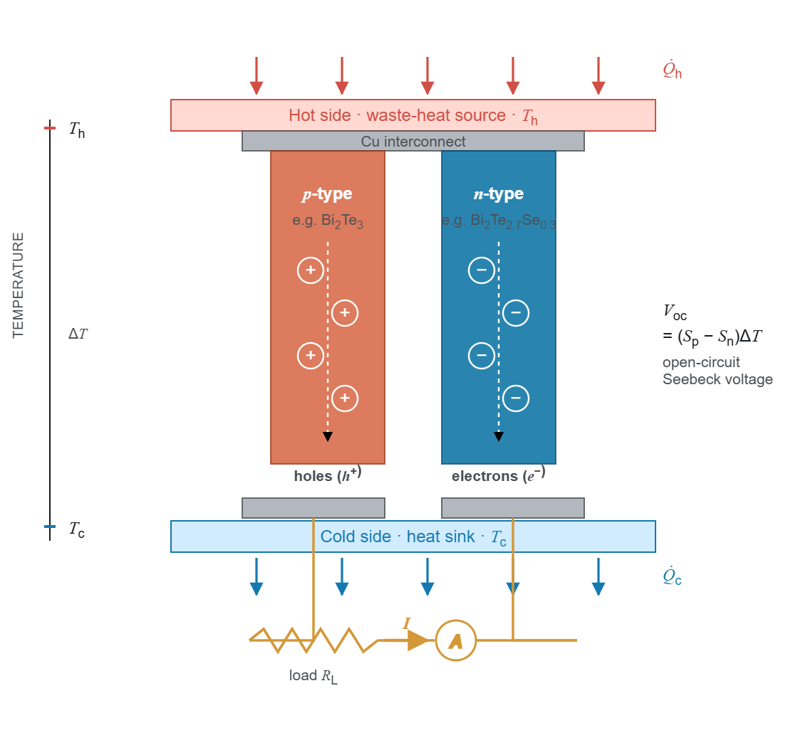{width="4.572916666666667in" height="4.25in"}

**Figure 1:** Schematic of a thermoelectric p--n couple exhibiting charge-carrier diffusion from the hot to the cold side, giving rise to an open-circuit Seebeck voltage.

In Eq. (1), the numerator S^2^*σ* is the power factor (PF), a measure of electrical power output, whereas *κ* comprises an electronic part (*κ*~e~) controlled by charge carriers and a lattice part (*κ*~l~) controlled by phonons. High zT requires S^2^*σ* to be maximized and *κ* minimized simultaneously, which is inherently difficult because these quantities are interrelated through the carrier concentration (Fig. 2) [@snyder2008complex]. As carrier concentration increases, *σ* increases while S decreases, because the average entropy per carrier decreases. In addition, the Wiedemann--Franz law links *κ*~e~ to *σ*:

$\kappa_{e} = L\sigma T$ (3)

where L is the Lorenz number. The only transport parameter that can be reduced relatively independently is *κ*~l~, which has driven research toward materials with complex crystal structures, heavy atoms and large unit cells that scatter phonons efficiently.

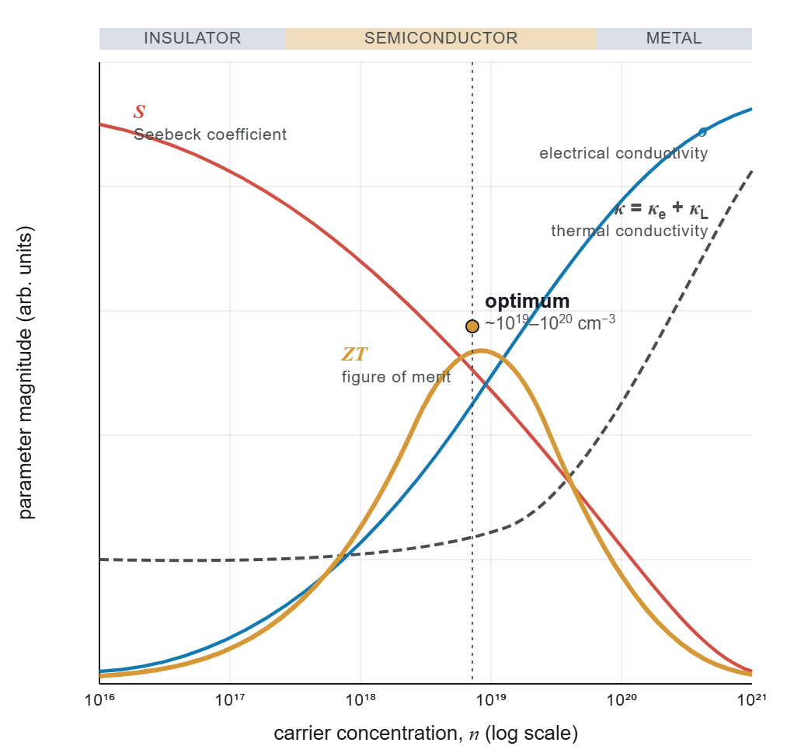{width="4.385416666666667in" height="4.052083333333333in"}

**Figure 2:** Carrier-concentration dependence of the thermoelectric transport properties. The figure of merit (zT) reaches its maximum at an optimum carrier concentration of ≈10^19^--10^20^ cm^−3^.

Several strategies approach the PGEC ideal [@slack1995materials]. Band convergence aligns multiple band extrema to enhance the density-of-states effective mass and hence S without reducing mobility [@pei2011convergence]. Nanostructuring introduces grain boundaries that scatter long-wavelength phonons more effectively than charge carriers, reducing *κ*~l~ while preserving *σ* [@biswas2012performance]. Doping or alloying introduces mass and strain fluctuations that scatter phonons over a range of frequencies. Interest has also grown in materials with intrinsic bond anharmonicity: lone-pair electrons (SnSe, BiCuSeO), rattling cations in oversized cages (skutterudites, clathrates) and soft lattice modes (halide perovskites) produce strong anharmonic phonon--phonon interactions and intrinsically low *κ*~l~ without complex processing [@zhao2014ultralow].

## 2.2 Perovskite thermoelectric materials

In ABX~3~ perovskites, A is a larger cation (e.g. Sr, Ca, Ba, Cs), B a smaller cation (e.g. Ti, Mn, Co, Sn) and X an anion (O, Cl, Br, I, S, Se, Te). The ideal cubic structure (space group *Pm*3̄*m*) consists of corner-sharing BX~6~ octahedra with the A cation in the cuboctahedral void (Fig. 3). Structural stability is conventionally assessed by the Goldschmidt tolerance factor t and the octahedral factor *µ* [@goldschmidt1926die]:

$t = \frac{r_{A} + r_{X}}{\sqrt{2}\left( r_{B} + r_{X} \right)},\quad\quad µ = \frac{r_{B}}{r_{X}}$ (4)

where r~A~, r~B~ and r~X~ are the ionic radii of the A-, B- and X-site ions. The tolerance factor is an imperfect classifier of perovskite formation: Bartel et al. [@bartel2019tolerance] proposed a revised tolerance factor *τ* that accounts for oxidation state and classifies both oxides and halides more accurately than t. While tolerance factors provide useful first-pass estimates, the Materials Project already provides DFT-computed formation energies and energies above the convex hull, which are more reliable stability indicators; this study therefore uses Materials Project stability data directly rather than geometric criteria.

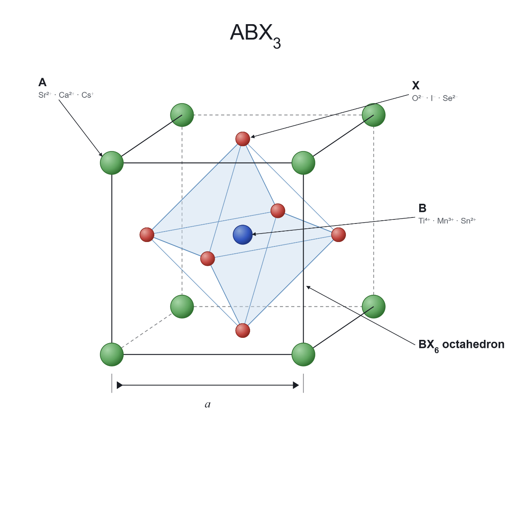{width="3.5729166666666665in" height="3.5729166666666665in"}

**Figure 3:** Ideal cubic perovskite structure (ABX~3~) showing A-site cations (green) at the corners, the B-site cation (blue) at the body centre and X-site anions (red) at the face centres, forming the BX~6~ octahedron.

*Oxide perovskites.* Oxide perovskites have been studied as thermoelectrics owing to their chemical stability at high temperature and the abundance of their constituent elements. Undoped SrTiO~3~ has a large Seebeck coefficient (≈ −700 *µ*V K^−1^ at 300 K) but negligible electrical conductivity and high thermal conductivity (10--12 W m^−1^ K^−1^), giving zT below 0.01. La or Nb doping introduces carriers and reduces both *κ* and S, raising zT substantially [@ohta2005temperature]. CaMnO~3~ exhibits S ≈ −350 *µ*V K^−1^ but zT \< 0.1 because of low *σ* [@flahaut2006effect]; rare-earth substitution on the Ca site (Dy, Y, Nd, Yb) raises the carrier concentration and zT up to ≈0.2. LaCoO~3~ and its Sr-doped derivatives are p-type, with S of 200--600 *µ*V K^−1^ but modest zT [@androulakis2004coo].

*Halide perovskites.* Following their success in photovoltaics, halide perovskites have entered the thermoelectric field. CsSnI~3~ and related all-inorganic halides exhibit lattice thermal conductivity below 0.5 W m^−1^ K^−1^ arising from soft, anharmonic vibrations and cation rattling in the halide cage [@lee2017ultralow; @xie2020all], but experimental validation of high zT has been limited by the instability of tin-based compounds under ambient conditions [@stoumpos2013semiconducting]. In hybrid organic--inorganic perovskites such as MASnI~3~, the rotational freedom of the organic cation further complicates transport and is difficult to encode in compositional feature vectors.

*Chalcogenides.* Chalcogenide perovskites (e.g. BaZrS~3~, BaZrSe~3~) and related ternary chalcogenides are attractive lead-free targets because they combine earth-abundant elements with heavy anions and low thermal conductivity [@sopiha2021chalcogenide].

## 2.3 Computational methods and materials databases

The conventional computational route to thermoelectric properties begins with a DFT band structure from codes such as VASP [@kresse1996efficient] or Quantum ESPRESSO [@giannozzi2009quantum]. Electronic transport coefficients (S, *σ*/*τ*, *κ*~e~/*τ*) are then obtained by solving the BTE within the constant relaxation-time approximation, commonly with BoltzTraP [@madsen2006boltztrap]; because *τ* is assumed constant, absolute *σ* and *κ*~e~ require additional experimental input or separate calculations. Lattice thermal conductivity requires interatomic force constants from supercell calculations and solution of the phonon BTE, e.g. with ShengBTE [@li2014shengbte]. A complete characterization (S, *σ*, *κ*~e~, *κ*~l~ at several temperatures) of one compound can take days to weeks, motivating ML surrogate models.

*Starrydata2* is the largest publicly available database of experimental thermoelectric measurements, assembled by systematic digitization of published figures; each data point is linked to a paper DOI and sample ID [@katsura2019datadriven; @katsura2025starrydata]. Known limitations include digitization uncertainty (typically 2--5%), inter-laboratory variability for the same nominal composition and occasional unlabeled computational data. The *Materials Project* provides DFT-computed crystal structures, formation energies, energies above the convex hull and band gaps for over 150,000 inorganic compounds via a REST API [@jain2013commentary], but transport coefficients are not available for most entries. The ESTM (Experimentally Synthesized Thermoelectric Materials) database curated at the Korea Research Institute of Chemical Technology contains 5,205 experimental observations for 880 unique materials [@na2022public]. ESTM was curated independently of Starrydata2, making it a valuable external validation resource. JARVIS, maintained by NIST, contains BoltzTraP-computed transport properties for thousands of compounds [@choudhary2020joint]; these differ systematically from experiment because of the constant relaxation-time approximation and ideal-crystal assumptions.

## 2.4 Machine learning for thermoelectric property prediction

ML approaches are divided by input representation. Structure-based approaches use atomic coordinates, lattice vectors and site symmetry, e.g. crystal graph neural networks (CGCNN) [@xie2018crystal]. Composition-based methods use only the chemical formula, from which statistical summaries of elemental properties are computed; they are more broadly applicable because they do not require the crystal structure, which is often unknown for hypothetical materials. Tree ensembles (XGBoost, LightGBM, gradient-boosted decision trees) dominate composition-based thermoelectric prediction because they handle tabular features, are robust to missing values and are compatible with SHAP; deep neural networks and transformer-based models (TabPFN) have been used with mixed results. Table 1 summarizes recent studies.

<!-- BEGIN TABLE 1 -->
**Table 1:** Recent ML studies of thermoelectric property prediction: the metric and the validation protocol each reports, as the authors report them. The studies differ in dataset, target, preprocessing and protocol, so the values are not comparable with one another or with the R^2^ of this work. N/R = not reported.

| **Study** | **Model** | **Source** | **Rows** | **Reported metric** | **Validation protocol** |
|--------------|----------|-----------|-----------|-------------------|------------|
| Parse et al. [@parse2024predicting] | XGBoost | Starrydata2 | 18.1K | R^2^ (zT) 0.815 | 5-fold CV |
| Jia et al. [@jia2024dealing] | GBDT | Starrydata2 | 92K | R^2^ (zT) 0.89--0.90 | Composition-level CV |
| Ma & Poon [@ma2025reexamining] | LightGBM | Compiled TE | <!--c:ma2025_rows-->14.1<!--/c-->K | R^2^ (zT) <!--c:ma2025_zT_r2-->0.86<!--/c-->; R^2^ (\|S\|) <!--c:ma2025_S_r2-->0.8<!--/c--> | Not stated |
| Sun et al. [@sun2025rationally] | DNN | Starrydata2 | N/R | R^2^ (zT) 0.90 (test) | Train/test split |
| Barua et al. [@barua2025thermoelectric] | XGBoost | Starrydata2 | ∼160K | R^2^ (zT) 0.67--0.80 | Three external test sets |
| Wang et al. [@wang2025highperformance] | Stacking | Mixed | 5.2K | R^2^ (zT) 0.97 | 10-fold CV |
| Elavunkel & Padhan [@elavunkel2025unlocking] | Stacking | Half-Heusler | small | R^2^ (S) 0.99; R^2^ (zT) 0.92 | Random split |
<!-- END TABLE 1 -->

Parse et al. [@parse2024predicting] trained XGBoost on 18,126 cleaned Starrydata2 instances covering 2,761 compounds (R^2^ = 0.815, 5-fold CV). Jia et al. [@jia2024dealing] introduced composition-based cross-validation, excluding individual compositions rather than random rows, and obtained R^2^ of 0.89--0.90 for zT on 92,000 entries; this is stricter than standard K-fold but less strict than system-level grouping, because members of the same chemical family (e.g. different doping levels of Bi~2~Te~3~) can still appear in both sets. Sun et al. [@sun2025rationally] combined MAGPIE and CBFV features, selected with Pearson correlation and LassoCV, in deep neural networks (R^2^ = 0.95 on the training set and 0.90 on the test set), the dual-featurizer approach used here. Ma and Poon [@ma2025reexamining] added pair-interaction descriptors (Miedema mixing enthalpy) and dopant properties, reporting modest improvements. Barua et al. [@barua2025thermoelectric] trained XGBoost on ≈160,000 data points and reported R^2^ between 0.67 and 0.80 on three test sets. Stacking ensembles on small, domain-restricted datasets [@wang2025highperformance; @elavunkel2025unlocking] reported R^2^ of 0.92--0.99, under row-level validation (10-fold CV in [@wang2025highperformance]), which inflates R^2^ relative to chemistry-aware splitting of larger and more diverse data.

MAGPIE [@ward2016general] computes six statistics (minimum, maximum, range, mean, average deviation, mode) of <!--c:ward2016_props-->22<!--/c--> elemental properties, yielding <!--v:n_magpie-->132<!--/v--> features per composition. CBFV extends this with the Oliynyk elemental property set [@oliynyk2016highthroughput], including polarizability, Gordy and Mulliken electronegativities, Miracle radius, metallic valence and heat of atomization. Physics-informed descriptors such as mass variance (phonon scattering by mass disorder) [@tamura1983isotope], tolerance factors [@goldschmidt1926die; @bartel2019tolerance] and Miedema mixing enthalpy [@ma2025reexamining] have also been explored.

## 2.5 Validation strategies and data leakage

Random train--test splitting and K-fold cross-validation assume independent and identically distributed (i.i.d.) samples; when this holds, K-fold CV provides a nearly unbiased estimate of generalization error [@hastie2009elements]. Data leakage from improper validation is now recognized as a widespread cause of over-optimistic results across ML-based science [@kapoor2023leakage]. Thermoelectric datasets violate the i.i.d. assumption because a material such as Bi~0.5~Sb~1.5~Te~3~ may appear at <!--v:bins-->21<!--/v--> temperatures (<!--v:t_min-->300<!--/v-->, <!--v:t_second-->325<!--/v-->, . . . , <!--v:t_max-->800<!--/v--> K); under random splitting the test prediction becomes interpolation along a known temperature curve rather than extrapolation to new chemistry. Roberts et al. [@roberts2017cross] showed that grouped or blocked CV, which withholds entire groups of correlated observations, is needed for unbiased estimates with structured data. In materials informatics, Meredig et al. [@meredig2018machine] introduced leave-one-cluster-out CV, Xiong et al. [@xiong2020evaluating] showed that standard K-fold overstates the ability to extrapolate, and Li et al. [@li2023critical] demonstrated systematic degradation of materials ML models under distribution shift. chemistry-cluster CV assigns all measurements of one group exclusively to training or test. The grouping can be defined at the level of compositions (as in [@jia2024dealing]), element sets (e.g. Bi--Sb--Te), chemistry clusters (Section 3.5) or broader families; stricter grouping gives more conservative but more realistic estimates for genuinely new chemistry.

## 2.6 Model interpretability

SHAP (SHapley Additive exPlanations) attributes each prediction to features using Shapley values from cooperative game theory, and TreeExplainer computes exact values in polynomial time for tree ensembles [@lundberg2017unified]. SHAP provides consistent global (mean \|SHAP\|) and local explanations, unlike gain-based importance. LIME fits local linear surrogates around individual predictions [@ribeiro2016why] but does not provide global patterns. In thermoelectrics, interpretability is a tool for scientific validation: if melting temperature dominates predictions of *κ*, this is consistent with known physics (bond strength governs phonon velocity), whereas a dominant but physically irrelevant feature would indicate a spurious correlation.

## 2.7 Research gaps

Five gaps motivate this study. (1) *Validation bias is unquantified at scale*: the only thermoelectric comparison of several splitting strategies we know of uses a small subset [@ho2026physicsinspired], and none uses one model across five strategies on a full database snapshot. (2) *Component properties are rarely reported*: *σ* and *κ* are seldom predicted as independent targets, although knowing what is and is not predictable from composition is essential for reliable screening. (3) *Feature-selection effects are not examined*: correlation filtering, Lasso or mutual-information selection is often applied without checking whether it helps tree models with built-in feature subsampling. (4) *Lead-free perovskite screening with experimentally trained, chemistry-aware-validated models is limited*: existing screens rely on DFT-trained models or random-split validation. (5) *Model architecture is overemphasized*: gains from complex architectures are usually reported on small datasets with random splits. The present study addresses all five gaps.

# 3 Methodology

## 3.1 Research framework

The research follows a four-phase pipeline (Fig. 4): (1) data acquisition and curation from Starrydata2; (2) feature engineering with two complementary compositional featurization schemes; (3) model development with chemistry-aware validation; and (4) virtual screening of lead-free perovskite candidates from the Materials Project. Each phase addresses a particular challenge: noise and inconsistency in experimental databases, translation of formulas into physically meaningful numerical representations, avoidance of temperature-series leakage, and identification of promising lead-free candidates.

[[PENDING: NA11: Figure 4 is redrawn from the final numbers once the screening has been rerun; the original was machine-generated and is not reused]]

**Figure 4:** Research workflow showing the four phases from data acquisition to virtual screening.

## 3.2 Data acquisition and curation

### 3.2.1 Source data

The main data source is Starrydata2 [@katsura2019datadriven; @katsura2025starrydata], which covers bismuth tellurides, lead chalcogenides, skutterudites, half-Heuslers, oxides and silicides, among others. The study uses a single pinned pull of the Starrydata2 export taken on <!--v:snapshot_date-->22 August 2026<!--/v--> (the export is regenerated daily, so an unpinned pull is not reproducible): <!--v:raw_papers-->9,494<!--/v--> publications, <!--v:raw_samples-->55,261<!--/v--> samples and <!--v:raw_curves-->156,101<!--/v--> digitised property curves, held in three files (papers, samples and curves). The raw curves hold <!--v:na5_points_all-->2,679,279<!--/v--> digitised points in total, of which <!--v:na5_points_target-->2,068,554<!--/v--> are points of the four target properties against temperature (<!--v:n_step1-->1,996,047<!--/v--> remain after range filtering). Each data point is a single property reading of one sample at one temperature, so counts of data points reflect measurement volume rather than the number of distinct compositions. Four targets were extracted: S, *σ*, *κ* and zT; where resistivity *ρ* was reported instead of conductivity, it was converted using *σ* = 1/*ρ*. Each formula is also assigned a parent chemical system (the sorted set of its constituent elements, e.g. Bi--Sb--Te for all bismuth antimony telluride variants irrespective of stoichiometry or doping), kept for reference; the grouping used for validation is the chemistry cluster defined in Section 3.5.

### 3.2.2 Data cleaning pipeline

An eleven-step cleaning pipeline converted the raw data into a reliable training set (Fig. 5).

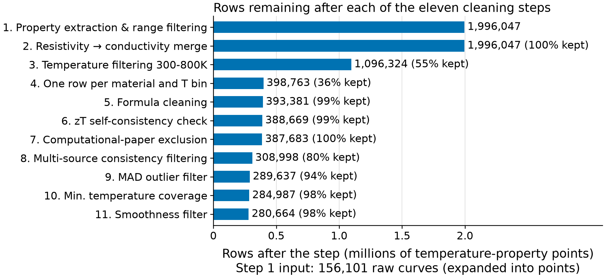{width=100%}

**Figure 5:** Row count through the eleven-step cleaning pipeline, from <!--v:n_step1-->1,996,047<!--/v--> property observations after range filtering to <!--v:n_clean-->280,664<!--/v--> rows in the final cleaned dataset.

*Data preparation (steps 1--5).* Step 1 extracted the four target properties, converted resistivity to conductivity and applied physical-range bounds: <!--v:b_S-->−1000<!--/v--> ≤ S ≤ <!--v:b_S_hi-->1000<!--/v--> *µ*V K^−1^, <!--v:b_sigma_lo-->10<!--/v--> ≤ *σ* ≤ 10^7^ S m^−1^, <!--v:b_kappa_lo-->0.05<!--/v--> ≤ *κ* ≤ <!--v:b_kappa_hi-->25<!--/v--> W m^−1^ K^−1^ and 0 ≤ zT ≤ <!--v:b_zT_hi-->4<!--/v-->, giving <!--v:n_step1-->1,996,047<!--/v--> observations. The Seebeck bound is an empirical cap that excludes gross digitization errors rather than imposing a tight physical limit; the *σ* and *κ* limits correspond approximately to the semiconductor--insulator boundary and to a permissive value below amorphous (Cahill--Pohl) limits [@cahill1992lower], respectively (the Cahill--Pohl limit is material-specific, so the *κ* bound is not itself that minimum); and zT ≤ <!--v:b_zT_hi-->4<!--/v--> admits all physically plausible values [@snyder2008complex]. Step 2 merged curve data with sample metadata. Step 3 restricted temperatures to <!--d:clean_t_min-->300<!--/d-->--<!--d:clean_t_max-->800<!--/d--> K and binned them into <!--d:clean_bin_width-->25<!--/d--> K intervals so that slightly different reported temperatures (e.g. 298, 300 and 303 K) fall in the same bin, leaving <!--v:n_step3-->1,096,324<!--/v--> observations. Step 4 pivoted the data from long format (one row per measurement) to wide format (one row per sample per temperature bin), giving <!--v:n_step4-->398,763<!--/v--> rows, and Step 5 removed formulas that could not be parsed by the pymatgen Composition class [@ong2013python] (<!--v:rem_step5-->5,382<!--/v--> rows, <!--v:remp_step5-->1.3<!--/v-->%).

*Quality filtering (steps 6--8).* Step 6 compared the reported zT with the value recomputed from Eq. (1) for all rows containing the four properties and removed rows whose relative discrepancy exceeded <!--d:clean_zt_tol_pct-->50<!--/d-->%:

$\frac{|{zT}_{rep} - S^{2}\sigma T/\kappa|}{{zT}_{rep}} > 0.5$ (5)

This removed <!--v:rem_step6-->4,712<!--/v--> rows (<!--v:remp_step6-->1.2<!--/v-->%); it changed the mean zT from <!--v:na5_zt6_before-->0.383<!--/v--> to <!--v:na5_zt6_after-->0.387<!--/v-->. This is conservative (some valid individual property measurements may be lost), but guarantees internal consistency of the retained rows. Step 7 removed DFT-computed entries identified by searching paper metadata for keywords such as "DFT", "first principles", "ab initio" and "VASP", because such values differ systematically from experiment owing to the constant relaxation-time assumption; only <!--v:rem_step7-->986<!--/v--> rows (<!--v:remp_step7-->0.3<!--/v-->%) were flagged, confirming that Starrydata2 is predominantly experimental. Step 8, the largest single step, removed <!--v:rem_step8-->78,685<!--/v--> rows (<!--v:remp_step8-->20.3<!--/v-->%): for each (formula, temperature) group with multiple measurements, the coefficient of variation (CV) was computed and groups exceeding property-specific thresholds were removed (<!--d:clean_cv_S-->0.5<!--/d--> for S, *κ* and zT; <!--d:clean_cv_sigma-->0.8<!--/d--> for *σ*, set higher a priori because conductivity varies more between samples); these are starting values fixed before any model was trained, not values tuned on model performance.

*Statistical filtering (steps 9--11).* Step 9 applied a median absolute deviation (MAD) filter, removing values with

$|x - median(x)| > 3.5\, MAD(x)$ (6)

a robust alternative to a rule based on the mean and standard deviation [@leys2013detecting], where x is S, log~10~ *σ* or log~10~ *κ*, and the median and the MAD, MAD(x) = median(|x − median(x)|), are taken over all rows that have a value of that property. The MAD is unscaled (no 1.4826 consistency factor), so the multiplier of <!--d:clean_mad_mult-->3.5<!--/d--> MADs corresponds to about <!--v:mad_sigma-->2.4<!--/v--> standard deviations for normally distributed data; it is a choice of this study (see below), not the multiplier recommended in the cited work. The MAD filter was applied to S, *σ* and *κ* but not to zT, a derived quantity whose plausibility is better judged against the physical bounds of Step 1; it removed <!--v:rem_step9-->19,361<!--/v--> rows (<!--v:remp_step9-->6.3<!--/v-->%). Rows with zT \> 3.0 lie above the maximum reliably reported for bulk thermoelectrics (≈2.6 [@zhao2014ultralow]); <!--v:na4_zt3-->15<!--/v--> of the <!--v:n_zT-->129,419<!--/v--> zT rows (<!--v:na4_zt3_pct-->0.012<!--/v-->%) are affected; they are retained as statistically immaterial. Step 10 removed formulas with fewer than <!--d:clean_min_temps-->3<!--/d--> distinct temperatures, for which consistency cannot be verified (<!--v:rem_step10-->4,650<!--/v--> rows). Step 11 applied a rolling-median smoothness filter (window = <!--d:clean_smooth_window-->3<!--/d-->) to each temperature curve of each sample and property: a point is a spike if it deviates from the centred rolling median by more than <!--d:clean_mad_mult-->3.5<!--/d--> times the median of those absolute deviations along that curve (the same unscaled multiplier as Step 9, applied to the local deviations), setting <!--v:na5_spikes-->25,166<!--/v--> spike values to NaN and removing rows in which all properties became NaN (<!--v:rem_step11-->4,323<!--/v--> rows, <!--v:remp_step11-->1.5<!--/v-->%).

*Analysis choices.* The following settings of the cleaning pipeline are choices of this study, fixed before any model was trained; none was tuned on model performance and none was tested by a sensitivity analysis, so the results are conditional on them. (i) The temperature window of <!--d:clean_t_min-->300<!--/d-->--<!--d:clean_t_max-->800<!--/d--> K restricts the study to near-room-temperature and mid-temperature readings; readings outside it are outside the scope of the prediction and are not used. (ii) The <!--d:clean_bin_width-->25<!--/d--> K bin width groups readings of one sample that were reported at slightly different temperatures into one bin while keeping the shape of the curve; it was not varied. (iii) The <!--d:clean_zt_tol_pct-->50<!--/d-->% tolerance of the zT consistency check is deliberately loose: it removes gross inconsistencies between a reported zT and the value recomputed from the same sample's S, *σ* and *κ*, without discarding rows over the ordinary digitization and measurement uncertainty of the three properties. (iv) Formulas with fewer than <!--d:clean_min_temps-->3<!--/d--> distinct temperatures are removed because the smoothness filter, whose window is <!--d:clean_smooth_window-->3<!--/d-->, cannot judge a curve with fewer points. (v) A window of <!--d:clean_smooth_window-->3<!--/d--> is the smallest odd window that defines a local median; a wider window would also flatten genuine extrema of zT(T). The multiplier <!--d:clean_mad_mult-->3.5<!--/d--> of the two MAD filters (Steps 9 and 11) is likewise a choice.

### 3.2.3 Final dataset

The final cleaned dataset contains <!--v:n_clean-->280,664<!--/v--> rows; featurisation (formulas that fail either featuriser are excluded and logged) leaves <!--v:n_featurized-->280,173<!--/v--> rows covering <!--v:n_formulas-->17,977<!--/v--> unique chemical formulas in <!--v:n_clusters-->8,908<!--/v--> chemistry clusters and <!--v:n_parent-->3,909<!--/v--> parent chemical systems. The four per-target datasets contain <!--v:n_S-->185,064<!--/v--> rows with S, <!--v:n_sigma-->182,755<!--/v--> with *σ*, <!--v:n_kappa-->121,110<!--/v--> with *κ* and <!--v:n_zT-->129,419<!--/v--> with zT (<!--v:cov_S-->66.1<!--/v-->%, <!--v:cov_sigma-->65.2<!--/v-->%, <!--v:cov_kappa-->43.2<!--/v-->% and <!--v:cov_zT-->46.2<!--/v-->% of the featurised rows); they overlap and are not a partition. The mean zT of the retained rows is <!--v:na4_zt_mean-->0.427<!--/v--> (<!--v:na5_zt_final-->0.426<!--/v--> over the <!--v:n_clean-->280,664<!--/v--> cleaned rows, against <!--v:na5_zt6_after-->0.387<!--/v--> after Step 6). The S distribution (Fig. 6a) mixes p-type samples (<!--v:na4_S_p_share-->55.6<!--/v-->% of the S rows) and n-type samples, and the negative values of the latter pull the mean (<!--v:na4_S_mean-->19.1<!--/v--> *µ*V K^−1^) below the median (<!--v:na4_S_median-->50.0<!--/v--> *µ*V K^−1^) (Table 2).

<!-- BEGIN TABLE 2 -->
**Table 2:** Final dataset statistics: the 280,173 featurised rows, per property (coverage is the share of those rows with a value; SD is the sample standard deviation).

| **Property** | **Rows** | **Coverage** | **Mean** | **Median** | **SD** | **Range** |
|---------------|---------|-----------|-----------|-----------|-----------|----------------|
| S (*µ*V K^−1^) | 185,064 | 66.1% | 19.1 | 50.0 | 176.9 | −461 to 562.5 |
| *σ* (S m^−1^) | 182,755 | 65.2% | 83,498 | 45,262 | 129,514 | 959 to 1.66 × 10^6^ |
| *κ* (W m^−1^ K^−1^) | 121,110 | 43.2% | 2.54 | 2.00 | 1.98 | 0.28 to 13.78 |
| zT | 129,419 | 46.2% | 0.427 | 0.316 | 0.388 | 0.000 to 3.899 |
<!-- END TABLE 2 -->

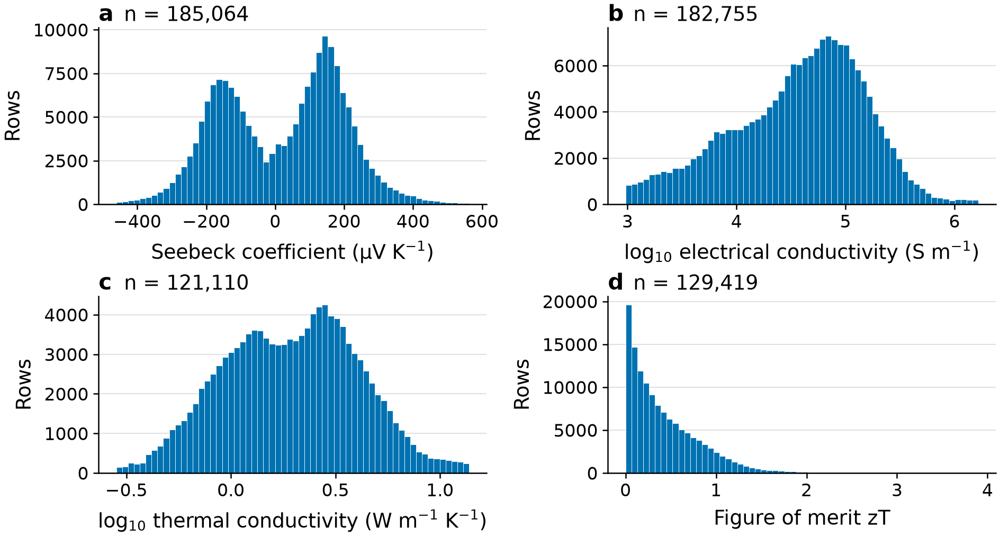{width=100%}

**Figure 6:** Distribution of thermoelectric properties in the final dataset (<!--v:n_featurized-->280,173<!--/v--> featurised rows): (a) Seebeck coefficient, (b) electrical conductivity, (c) thermal conductivity and (d) figure of merit.

## 3.3 Feature engineering

The first feature set was generated with the MAGPIE preset of the matminer library [@ward2016general; @ward2018matminer]: six statistics for each of <!--c:ward2016_props-->22<!--/c--> elemental properties, i.e. <!--v:n_magpie-->132<!--/v--> features computed from the chemical formula alone. The second set was generated with CBFV using the Oliynyk element property set [@oliynyk2016highthroughput], which includes properties not available in MAGPIE (polarizability, Gordy and Mulliken electronegativity, heat of atomization); all <!--v:n_cbfv-->264<!--/v--> CBFV features were retained, without a correlation filter. Temperature (T, K) was added as a direct input feature, giving <!--v:n_magpie-->132<!--/v--> + <!--v:n_cbfv-->264<!--/v--> + 1 = <!--v:n_feat-->397<!--/v--> descriptors in total.

All results use the full <!--v:n_feat-->397<!--/v-->-feature set; no explicit feature selection is applied, because XGBoost subsamples columns at every tree. A descriptor ablation with the hyperparameters frozen at their full-feature values (so that only the descriptor set changes) shows how little each block adds: restricting the descriptors to MAGPIE and temperature (<!--v:n_magpie_t-->133<!--/v--> features) lowers the chemistry-cluster R^2^ by only <!--v:abl_delta_S-->0.006<!--/v--> for S, <!--v:abl_delta_sigma-->0.010<!--/v--> for *σ*, <!--v:abl_delta_kappa-->0.006<!--/v--> for *κ* and <!--v:abl_delta_zT-->0.005<!--/v--> for zT, and the CBFV block alone reaches <!--v:abl_zT_cbfv-->0.744<!--/v--> for zT against <!--v:chem_zT-->0.746<!--/v--> for the full set.

<!-- Table 3 (feature-selection experiment) removed: not reproducible, not essential. Renumber the tables after it at the end. -->

## 3.4 Model development

XGBoost [@chen2016xgboost] was selected after comparison with LightGBM [@ke2017lightgbm], random forest [@breiman2001random] and a stacking ensemble (Section 4.1.3) [[PENDING: NA2]]. XGBoost was preferred for its robustness to missing features (*κ* is present in <!--v:cov_kappa-->43.2<!--/v-->% of the featurised rows), feature subsampling, computational efficiency and compatibility with SHAP. The models are scikit-learn [@pedregosa2011scikit]-compatible XGBRegressor objects fitted directly on the features: no imputation or standardisation is applied, since XGBoost handles missing values natively and tree splits are invariant to feature scaling. Four models were trained for S (*µ*V K^−1^), log~10~*σ*, log~10~*κ* and zT; the logarithmic transformation was applied to *σ* and *κ* because they span several orders of magnitude, and every R^2^ is computed in the space the target was trained in.

Hyperparameters were tuned once per target on all rows of that target, by an Optuna search of <!--v:optuna_trials-->20<!--/v--> trials scored by R^2^ under <!--v:inner_folds-->3<!--/v-->-fold chemistry-cluster cross-validation, then frozen and reused unchanged across every validation protocol and experiment, so that differences between conditions reflect the condition and not the tuning (Table 4); the frozen values differ between targets. Because the evaluation folds draw on rows that were also used for tuning, the grouped R^2^ values may be optimistic [@cawley2010overfitting; @varma2006bias]; the size of this optimism is [[PENDING: NA1: nested grouped CV]].

Comparison models (Section 4.1.3). LightGBM [@ke2017lightgbm] is tuned exactly as XGBoost (<!--v:optuna_trials-->20<!--/v--> Optuna trials, <!--v:inner_folds-->3<!--/v-->-fold chemistry-cluster CV on all rows of the target, then frozen). The random forest [@breiman2001random] is not tuned: all four targets use one setting fixed in advance from the software defaults for regression reviewed by Probst et al. [@probst2019hyperparameters] (<!--d:rf_trees-->500<!--/d--> trees, a third of the features per split, a minimum node size of <!--d:rf_leaf-->5<!--/d-->, no depth limit, bootstrap sampling), because a tuned search was too slow for the available compute: the first session ran <!--v:rf_hours-->10.7<!--/v--> h and completed <!--v:rf_trials_done-->15<!--/v--> trials for S, <!--v:rf_complete-->12<!--/v--> scored and <!--v:rf_pruned-->3<!--/v--> pruned, before it was stopped, and the design was changed before any random-forest test-fold result existed. The inner-CV R^2^ of the scored S trials ranged from <!--v:rf_min-->0.306<!--/v--> to <!--v:rf_max-->0.739<!--/v--> (no trial excluded); the one trial with trees of depth <!--v:rf_shallow_depth-->3<!--/v--> was clearly worse (<!--v:rf_shallow-->0.306<!--/v-->), and the <!--v:rf_n_deep-->11<!--/v--> trials with trees of depth <!--d:rf_deep_ge-->15<!--/d--> or more, the region the fixed setting also occupies, ranged from <!--v:rf_deep_min-->0.725<!--/v--> to <!--v:rf_deep_max-->0.739<!--/v-->, a spread of <!--v:rf_deep_range-->0.014<!--/v-->, against <!--v:xgb_inner-->0.797<!--/v--> for the frozen XGBoost model on the same objective. This asymmetry (XGBoost tuned, random forest fixed) favours XGBoost: a forest that tuning would improve is understated, so an XGBoost advantage over the fixed forest is an upper bound on its advantage over a tuned one, and a forest that matches or beats XGBoost stands despite it. The tuning evidence is for S only, and the average tuning gains that Probst et al. report are for classification, so neither shows that regression on composition features is insensitive to tuning.

<!-- BEGIN TABLE 4 -->
**Table 4:** XGBoost hyperparameters: the four frozen sets (each tuned once on all rows of its target, by a 20-trial Optuna search scored with 3-fold chemistry-cluster cross-validation) and the search space.

| **Parameter** | **S** | ***σ*** | ***κ*** | **zT** | **Search range** |
|---------------------|-----------|-----------|-----------|-----------|------------------|
| n_estimators | 500 | 550 | 350 | 500 | 100–600 |
| max_depth | 10 | 10 | 9 | 9 | 3–10 |
| learning_rate | 0.03183 | 0.02669 | 0.05742 | 0.02188 | 0.01–0.3 |
| subsample | 0.8969 | 0.8676 | 0.9052 | 0.6804 | 0.5–1.0 |
| colsample_bytree | 0.5062 | 0.5167 | 0.7082 | 0.6984 | 0.5–1.0 |
| min_child_weight | 4 | 4 | 6 | 4 | 1–10 |
| reg_lambda | 0.6494 | 0.8074 | 0.05444 | 1.713 | 1e-3–10.0 |
| reg_alpha | 8.793 | 6.548 | 3.351 | 0.05033 | 1e-3–10.0 |
<!-- END TABLE 4 -->

The Seebeck regressor is trained on signed S and predicts the sign implicitly, but for compositions far from the training distribution the predicted sign may be unreliable. An XGBoost classifier was therefore trained on the same <!--v:n_feat-->397<!--/v--> features to predict carrier type (p vs n), with the frozen hyperparameters of the Seebeck regressor and the sign of the measured S as label (rows whose measured S is exactly zero are dropped; <!--v:cl_n-->185,056<!--/v--> rows, <!--v:cl_pshare-->55.6<!--/v-->% p-type); its inputs are the same composition descriptors and the temperature bin, no measured property. Whether its sign should replace the regressor's was decided before the screening: on the regressor's own chemistry-cluster folds (the classifier refitted on them, so that both rules are scored on the same partition of the rows), the classifier's sign accuracy is compared with that of the sign of the regressor's out-of-fold prediction, and the classifier is used only if the cluster-bootstrap interval of the paired difference lies above zero. It does: sign accuracy <!--v:cl_sign_clf-->0.949<!--/v--> against <!--v:cl_sign_reg-->0.941<!--/v-->, a difference of <!--v:cl_sign_diff-->0.008<!--/v--> (interval <!--v:cl_sign_diff_lo-->0.004<!--/v-->--<!--v:cl_sign_diff_hi-->0.012<!--/v-->). The gain is small and comes mostly from rows whose measured |S| is below <!--d:signcmp_small_s-->20<!--/d--> *µ*V K^−1^ (<!--v:cl_sign_small_n-->7,307<!--/v--> rows, difference <!--v:cl_sign_small_diff-->0.058<!--/v-->, against <!--v:cl_sign_big_diff-->0.006<!--/v--> for the others). During screening, when the classifier and regressor disagree on the sign, the classifier's prediction is used.

## 3.5 Validation strategy

Chemistry-cluster grouped cross-validation prevents temperature-series and doping-series leakage. Each formula is assigned to a chemistry cluster: elements present below 5 atomic percent are treated as dopants and removed, remaining amounts within 5% of an integer are snapped to that integer, and the formula is reduced; a doped material therefore groups with its parent ((PbTe)~0.97~(SrTe)~0.02~(Na~2~Te)~0.01~ and Pb~0.97~Te both group with PbTe, while Bi~2~Te~2.7~Se~0.3~, where selenium occupies 6.0 atomic percent and is an alloy component, does not group with Bi~2~Te~3~). The snapshot contains <!--v:n_clusters-->8,908<!--/v--> chemistry clusters, against <!--v:n_parent-->3,909<!--/v--> parent chemical systems; the two groupings cross-cut each other, and the cluster is the stricter safeguard against near-duplicate dopant variants of one host lattice. Folds are generated by a custom assignment of whole clusters, with the placement of the largest clusters randomised between repeats: <!--v:repeats-->5<!--/v--> repeats of <!--v:outer_folds-->5<!--/v-->-fold CV [@roberts2017cross]. To quantify inflation, five splitting strategies were applied with the same model, hyperparameters and features: (i) <!--v:rand_draws-->20<!--/v--> independent random 80/20 draws, pooled; (ii) 5-fold and (iii) 10-fold CV, all partitioning data at row level; (iv) composition-level CV following Jia et al. [@jia2024dealing], where all temperature points of a given formula are kept in the same fold, preventing intra-formula leakage but allowing related compounds of the same family (e.g. Bi~2~Te~3~ and Bi~0.5~Sb~1.5~Te~3~) on opposite sides of the split; and (v) chemistry-cluster CV, in which no member of a cluster appears in testing if any member appears in training. Performance was quantified by the coefficient of determination and the mean absolute error,

$R^{2} = 1 - \frac{\sum_{i}^{}\left( y_{i} - {y\hat{}}_{i} \right)^{2}}{\sum_{i}^{}\left( y_{i} - y\bar{} \right)^{2}},\quad\quad MAE = \frac{1}{n}\sum_{i}^{}{|y_{i} - {y\hat{}}_{i}|}$ (7)

and the validation inflation was defined as

$\Delta R^{2} = R_{random}^{2} - R_{cluster}^{2}$ (8)

For external validation, the models were refit on 100% of the training data with their frozen hyperparameters and applied once to ESTM [@na2022public]. After restricting to <!--v:t_min-->300<!--/v-->--<!--v:t_max-->800<!--/v--> K, ESTM has <!--v:estm_scope-->4,539<!--/v--> rows. ESTM and Starrydata2 are both digitised from the literature and share source papers: <!--v:estm_dois-->69<!--/v--> ESTM source publications also appear in the training data. The rows are therefore partitioned in two ways that are never pooled: (a) the <!--v:estm_a_drop-->1,416<!--/v--> rows sharing a source DOI with the training data are removed, leaving <!--v:estm_a_n-->3,123<!--/v-->, which tests measurement transfer; (b) the <!--v:estm_b_drop-->3,091<!--/v--> rows whose chemistry cluster appears in the training data are removed, leaving <!--v:estm_b_n-->1,448<!--/v-->, which tests chemistry transfer. Because ESTM extends beyond the property ranges of the training data, results are also reported restricted to rows inside the training range of S, *σ*, *κ* and temperature (<!--v:estm_a_insup_n-->2,709<!--/v--> of <!--v:estm_a_n-->3,123<!--/v--> rows in (a), <!--v:estm_b_insup_n-->1,196<!--/v--> of <!--v:estm_b_n-->1,448<!--/v--> in (b)). Back-transformation of the log-space predictions of *σ* and *κ* uses smearing factors computed from training-side out-of-fold residuals only, so that no external label is used for calibration. The <!--v:estm_scope-->4,539<!--/v--> rows cover <!--v:na9_formulas-->853<!--/v--> distinct formulas, of which <!--v:na9_seen-->343<!--/v--> also occur in the training data (<!--v:na9_clusters_seen-->300<!--/v--> of the <!--v:na9_clusters-->528<!--/v--> chemistry clusters occur in it). As a cross-domain description, the S model is also applied to DFT-computed Seebeck coefficients from the JARVIS dft_3d dataset [@choudhary2020joint]: <!--v:jv_both-->23,218<!--/v--> of its <!--v:jv_total-->93,902<!--/v--> entries carry a Seebeck coefficient for both n-type and p-type doping, each tabulated at <!--c:jarvis_temp-->600<!--/c--> K and a doping of <!--c:jarvis_doping-->10^20^<!--/c--> cm^−3^, calculated from the DFT band structure with BoltzTraP in the constant-relaxation-time approximation (the relaxation time cancels in the Seebeck coefficient). All were featurised as the training data were, with the temperature input set to that temperature, and the Seebeck model was applied to them. The JARVIS values are computed for ideal crystals, so the comparison is not a validation. Because the two JARVIS values of a semiconductor have opposite signs by construction (the sign follows the imposed doping), a JARVIS sign exists only for the <!--v:jv_same-->13,123<!--/v--> entries whose n-type and p-type values have the same sign. The predicted sign is the sign of the predicted S; sign agreement is computed on these entries when the magnitude of the reference, the mean of the absolute n-type and p-type values, is at least <!--d:jarvis_min_ref-->20<!--/d--> *µ*V K^−1^ (<!--v:jv_ref_n-->3,885<!--/v--> entries), and the rank correlation (Spearman) of the absolute predicted S with that reference is computed for every entry. Entries with an optb88vdw gap below <!--d:jarvis_gap_metal-->0.05<!--/d--> eV are treated as metals or semimetals and the others as semiconductors, and the entries are split by whether their chemistry cluster occurs in the training data. Intervals are chemistry-cluster bootstrap percentile intervals (clusters resampled with replacement). Electrical and thermal conductivity and zT are not compared: JARVIS gives conductivity only divided by an unknown relaxation time and no zT.

## 3.6 Virtual screening

The Materials Project API [@jain2013commentary] is queried for compounds with energy above the convex hull E~hull~ ≤ <!--d:scr_ehull-->0.05<!--/d--> eV atom^−1^ (lower values indicate greater thermodynamic stability) and a PBE band-gap window of <!--d:scr_gap_lo-->0.1<!--/d--> to <!--d:scr_gap_hi-->3<!--/d--> eV, then filtered for lead and for radioactive, unstable and toxic elements and reduced to ABX~3~ candidates. Perovskite-type structure is decided by an explicit connectivity test (six-fold B--X coordination with corner-sharing BX~6~ octahedra), not by space group alone, because the same space group is shared by perovskites and non-perovskite ABX~3~ structures (for example the needle-like chain structure of *α*-SrZrS~3~ and the GdFeO~3~-type perovskite *β*-SrZrS~3~ are both *Pnma* [@sopiha2021chalcogenide]). Materials Project band gaps are PBE values, which underestimate experimental gaps [@borlido2019large]; the band-gap criteria are therefore applied as stated, and sensitivity rows in which the gap criteria are widened by a factor of <!--d:scr_factor-->1.5<!--/d--> and the stability limit is raised to <!--d:scr_ehull_sens-->0.1<!--/d--> eV atom^−1^ are reported alongside the counts. The filters are applied in the order stability, band-gap window, exclusion of lead and of radioactive elements, ABX~3~ stoichiometry (anti-perovskites, with the anion on the A site, are set aside), the connectivity test, a final band-gap cap of <!--d:scr_gap_cap-->0.6<!--/d--> eV, and exclusion of Tl, Hg, Cd, As and Be; the counts after each filter are given in Section 4.5. The stability limit, the gap window and the cap are choices, not findings (the gap window has no literature justification, and PBE gaps underestimate measured ones), which is why the sensitivity lists are reported.

For each candidate, MAGPIE and CBFV features are computed and the four models predict S, *σ*, *κ* and zT from 300 to 800 K in 100 K steps; the carrier-type classifier assigns the sign of S (Section 3.4). Each candidate is flagged by whether its chemistry cluster occurs in the training data, and the candidates in seen and unseen clusters are reported separately, because the models are far less reliable outside the training chemistries (Sections 4.1 and 4.2). The screening is framed as hypothesis generation: the candidates are ordered by predicted zT, using the direct prediction because it was more accurate under chemistry-cluster CV than the derived S^2^*σ*T/*κ* route (Section 4.4), but the ordering is a way of listing hypotheses, and no predicted zT is presented as a finding. Which candidates are highlighted was fixed before any prediction was seen: only the shortlist of compounds that are on the convex hull in every stability variant and whose chemistry cluster is in the training data (<!--v:sl_n-->4<!--/v--> candidates), ordered by their maximum predicted zT over the grid, is named in the abstract and the conclusion; all other candidates appear only in the full ranked list with their cluster and stability labels. Every candidate is also labelled by a literature check, made independently of the predictions, for whether it has been studied as a thermoelectric. The four final models were fitted on all rows of their target with the frozen hyperparameters.

## 3.7 Model explainability

SHAP TreeExplainer [@lundberg2017unified] is applied to each model on a fixed random subsample of <!--v:shap_rows-->20,000<!--/v--> rows of each of the <!--v:shap_folds-->25<!--/v--> chemistry-cluster test folds (five repeats of five folds), with the frozen hyperparameters of Paper A; the mean absolute SHAP value of each feature is averaged over the folds, and its SD across folds is shown. Global bar plots (mean \|SHAP\| per feature) are created for the top <!--d:shap_top_n-->15<!--/d--> features per target; the beeswarm plots use a second run that saved the SHAP values of individual rows for the first repeat (the same folds and frozen hyperparameters): <!--v:bs_per_fold-->1,000<!--/v--> seeded test rows per fold, <!--v:bs_rows-->5,000<!--/v--> per model, and show the <!--d:beeswarm_top_n-->10<!--/d--> features with the largest mean \|SHAP\| among those rows. Agreement between the most important features and known thermoelectric physics provides an independent check that the models have learned meaningful relationships rather than spurious correlations.

# 4 Results and discussion

## 4.1 Model performance

### 4.1.1 Chemistry-cluster cross-validation

Table 5 presents the chemistry-cluster results. R^2^ was highest for *κ* (<!--v:chem_kappa-->0.809<!--/v-->), followed by S (<!--v:chem_S-->0.753<!--/v-->), zT (<!--v:chem_zT-->0.746<!--/v-->) and *σ* (<!--v:chem_sigma-->0.702<!--/v-->). This ordering is consistent with the intrinsic predictability of each property from composition: *κ* depends on atomic mass, bond strength and structural complexity, all of which have strong compositional proxies, whereas *σ* depends strongly on carrier concentration, which is set by doping and synthesis conditions rather than by the nominal formula. Fig. 7 shows predicted versus measured values (first repeat): predictions follow the diagonal but are compressed towards the mean, with calibration slopes of <!--v:na8_slope_S-->0.74<!--/v--> (S), <!--v:na8_slope_sigma-->0.68<!--/v--> (*σ*), <!--v:na8_slope_kappa-->0.80<!--/v--> (*κ*) and <!--v:na8_slope_zT-->0.73<!--/v--> (zT), and the top 5% of zT rows (mean measured zT <!--v:na8_zt_top_true-->1.48<!--/v-->) are predicted at <!--v:na8_zt_top_pred-->1.15<!--/v--> on average, consistent with high-performance compositions being rare in the training data.

<!-- BEGIN TABLE 5 -->
**Table 5:** Chemistry-cluster grouped cross-validation results (5 repeats of 5-fold CV; R^2^ is the mean ± standard deviation across repeats of the per-repeat pooled value, and MAE and RMSE are the means of the per-repeat pooled values; the fold-level SD is over all folds). MAE and RMSE are in *µ*V K^−1^ for S and in log~10~ units for *σ* and *κ*.

| **Target** | **R^2^** | **Fold-level SD** | **MAE** | **RMSE** | **Rows** | **Features** |
|------------|-------------|----------|-------|-------|----------|----------|
| S | 0.753 ± 0.005 | 0.032 | 51.5 | 87.9 | 185,064 | 397 |
| log~10~*σ* | 0.702 ± 0.002 | 0.029 | 0.230 | 0.334 | 182,755 | 397 |
| log~10~*κ* | 0.809 ± 0.002 | 0.017 | 0.097 | 0.140 | 121,110 | 397 |
| zT | 0.746 ± 0.005 | 0.042 | 0.126 | 0.196 | 129,419 | 397 |
<!-- END TABLE 5 -->

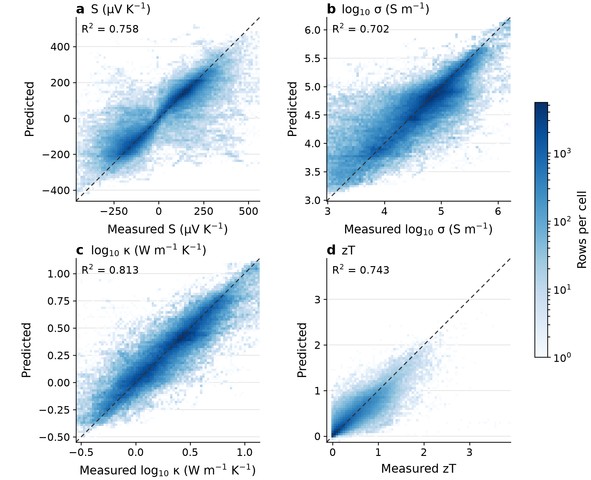{width=100%}

**Figure 7:** Predicted versus measured values under chemistry-cluster cross-validation (first repeat, all five folds pooled) for (a) S, (b) log *σ*, (c) log *κ* and (d) zT; colour is the number of rows per cell. The dashed line indicates perfect prediction.

### 4.1.2 Validation method comparison

Table 6 and Fig. 8 compare the five validation methods. Random split, 5-fold and 10-fold CV give practically identical R^2^ (maximum difference <!--v:spread_max-->0.002<!--/v--> per target), showing that all three leak the same temperature-series information and that increasing the number of folds does not address the leakage. Composition-level CV gives intermediate values (e.g. zT R^2^ = <!--v:comp_zT-->0.818<!--/v-->), and chemistry-cluster CV gives the lowest and most realistic values. This yields a clear hierarchy for zT: random/K-fold (<!--v:rand_zT-->0.918<!--/v-->) \> composition CV (<!--v:comp_zT-->0.818<!--/v-->) \> chemistry-cluster CV (<!--v:chem_zT-->0.746<!--/v-->). The inflation ∆R^2^ (Eq. (8)) ranges from +<!--v:gap_lo-->0.134<!--/v--> for *κ* to +<!--v:gap_hi-->0.213<!--/v--> for *σ*; we attribute the differences between properties to how strongly each depends on doping rather than on composition, which these data do not test directly. Chemistry-cluster CV is the relevant estimate for discovering entirely new chemical families, whereas composition-level CV is appropriate for the doping-optimization use case, i.e. predicting new variants within a known family.

<!-- BEGIN TABLE 6 -->
**Table 6:** R^2^ obtained with five validation methods (same model, frozen hyperparameters and 397 features). Random 80/20 pools 20 independent draws; 5-fold and 10-fold are single partitions; composition and chemistry cluster are the mean ± SD across 5 repeats. ∆R^2^ is random 80/20 minus chemistry cluster.

| **Target** | **Random 80/20** | **5-fold** | **10-fold** | **Composition** | **Chemistry cluster** | **∆R^2^** |
|---------|----------|----------|----------|-------------|-------------|----------|
| S | 0.958 | 0.958 | 0.960 | 0.832 ± 0.004 | 0.753 ± 0.005 | +0.205 |
| *σ* | 0.915 | 0.915 | 0.917 | 0.776 ± 0.002 | 0.702 ± 0.002 | +0.213 |
| *κ* | 0.943 | 0.944 | 0.946 | 0.857 ± 0.001 | 0.809 ± 0.002 | +0.134 |
| zT | 0.918 | 0.918 | 0.919 | 0.818 ± 0.001 | 0.746 ± 0.005 | +0.172 |
<!-- END TABLE 6 -->

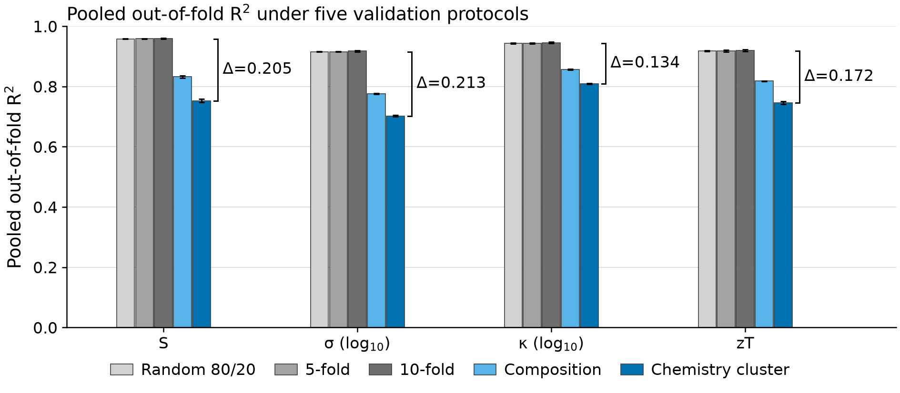{width=100%}

**Figure 8:** Pooled R^2^ across the five validation methods. Chemistry-cluster CV is the lowest for every target; ∆ is random 80/20 minus chemistry cluster. Error bars are the standard deviations defined in Table 6.

### 4.1.3 Algorithm comparison

LightGBM, random forest and a stacking ensemble (XGBoost + LightGBM + random forest with a ridge meta-learner) are compared with XGBoost under chemistry-cluster CV [[PENDING: NA2: Table 7 and the statement on convergence]]. A complementary check on the information content of the descriptors, independent of the learner, is the descriptor ablation of Section 3.3: moving from MAGPIE alone to the full set raises R^2^ by only <!--v:abl_delta_S-->0.006<!--/v--> (S), <!--v:abl_delta_sigma-->0.010<!--/v--> (*σ*), <!--v:abl_delta_kappa-->0.006<!--/v--> (*κ*) and <!--v:abl_delta_zT-->0.005<!--/v--> (zT).

**Table 7:** Stacking ensemble, LightGBM and random forest versus XGBoost (chemistry-cluster CV R^2^).

[[PENDING: NA2: Table 7]]

### 4.1.4 Carrier-type classification

Under chemistry-cluster CV the carrier-type classifier (<!--v:cl_n-->185,056<!--/v--> rows, <!--v:cl_clusters-->7,810<!--/v--> clusters) reaches an accuracy of <!--v:cl_acc-->0.948<!--/v--> (cluster-bootstrap interval <!--v:cl_acc_lo-->0.939<!--/v-->--<!--v:cl_acc_hi-->0.956<!--/v-->) and a balanced accuracy of <!--v:cl_bacc-->0.948<!--/v-->; for the p class precision is <!--v:cl_prec_p-->0.955<!--/v--> (<!--v:cl_prec_p_lo-->0.940<!--/v-->--<!--v:cl_prec_p_hi-->0.966<!--/v-->) and recall <!--v:cl_rec_p-->0.951<!--/v--> (<!--v:cl_rec_p_lo-->0.938<!--/v-->--<!--v:cl_rec_p_hi-->0.962<!--/v-->), for the n class <!--v:cl_prec_n-->0.940<!--/v--> (<!--v:cl_prec_n_lo-->0.930<!--/v-->--<!--v:cl_prec_n_hi-->0.948<!--/v-->) and <!--v:cl_rec_n-->0.944<!--/v--> (<!--v:cl_rec_n_lo-->0.934<!--/v-->--<!--v:cl_rec_n_hi-->0.954<!--/v-->), and the area under the ROC curve is <!--v:cl_auc-->0.987<!--/v--> (<!--v:cl_auc_lo-->0.985<!--/v-->--<!--v:cl_auc_hi-->0.990<!--/v-->, first repeat only). Summed over the five repeats the confusion matrix is <!--v:cl_tn-->388,028<!--/v--> n-type rows correct and <!--v:cl_fp-->22,832<!--/v--> predicted p; <!--v:cl_fn-->24,978<!--/v--> p-type rows predicted n and <!--v:cl_tp-->489,442<!--/v--> correct. Accuracy is lower for the <!--v:cl_single_n-->59<!--/v--> rows of single-row clusters (<!--v:cl_single_acc-->0.78<!--/v-->) and for clusters of two to nine rows (<!--v:cl_small_acc-->0.92<!--/v-->) than for larger ones. In the screening, the classifier changed the sign of the regressor's S in <!--v:ov_all_k-->579<!--/v--> of the <!--v:ov_all_n-->2,454<!--/v--> candidate-temperature predictions (<!--v:ov_all_share-->24<!--/v-->%; <!--v:ov_all_entries-->142<!--/v--> of the <!--v:ov_all_cands-->409<!--/v--> candidates at one temperature or more) and in <!--v:ov_main_k-->16<!--/v--> of the <!--v:ov_main_n-->180<!--/v--> (<!--v:ov_main_share-->9<!--/v-->%; <!--v:ov_main_entries-->3<!--/v--> candidates) of the main list, none of the shortlist.

## 4.2 External validation

The most stringent test is evaluation on a completely independent dataset. ESTM data (<!--v:estm_scope-->4,539<!--/v--> rows within <!--v:t_min-->300<!--/v-->--<!--v:t_max-->800<!--/v--> K) were not used in model development. Results are summarized in Table 8 and Fig. 9. External scores are lower than the internal chemistry-cluster values for every property, and the loss is larger for chemistries absent from training (stratum b) than when only rows sharing a source publication with training are removed (stratum a). Thermal conductivity transfers best: its R^2^ is <!--v:estm_b_kappa-->0.618<!--/v--> in stratum (b) (<!--v:estm_b_drop_kappa-->−0.191<!--/v--> from the internal value) and <!--v:estm_a_kappa-->0.689<!--/v--> in stratum (a) (<!--v:estm_a_drop_kappa-->−0.120<!--/v-->). For zT the R^2^ is <!--v:estm_b_zT-->0.498<!--/v--> in stratum (b) (<!--v:estm_b_drop_zT-->−0.247<!--/v-->) and <!--v:estm_a_zT-->0.662<!--/v--> in stratum (a) (<!--v:estm_a_drop_zT-->−0.084<!--/v-->), so zT retains genuine predictive power for new chemistry, but well below its internal value. The largest decrease is for *σ* (<!--v:estm_b_drop_sigma-->−0.427<!--/v--> in stratum b; R^2^ = <!--v:estm_b_sigma-->0.275<!--/v-->): ESTM extends beyond the conductivity range of the training data, and restricting stratum (b) to rows inside the training range of S, *σ*, *κ* and temperature (<!--v:estm_b_insup_n-->1,196<!--/v--> of <!--v:estm_b_n-->1,448<!--/v--> rows; <!--v:estm_b_ood-->17<!--/v-->% lie outside it) raises it to <!--v:estm_b_insup_sigma-->0.408<!--/v-->, reinforcing the limitation of composition-only models for carrier-concentration-dependent properties.

<!-- BEGIN TABLE 8 -->
**Table 8:** ESTM external validation (R^2^). The 4,539 ESTM rows within 300--800 K are scored in two strata that are never pooled: rows sharing no source DOI with the training data (a, n = 3,123) and rows whose chemistry cluster is absent from training (b, n = 1,448). The in-support column restricts (b) to rows inside the training range of S, *σ*, *κ* and temperature (n = 1,196). The drop is stratum (b) minus the internal chemistry-cluster value.

| **Target** | **Internal (chemistry cluster)** | **ESTM (a) DOI-disjoint** | **ESTM (b) cluster-disjoint** | **(b), in-support** | **Drop (b)** |
|---------|-------------|-------------|-------------|-----------|---------|
| S | 0.753 | 0.566 | 0.354 | 0.512 | −0.399 |
| *σ* | 0.702 | 0.399 | 0.275 | 0.408 | −0.427 |
| *κ* | 0.809 | 0.689 | 0.618 | 0.657 | −0.191 |
| zT (direct) | 0.746 | 0.662 | 0.498 | 0.534 | −0.247 |
<!-- END TABLE 8 -->

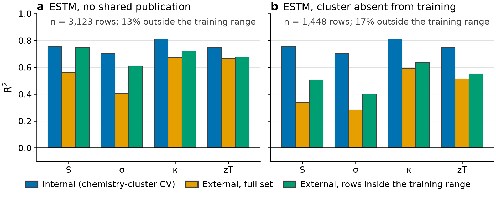{width=100%}

**Figure 9:** ESTM external validation: R^2^ for the internal chemistry-cluster CV (blue), the external full set (orange) and the external rows inside the training range (green), for (a) rows sharing no source publication with the training data and (b) rows whose chemistry cluster is absent from training. The note in each panel gives the number of rows and the share of them outside the training range.

The comparison with the DFT-computed Seebeck coefficients of JARVIS [@choudhary2020joint] shows at most a marginal transfer of the sign and only a weak transfer of the magnitude. The sign test covers mostly metals: of the <!--v:jv_same-->13,123<!--/v--> entries with a JARVIS sign, <!--v:jv_same_metal-->12,733<!--/v--> are metals or semimetals and <!--v:jv_same_semi-->390<!--/v--> are semiconductors, and of the <!--v:jv_ref_n-->3,885<!--/v--> entries that remain after the magnitude criterion <!--v:jv_ref_metal-->3,534<!--/v--> (<!--v:jv_metal_share_ref-->91<!--/v-->%) are metals or semimetals. Of the <!--v:jv_semi-->9,762<!--/v--> semiconductors, <!--v:jv_opp_semi-->9,372<!--/v--> have opposite n-type and p-type signs and therefore no sign to compare. Sign agreement is at chance overall (<!--v:jv_sign_all-->0.50<!--/v-->, interval <!--v:jv_sign_all_lo-->0.49<!--/v-->--<!--v:jv_sign_all_hi-->0.52<!--/v-->, <!--v:jv_sign_all_n-->3,885<!--/v--> entries), for metals and semimetals (<!--v:jv_sign_metal-->0.50<!--/v-->, <!--v:jv_sign_metal_lo-->0.48<!--/v-->--<!--v:jv_sign_metal_hi-->0.52<!--/v-->) and for semiconductors (<!--v:jv_sign_semi-->0.52<!--/v-->, <!--v:jv_sign_semi_lo-->0.47<!--/v-->--<!--v:jv_sign_semi_hi-->0.58<!--/v-->, only <!--v:jv_sign_semi_n-->351<!--/v--> entries). The model predicts p-type for <!--v:jv_pred_pos-->63<!--/v-->% of these entries and JARVIS has <!--v:jv_jarvis_pos-->53<!--/v-->% positive. With the carrier-type classifier's sign, which the screening uses, the agreement is <!--v:jvc_all-->0.52<!--/v--> (<!--v:jvc_all_lo-->0.50<!--/v-->--<!--v:jvc_all_hi-->0.54<!--/v-->) overall and <!--v:jvc_semi-->0.57<!--/v--> (<!--v:jvc_semi_lo-->0.51<!--/v-->--<!--v:jvc_semi_hi-->0.62<!--/v-->) for the semiconductors: marginally above chance, and clearly so only for metals in clusters seen in training (<!--v:jvc_mseen-->0.67<!--/v-->, <!--v:jvc_mseen_lo-->0.59<!--/v-->--<!--v:jvc_mseen_hi-->0.74<!--/v-->), against <!--v:jvc_munseen-->0.51<!--/v--> for unseen clusters. The rank correlation of the absolute predicted S with the JARVIS magnitude is <!--v:jv_rho_all-->0.23<!--/v--> (<!--v:jv_rho_all_lo-->0.21<!--/v-->--<!--v:jv_rho_all_hi-->0.24<!--/v-->) over all entries, <!--v:jv_rho_metal-->0.11<!--/v--> (<!--v:jv_rho_metal_lo-->0.09<!--/v-->--<!--v:jv_rho_metal_hi-->0.13<!--/v-->) for metals and semimetals and negative for semiconductors (<!--v:jv_rho_semi-->-0.08<!--/v-->, <!--v:jv_rho_semi_lo-->-0.11<!--/v-->--<!--v:jv_rho_semi_hi-->-0.05<!--/v-->); the overall value is carried by the metals and by chemistries the model has seen. For entries whose chemistry cluster occurs in the training data it is <!--v:jv_rho_seen-->0.38<!--/v--> (<!--v:jv_rho_seen_lo-->0.25<!--/v-->--<!--v:jv_rho_seen_hi-->0.48<!--/v-->, <!--v:jv_rho_seen_n-->1,150<!--/v--> entries) against <!--v:jv_rho_unseen-->0.22<!--/v--> (<!--v:jv_rho_unseen_lo-->0.20<!--/v-->--<!--v:jv_rho_unseen_hi-->0.24<!--/v-->) for the others; among metals it is <!--v:jv_rho_mseen-->0.31<!--/v--> for seen clusters (<!--v:jv_rho_mseen_n-->627<!--/v--> entries) and <!--v:jv_rho_munseen-->0.10<!--/v--> for unseen ones, and the sign agreement of metals with seen clusters is <!--v:jv_sign_mseen-->0.62<!--/v--> (<!--v:jv_sign_mseen_lo-->0.53<!--/v-->--<!--v:jv_sign_mseen_hi-->0.69<!--/v-->, <!--v:jv_sign_mseen_n-->172<!--/v--> entries) against <!--v:jv_sign_munseen-->0.50<!--/v--> for unseen ones. The models therefore carry essentially no sign information to DFT-computed values for chemistries outside the training data (agreement at chance with the regressor's sign, marginally above it with the classifier's), and a weak magnitude ranking that is largely confined to compositions they have seen. This is a statement about transfer to computed values for ideal crystals at one temperature and one doping level, which differ from measured values of real samples in several ways, not a measure of accuracy on perovskites.

## 4.3 Feature importance and explainability

Table 9 lists the five features with the largest mean \|SHAP\| per target, each with the interval (<!--d:iv_lo-->2.5<!--/d-->th to <!--d:iv_hi-->97.5<!--/d-->th percentile) of its per-fold mean across the <!--v:shap_folds-->25<!--/v--> chemistry-cluster folds and the number of folds in which it is among the three most important features; the folds are five repeats of five grouped folds, so they are not independent, and for most features the intervals are wide. Only orderings that the folds support are interpreted. Temperature is the most important feature of the zT model in all <!--v:rb_zT_n-->25<!--/v--> folds (mean \|SHAP\| <!--v:rb_zT_1_mean-->0.128<!--/v-->, interval <!--v:rb_zT_1_lo-->0.120<!--/v--> to <!--v:rb_zT_1_hi-->0.136<!--/v-->), consistent with the explicit T dependence in Eq. (1); the next two features by the mean, <!--v:shap_zT_2-->Elemental Zunger radii sum, mean abs. deviation (CBFV)<!--/v--> and <!--v:shap_zT_3-->Elemental d valence electrons, mean (MAGPIE)<!--/v-->, are among the top three in <!--v:rb_zT_2_top3-->16<!--/v--> and <!--v:rb_zT_3_top3-->15<!--/v--> folds and their intervals overlap, so their order is not interpreted. All features other than temperature are statistics of ELEMENTAL properties of the elements in the formula, not measured properties of the material. For S, <!--v:rb_S_1_name-->Elemental thermal conductivity, mean abs. deviation (CBFV)<!--/v--> is among the top three in <!--v:rb_S_1_top3-->24<!--/v--> of <!--v:rb_S_n-->25<!--/v--> folds and first in <!--v:rb_S_1_top1-->17<!--/v-->; for *σ*, <!--v:rb_sigma_1_name-->Elemental MB electronegativity, mean abs. deviation (CBFV)<!--/v--> is among the top three in <!--v:rb_sigma_1_top3-->24<!--/v--> folds (first in <!--v:rb_sigma_1_top1-->14<!--/v-->) and temperature in <!--v:rb_sigma_t_top3-->22<!--/v-->; for *κ*, temperature is among the top three in <!--v:rb_kappa_t_top3-->20<!--/v--> folds and among the top five in all <!--v:rb_kappa_n-->25<!--/v-->, whereas the feature that leads on average, <!--v:rb_kappa_1_name-->Elemental heat of vaporization, maximum (CBFV)<!--/v-->, is among the top three in only <!--v:rb_kappa_1_top3-->14<!--/v--> folds and its interval reaches almost zero (<!--v:rb_kappa_1_lo-->0.001<!--/v--> to <!--v:rb_kappa_1_hi-->0.056<!--/v-->). In every model the intervals of the features ranked second to fifth by the mean overlap each other, so their order is not interpreted. Temperature is among the top five features in <!--v:rb_S_t_top5-->15<!--/v--> of <!--v:rb_S_n-->25<!--/v--> folds for S and in all of them for *σ*, *κ* and zT. In the beeswarm plots (Fig. 11) the SHAP value of the temperature feature rises with temperature for zT (Spearman correlation of the feature value with its SHAP value <!--v:bs_rho_zT-->0.95<!--/v-->) and falls with temperature for *κ* (<!--v:bs_rho_kappa-->−0.90<!--/v-->) and *σ* (<!--v:bs_rho_sigma-->−0.79<!--/v-->), and depends only weakly on it for S (<!--v:bs_rho_S-->0.19<!--/v-->). These are attributions of the fitted models, not causal effects, and the physical reading of a descriptor is left to the reader: no mechanism is claimed here. Fig. 10 shows the bar plots with the SD across folds.

<!-- BEGIN TABLE 9 -->
**Table 9:** The five features with the largest mean \|SHAP\| per target (mean over 25 chemistry-cluster test folds, each on 20,000 random test rows), each with the 2.5th to 97.5th percentile of the per-fold mean across the 25 folds and the number of folds in which it is among the three most important features. The folds are five repeats of five grouped folds, so they are not independent. Only orderings the folds support are interpreted: the intervals of ranks two to five overlap in every model, so those ranks are listed by their mean without a ranking claim. Units of the SHAP values are those of the target (*µ*V K^−1^ for S; log~10~ units for *σ* and *κ*). Every feature is a statistic of an ELEMENTAL property of the elements in the formula (or the temperature), not a measured property of the material; the statistic is the atomic-fraction-weighted mean, the weighted mean absolute deviation about it (mean abs. deviation), the range, the minimum or the maximum over the elements, or the mode (the value of the most abundant element), from the MAGPIE or CBFV element tables. The labels come from docs/feature_labels.csv.

| **Rank** | **S** | ***σ*** | ***κ*** | **zT** |
|----|-------------|-------------|-------------|-------------|
| 1 | Elemental thermal conductivity, mean abs. deviation (CBFV) (12.9; 7.9--17.6; top 3 in 24 of 25 folds) | Elemental MB electronegativity, mean abs. deviation (CBFV) (0.069; 0.032--0.098; top 3 in 24 of 25 folds) | Elemental heat of vaporization, maximum (CBFV) (0.032; 0.001--0.056; top 3 in 14 of 25 folds) | Temperature (0.128; 0.120--0.136; top 3 in 25 of 25 folds) |
| 2 | Elemental density, mean abs. deviation (CBFV) (7.4; 3.5--11.2; top 3 in 15 of 25 folds) | Elemental Pauling electronegativity, mean (CBFV) (0.039; 0.002--0.086; top 3 in 14 of 25 folds) | Temperature (0.028; 0.025--0.031; top 3 in 20 of 25 folds) | Elemental Zunger radii sum, mean abs. deviation (CBFV) (0.032; 0.004--0.062; top 3 in 16 of 25 folds) |
| 3 | Elemental Gilmor number of valence electrons, mean abs. deviation (CBFV) (6.4; 2.0--13.8; top 3 in 10 of 25 folds) | Elemental melting temperature, mode (MAGPIE) (0.037; 0.011--0.096; top 3 in 9 of 25 folds) | Elemental melting point, mean (CBFV) (0.021; 0.001--0.060; top 3 in 8 of 25 folds) | Elemental d valence electrons, mean (MAGPIE) (0.027; 0.011--0.057; top 3 in 15 of 25 folds) |
| 4 | Elemental polarizability, mean (CBFV) (5.4; 0.7--16.6; top 3 in 8 of 25 folds) | Temperature (0.035; 0.031--0.040; top 3 in 22 of 25 folds) | Elemental heat of atomization, mean abs. deviation (CBFV) (0.020; 0.003--0.046; top 3 in 12 of 25 folds) | Elemental Mendeleev number, maximum (MAGPIE) (0.012; 0.002--0.048; top 3 in 5 of 25 folds) |
| 5 | Elemental metal flag, mean (CBFV) (5.4; 2.0--9.9; top 3 in 6 of 25 folds) | Elemental Gilmor number of valence electrons, mean abs. deviation (CBFV) (0.023; 0.016--0.032; top 3 in 0 of 25 folds) | Elemental Mendeleev number, maximum (MAGPIE) (0.018; 0.008--0.041; top 3 in 3 of 25 folds) | Elemental Mendeleev number, mean (MAGPIE) (0.011; 0.008--0.017; top 3 in 0 of 25 folds) |
<!-- END TABLE 9 -->

SHAP values are in the units of each target (*µ*V K^−1^ for S; log~10~ units for *σ* and *κ*). Feature labels read "Elemental <property>, <statistic> (MAGPIE or CBFV)": the property is one of the elements, the statistic is taken over the elements of the formula (mean = atomic-fraction-weighted mean, mean abs. deviation = the weighted mean absolute deviation about that mean, range, minimum and maximum over the elements, mode = the value of the most abundant element). For S the top feature, for instance, is the spread of the elemental thermal conductivities of the formula, not the thermal conductivity of the sample.

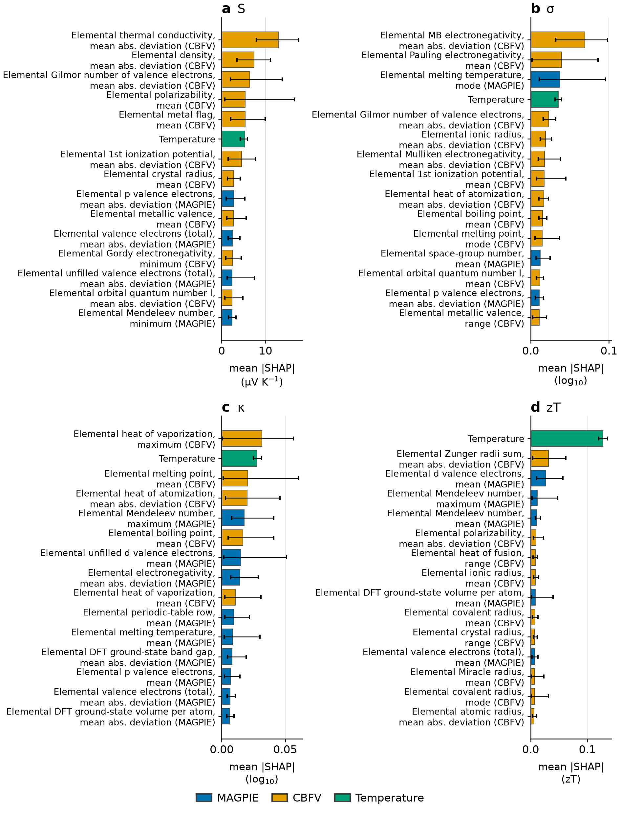{width=100%}

**Figure 10:** SHAP global feature importance (top <!--d:shap_top_n-->15<!--/d--> features, bars: mean over the <!--v:shap_folds-->25<!--/v--> folds; error bars: <!--d:iv_lo-->2.5<!--/d-->th to <!--d:iv_hi-->97.5<!--/d-->th percentile of the per-fold mean across the <!--v:shap_folds-->25<!--/v--> folds, which are five repeats of five grouped folds and not independent; orderings below the first few features are not supported where intervals overlap) for (a) S (*µ*V K^−1^), (b) *σ* (log~10~ units), (c) *κ* (log~10~ units) and (d) zT. Every feature other than temperature is a statistic of an ELEMENTAL property of the elements in the formula (the label names the property, the statistic and the element table, MAGPIE or CBFV), not a measured property of the material: the top feature of the S model, for example, is the spread of the elemental thermal conductivities, not the sample's thermal conductivity.

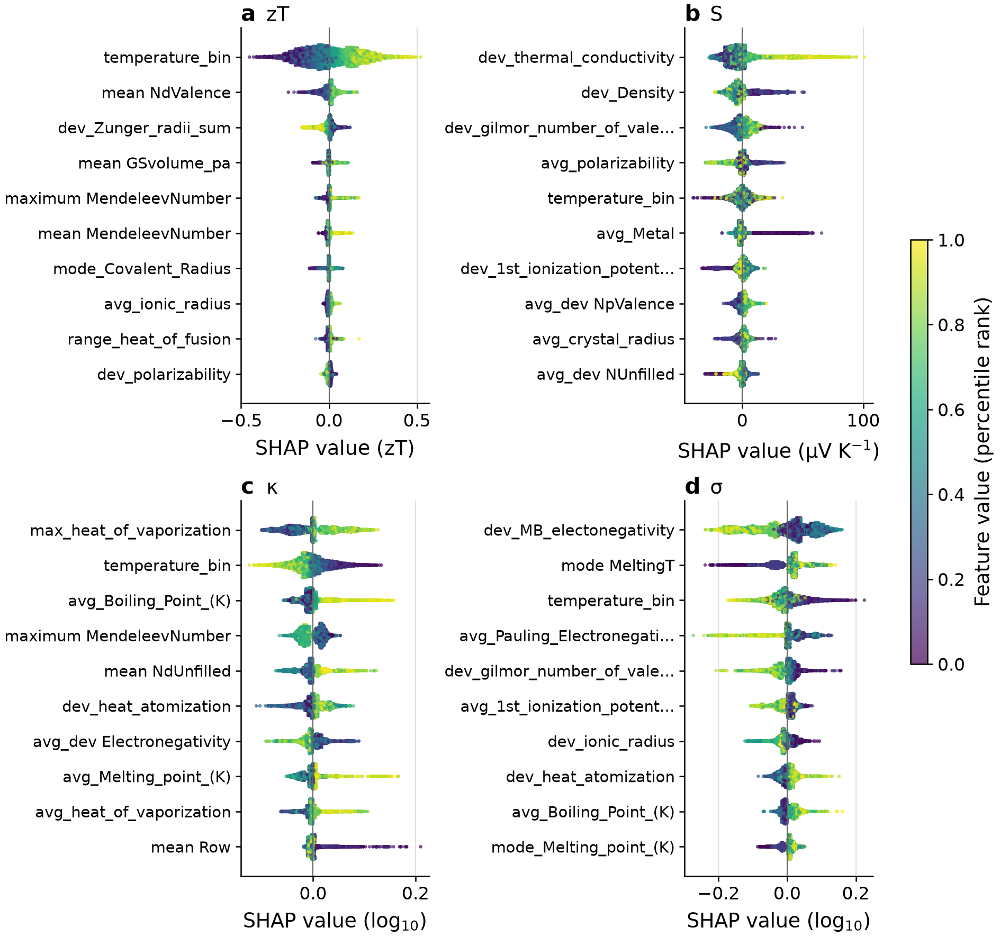{width=100%}

**Figure 11:** SHAP beeswarm plots for (a) S, (b) *σ*, (c) *κ* and (d) zT: one point per test row (<!--v:bs_rows-->5,000<!--/v--> per model, first repeat of the chemistry-cluster folds), coloured by the percentile rank of the row's value of the feature; the features are the ones with the largest mean \|SHAP\| among these rows, so their order can differ from Fig. 10, which averages all folds of all repeats. Every feature other than temperature is a statistic of an ELEMENTAL property of the elements in the formula, not a measured property of the material (for S, the top feature is the spread of the elemental thermal conductivities, not the sample's thermal conductivity).

The two featurization schemes contribute differently to the targets (Fig. 12). In the zT model, temperature accounts for <!--v:shap_share_temperature-->20<!--/v-->% of the mean \|SHAP\|, CBFV features for <!--v:shap_share_cbfv-->53<!--/v-->% and MAGPIE features for <!--v:shap_share_magpie-->28<!--/v-->% (shares over all <!--v:n_feat-->397<!--/v--> features, chemistry-cluster folds). In the other models temperature accounts for <!--v:shap_share_S_temperature-->2<!--/v-->% (S), <!--v:shap_share_sigma_temperature-->4<!--/v-->% (*σ*) and <!--v:shap_share_kappa_temperature-->5<!--/v-->% (*κ*), CBFV features for <!--v:shap_share_S_cbfv-->69<!--/v-->%, <!--v:shap_share_sigma_cbfv-->68<!--/v-->% and <!--v:shap_share_kappa_cbfv-->60<!--/v-->%, and MAGPIE features for <!--v:shap_share_S_magpie-->29<!--/v-->%, <!--v:shap_share_sigma_magpie-->28<!--/v-->% and <!--v:shap_share_kappa_magpie-->35<!--/v-->%. CBFV features carry the largest share of every model (<!--v:shap_cbfv_min-->53<!--/v--> to <!--v:shap_cbfv_max-->69<!--/v-->%), but they are also the more numerous (<!--v:shap_n_cbfv-->264<!--/v--> against <!--v:shap_n_magpie-->132<!--/v--> MAGPIE features): per feature, the mean share of a CBFV feature is <!--v:shap_ratio_min-->0.85<!--/v--> to <!--v:shap_ratio_max-->1.22<!--/v--> times that of a MAGPIE feature, so neither scheme is more informative per feature. Both carry a substantial share of every model; this attribution does not show whether either could be dropped.

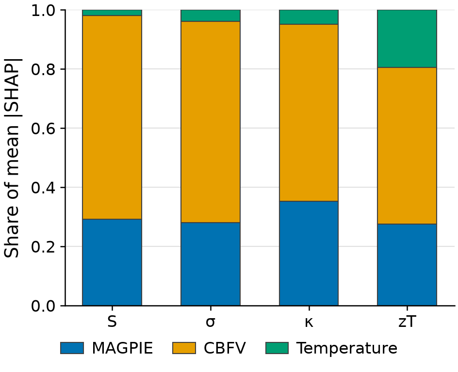{width=100%}

**Figure 12:** Relative contribution of MAGPIE, CBFV and temperature features (share of mean \|SHAP\| over all features) to each model.

## 4.4 Direct versus component-wise zT prediction

Direct zT prediction was compared with the component-wise derivation S^2^*σ*T/*κ* under chemistry-cluster CV (Table 10). Direct prediction is more accurate (R^2^ = <!--v:dvd_direct-->0.727<!--/v--> vs <!--v:dvd_derived-->0.540<!--/v-->), with each model using its own target's frozen hyperparameters. The derived pathway suffers from error propagation; to first order, the relative error of the derived zT is

$\frac{\delta zT}{zT} \approx \sqrt{\left( 2\frac{\delta S}{S} \right)^{2} + \left( \frac{\delta\sigma}{\sigma} \right)^{2} + \left( \frac{\delta\kappa}{\kappa} \right)^{2}}$ (9)

so the quadratic dependence on S doubles its relative error, and the weakest component model (*σ*, R^2^ = <!--v:dvd_sigma-->0.692<!--/v-->, against <!--v:dvd_S-->0.820<!--/v--> for S and <!--v:dvd_kappa-->0.821<!--/v--> for *κ*) adds a large further term. Back-transforming the log-space predictions of *σ* and *κ* with a smearing correction changes the derived R^2^ by <!--v:dvd_duan-->−0.005<!--/v-->, too little to alter the comparison. The individual component models remain useful diagnostically: a material predicted to have high S but low *σ*, for example, may benefit from carrier-concentration optimization through doping. The comparison was repeated under random row-level validation (shuffled 5-fold, five repeats, the same <!--v:dvd_rows-->56,088<!--/v--> rows and the same frozen hyperparameters; Table 10). Direct prediction is again more accurate (R^2^ = <!--v:na7_direct-->0.917<!--/v--> vs <!--v:na7_derived-->0.880<!--/v-->), so the ordering does not depend on grouped validation. The size of the advantage does: the gap between the two pathways is <!--v:na7_gap-->0.036<!--/v--> under random validation and <!--v:na7_grouped_gap-->0.186<!--/v--> under chemistry-cluster validation (differences of unrounded R^2^), a factor of <!--v:na7_ratio-->5.1<!--/v-->. Random validation therefore understates how much the derived route loses when it has to generalize to unseen chemistry.

<!-- BEGIN TABLE 10 -->
**Table 10:** Direct versus component-wise zT prediction on the 56,088 rows with all four properties present (4,139 chemistry clusters); each model uses its own target's frozen hyperparameters. Chemistry-cluster CV is 5 repeats x 5 folds of grouped folds; random CV is 5 repeats x 5 folds of shuffled row-level folds; both pool the out-of-fold predictions (n = 280,440).

| **Pathway** | **R^2^ (chemistry-cluster)** | **MAE (chemistry-cluster)** | **R^2^ (random)** | **MAE (random)** |
|------------------------|----------|---------|----------|---------|
| Direct (features → zT) | 0.727 | 0.132 | 0.917 | 0.072 |
| Derived (S^2^*σ*T/*κ*) | 0.540 | 0.166 | 0.880 | 0.083 |
<!-- END TABLE 10 -->

## 4.5 Virtual screening

The screening starts from <!--v:mp_f0-->75,508<!--/v--> Materials Project compounds with E~hull~ ≤ <!--d:scr_ehull-->0.05<!--/d--> eV atom^−1^. <!--v:mp_f1-->26,355<!--/v--> have a PBE gap in the window, <!--v:mp_f2-->24,723<!--/v--> remain after the exclusion of lead and radioactive elements, and <!--v:mp_f3-->806<!--/v--> have ABX~3~ stoichiometry, of which <!--v:mp_anti-->30<!--/v--> are anti-perovskites and are set aside. The connectivity test keeps <!--v:mp_f4-->315<!--/v--> compounds as perovskite-type; a space-group rule alone would have kept <!--v:mp_sg_rule-->281<!--/v-->, <!--v:mp_sg_not_conn-->62<!--/v--> of which fail the connectivity test, while <!--v:mp_conn_not_sg-->118<!--/v--> perovskite-type compounds lie outside the space groups of the rule. <!--v:mp_f5-->32<!--/v--> have a gap of at most <!--d:scr_gap_cap-->0.6<!--/d--> eV, and <!--v:mp_f6-->30<!--/v--> remain after the exclusion of Tl, Hg, Cd, As and Be. Of these <!--v:mp_f6-->30<!--/v--> candidates, <!--v:nv_main_seen-->9<!--/v--> (BaSnO~3~, CaMnO~3~, CsSnI~3~ in two entries, LaCoO~3~, LaNiO~3~, LaRhO~3~ and YCoO~3~ in two entries) lie in chemistry clusters that occur in the training data and <!--v:nv_main_unseen-->21<!--/v--> do not; the two groups are reported separately because the models are validated only where the training data contain the chemistry. Of the <!--v:mp_f6-->30<!--/v--> candidates, <!--v:mp_surv-->12<!--/v--> remain at every tighter stability limit and are on the convex hull. Raising the stability limit to <!--d:scr_ehull_sens-->0.1<!--/d--> eV atom^−1^ keeps all of them and adds <!--v:nv_e10_added-->14<!--/v--> (<!--v:mp_s3_f6-->44<!--/v--> in total, all of the added ones in unseen clusters), widening the cap to <!--d:scr_gap_cap_sens-->0.9<!--/d--> eV adds <!--v:nv_cap_added-->19<!--/v--> (<!--v:nv_cap_added_seen-->4<!--/v--> in seen clusters), both together give <!--v:mp_s4_f6-->73<!--/v-->, and allowing Tl, As and Be adds <!--v:mp_tl-->2<!--/v-->. The list is therefore sensitive to the criteria, which are choices, and every candidate beyond the stable ones depends on them.

<!-- BEGIN TABLE 11 -->
**Table 11:** Ranked list of the 30 lead-free, narrow-gap, perovskite-type candidates of the main list: hypotheses to test, not findings. Within each group (chemistry cluster present in the training data, or absent) the candidates are ordered by the maximum over 300--800 K of the predicted zT, reached at the temperature T; the other columns are the predictions at T (S with the sign of the carrier-type classifier). E~hull~ in eV atom^−1^ (on hull: no energy above the convex hull), E~g~ the PBE gap in eV, *σ* in S m^−1^, *κ* in W m^−1^ K^−1^. † the shortlist of the pre-registered rule (docs/decisions.md). ‡ the maximum lies above the melting point of the compound; see Table 11b. Studied before: a paper whose title or abstract reports a thermoelectric measurement or calculation of the compound was found by a literature check made independently of the predictions (no evidence = none found, not none existing). The features are composition-only, so polymorphs of one compound (separate Materials Project entries) share their predictions.

| **Cluster** | **#** | **Compound (MP id)** | **E~hull~** | **Stability** | **E~g~** | **T (K)** | **S (*µ*V K^−1^)** | ***σ*** | ***κ*** | **zT** | **Studied before** |
|------|---|-----------|------|--------|-----|-----|------|--------|-----|-----|---------|
| seen | 1 | CsSnI~3~ † ‡ (mp-614013) | 0.000 | on hull | 0.45 | 800 | 144 | 9.2 × 10^3^ | 0.62 | 0.58 | yes |
| seen | 2 | CsSnI~3~ ‡ (mp-616378) | 0.012 | metastable | 0.54 | 800 | 144 | 9.2 × 10^3^ | 0.62 | 0.58 | yes |
| seen | 3 | BaSnO~3~ † (mp-3163) | 0.000 | on hull | 0.37 | 800 | −74 | 3.0 × 10^4^ | 6.70 | 0.10 | yes |
| seen | 4 | CaMnO~3~ (mp-19201) | 0.035 | metastable | 0.47 | 800 | −289 | 2.8 × 10^3^ | 3.77 | 0.08 | yes |
| seen | 5 | YCoO~3~ (mp-1273178) | 0.012 | metastable | 0.31 | 800 | 208 | 1.1 × 10^4^ | 2.99 | 0.05 | yes |
| seen | 6 | YCoO~3~ (mp-1288734) | 0.015 | metastable | 0.11 | 800 | 208 | 1.1 × 10^4^ | 2.99 | 0.05 | yes |
| seen | 7 | LaRhO~3~ † (mp-5163) | 0.000 | on hull | 0.60 | 800 | 421 | 3.5 × 10^3^ | 1.81 | 0.05 | yes |
| seen | 8 | LaNiO~3~ (mp-1284950) | 0.021 | metastable | 0.36 | 800 | −12 | 2.7 × 10^4^ | 2.86 | 0.04 | yes |
| seen | 9 | LaCoO~3~ † (mp-1288145) | 0.000 | on hull | 0.28 | 800 | 35 | 3.8 × 10^4^ | 2.58 | 0.04 | yes |
| unseen | 1 | RbGeI~3~ (mp-571458) | 0.013 | metastable | 0.52 | 800 | 100 | 1.8 × 10^4^ | 0.69 | 0.61 | yes |
| unseen | 2 | CsSnBr~3~ (mp-27214) | 0.011 | metastable | 0.60 | 800 | 38 | 1.4 × 10^4^ | 0.67 | 0.57 | yes |
| unseen | 3 | AlSiP~3~ (mp-5168) | 0.007 | metastable | 0.29 | 800 | 165 | 1.3 × 10^4^ | 4.64 | 0.37 | no evidence |
| unseen | 4 | RbEuCl~3~ (mp-1206801) | 0.038 | metastable | 0.45 | 800 | 17 | 3.6 × 10^4^ | 1.33 | 0.35 | no evidence |
| unseen | 5 | SrBiO~3~ (mp-29164) | 0.000 | on hull | 0.31 | 800 | −134 | 6.0 × 10^3^ | 2.19 | 0.21 | no evidence |
| unseen | 6 | KCrF~3~ (mp-1180782) | 0.002 | metastable | 0.16 | 800 | 29 | 2.4 × 10^4^ | 2.19 | 0.21 | no evidence |
| unseen | 7 | EuHfS~3~ (mp-1190059) | 0.000 | on hull | 0.13 | 800 | −68 | 3.1 × 10^4^ | 1.52 | 0.20 | no evidence |
| unseen | 8 | KBiO~3~ (mp-29799) | 0.000 | on hull | 0.49 | 800 | −83 | 1.3 × 10^4^ | 2.02 | 0.17 | no evidence |
| unseen | 9 | EuZrS~3~ (mp-1189927) | 0.000 | on hull | 0.15 | 800 | −136 | 2.4 × 10^4^ | 1.25 | 0.16 | no evidence |
| unseen | 10 | MnBO~3~ (mp-1278986) | 0.032 | metastable | 0.60 | 800 | −55 | 9.5 × 10^3^ | 2.31 | 0.14 | no evidence |
| unseen | 11 | MnBO~3~ (mp-1289597) | 0.020 | metastable | 0.15 | 800 | −55 | 9.5 × 10^3^ | 2.31 | 0.14 | no evidence |
| unseen | 12 | EuHfO~3~ (mp-753781) | 0.000 | on hull | 0.60 | 800 | −131 | 5.1 × 10^4^ | 1.23 | 0.12 | no evidence |
| unseen | 13 | CaVO~3~ (mp-22608) | 0.001 | metastable | 0.43 | 800 | −82 | 8.1 × 10^4^ | 3.11 | 0.11 | no evidence |
| unseen | 14 | CaVO~3~ (mp-1435359) | 0.009 | metastable | 0.26 | 800 | −82 | 8.1 × 10^4^ | 3.11 | 0.11 | no evidence |
| unseen | 15 | LuVO~3~ (mp-2767717) | 0.000 | on hull | 0.26 | 800 | 27 | 2.2 × 10^4^ | 1.23 | 0.08 | no evidence |
| unseen | 16 | EuZrO~3~ (mp-1106293) | 0.000 | on hull | 0.51 | 800 | −169 | 4.6 × 10^4^ | 0.90 | 0.07 | no evidence |
| unseen | 17 | ErNiO~3~ (mp-1189736) | 0.002 | metastable | 0.37 | 800 | −15 | 1.4 × 10^4^ | 1.12 | 0.07 | no evidence |
| unseen | 18 | NiBiO~3~ (mp-25096) | 0.032 | metastable | 0.35 | 800 | 7 | 1.2 × 10^4^ | 1.95 | 0.06 | no evidence |
| unseen | 19 | MnVO~3~ (mp-1106224) | 0.042 | metastable | 0.32 | 800 | −60 | 6.9 × 10^3^ | 3.63 | 0.06 | no evidence |
| unseen | 20 | ErCrO~3~ (mp-19063) | 0.000 | on hull | 0.25 | 800 | 88 | 1.1 × 10^4^ | 2.10 | 0.06 | no evidence |
| unseen | 21 | MnSnO~3~ (mp-691106) | 0.022 | metastable | 0.23 | 800 | −67 | 1.0 × 10^4^ | 3.19 | 0.04 | no evidence |
<!-- END TABLE 11 -->

<!-- BEGIN TABLE 11b -->
**Table 11b:** The 4 shortlist compounds with their thermal limits (sources in the text) and the predictions within them: the highest grid temperature reported, the maximum predicted zT up to it (at the temperature T), and the secondary view, the predicted zT at 600 K with the rank at 600 K next to the primary rank (maximum over the whole grid). Model outputs, not findings.

| **Compound** | **Thermal limit** | **Highest T reported (K)** | **Maximum zT within the limit** | **T (K)** | **zT at 600 K** | **Rank, primary** | **Rank, 600 K** |
|-------------|--------------------|----------|---------|-----|-------|-----|-----|
| CsSnI~3~ | melts at 724 K | 700 | 0.53 | 700 | 0.42 | 1 | 1 |
| BaSnO~3~ | none found at or below 800 K | 800 | 0.10 | 800 | 0.07 | 2 | 2 |
| LaRhO~3~ | decomposes at 1728 K in air (none at or below 800 K) | 800 | 0.05 | 800 | 0.03 | 3 | 3 |
| LaCoO~3~ | none in air; reduced above 773 K in a reducing atmosphere | 800 | 0.04 | 800 | 0.03 | 4 | 4 |
<!-- END TABLE 11b -->

Physics check of the shortlist (added after the predictions had been seen; the rule and its order are unchanged). A predicted value means something only at temperatures where the compound exists. CsSnI~3~ melts at <!--c:cssni3_melt_c-->451<!--/c--> °C (<!--v:cs_limit_K-->724<!--/v--> K) [@gao2022defect; @lin2021inorganic], so its predictions are reported only up to <!--v:cs_grid_max-->700<!--/v--> K, where the maximum is <!--v:cs_zt_limit-->0.53<!--/v--> and not the <!--v:cs_zt_primary-->0.58<!--/v--> at <!--v:cs_primary_T-->800<!--/v--> K, which lies above the melting point (Tables 11 and 11b). The cubic structure of its Materials Project entry is, moreover, the high-temperature phase: the black phase is orthorhombic below <!--c:cssni3_t1-->362<!--/c--> K, tetragonal up to <!--c:cssni3_t2-->440<!--/c--> K and cubic above [@monacelli2023first]. For the other three compounds no melting or decomposition temperature at or below <!--v:t_max-->800<!--/v--> K was found: doped BaSnO~3~ films changed their conductivity by less than <!--c:bso_air_pct-->2<!--/c-->% in air at <!--c:bso_air_c-->530<!--/c--> °C [@lee2017transparent]; LaRhO~3~ decomposes at a calculated <!--c:lro_air_k-->1728<!--/c--> K in air [@jacob1995phase]; LaCoO~3~ is stable in air but is reduced in a reducing atmosphere from about <!--c:lco_red_c-->500<!--/c--> °C [@radovic2008thermal], so its predictions above <!--v:lco_cond_K-->773<!--/v--> K apply to an oxidising atmosphere only. As a secondary view, because the primary maxima lie at the <!--v:mp_tmax_main-->800<!--/v--> K edge of the grid (<!--v:mp_tmax_all_800-->406<!--/v--> of the <!--v:mp_tmax_all-->409<!--/v--> compounds), the shortlist ranked by the predicted zT at <!--d:secondary_t-->600<!--/d--> K is <!--v:lim_order-->CsSnI~3~, BaSnO~3~, LaRhO~3~, LaCoO~3~<!--/v-->, the same order as the primary one (Table 11b). The list is a set of hypotheses for experimental or higher-level computational follow-up, not a result of this paper. Two limits decide how far it can be read. First, the <!--v:nv_main_unseen-->21<!--/v--> candidates in chemistry clusters absent from the training data are the ones for which the chemistry-cluster and ESTM results of Sections 4.1 and 4.2 apply, and those results show a substantial loss of accuracy; the <!--v:nv_main_seen-->9<!--/v--> in seen clusters are closer to the training data. Second, the only transfer test against computed values available here, the comparison with JARVIS (Section 4.2), shows at most marginal sign transfer and a negative rank correlation of the magnitude for semiconductors (<!--v:jv_rho_semi-->-0.08<!--/v-->, interval <!--v:jv_rho_semi_lo-->-0.11<!--/v-->--<!--v:jv_rho_semi_hi-->-0.05<!--/v-->), and the candidates are semiconductors by construction (<!--d:scr_gap_lo-->0.1<!--/d--> eV or more in PBE). The ranking should therefore be read as an ordering produced by a composition-only model, not as an estimate of the performance of any compound. The PBE gap used for the narrow-gap criterion underestimates measured gaps, so the gap criterion is itself uncertain.

Because PBE systematically underestimates band gaps [@borlido2019large], a band-gap criterion applied to PBE values admits compounds whose true gaps may be considerably larger; this should be considered when interpreting the narrow-gap filter. Predicted zT values order the candidates and are model outputs with the uncertainty given below; no predicted zT is presented as a finding of this paper. Perovskites are under-represented in the training data: rows labelled perovskite titanate by the composition-only family rules are <!--v:na4_pt_share-->2.3<!--/v-->% of the S rows, manganites <!--v:na4_mn_share-->2.1<!--/v-->% and cobaltites <!--v:na4_co_share-->4.6<!--/v-->%. The chemistry-cluster MAE of zT is <!--v:mae_zT-->0.126<!--/v-->, so predicted zT should be read with an uncertainty of that order.

### 4.5.1 Literature validation

[[PENDING: NA12: comparison of predictions with published measurements for perovskite oxides at or below 800 K]]

**Table 12:** Literature validation of predicted zT and S against measured values.

[[PENDING: NA12: Table 12]]

## 4.6 Metrics and validation protocols reported in the literature

Table 1 lists the metric and the validation protocol that each published thermoelectric ML study reports. The studies differ in dataset, target, preprocessing and validation protocol, so their values are not comparable with one another or with the R^2^ values of this work, and no ranking is made. What Table 1 shows is the protocol: row-level splits and k-fold CV on one side, composition-level CV [@jia2024dealing] and external test sets [@barua2025thermoelectric] on the other. In this work, the same model, features and frozen hyperparameters give R^2^ values that differ by <!--v:gap_lo-->0.134<!--/v--> to <!--v:gap_hi-->0.213<!--/v--> between random and chemistry-cluster validation (Table 6), and chemistry-cluster values are higher than the external values (Table 8); a metric reported without its protocol therefore cannot be read as a measure of model quality.
## 4.7 Limitations

Prediction of electrical conductivity is intrinsically limited (chemistry-cluster R^2^ = <!--v:chem_sigma-->0.702<!--/v-->; ESTM stratum (b) R^2^ = <!--v:estm_b_sigma-->0.275<!--/v-->) because carrier concentration depends on doping and synthesis conditions not reflected in the formula, a limitation common to all composition-only models. The carrier-type classifier is right for <!--v:cl_acc-->0.948<!--/v--> of the held-out rows under chemistry-cluster CV, so about one row in twenty has a wrong sign even before the shift to a new family of compounds. MAGPIE and CBFV cannot encode the molecular properties of organic cations, so predictions for hybrid organic--inorganic perovskites should not be trusted. In the training data the sparsest temperature bin is the one at <!--v:na4_sparse_bin-->775<!--/v--> K (<!--v:na4_sparse_n-->3,173<!--/v--> zT rows) and the densest the one at <!--v:na4_dense_bin-->450<!--/v--> K (<!--v:na4_dense_n-->9,115<!--/v--> zT rows), so predictions near the top of the window are the least constrained. All <!--v:mp_f6-->30<!--/v--> candidates of the main list, and <!--v:mp_tmax_all_800-->406<!--/v--> of the <!--v:mp_tmax_all-->409<!--/v--> featurised compounds, reach their maximum predicted zT at <!--v:mp_tmax_main-->800<!--/v--> K, the end of the grid and of the training window, so the maximum is a boundary value and not a located peak. The models provide point predictions without calibrated uncertainty; ensemble variance or conformal prediction [@shafer2008tutorial] would make the screening more decision-ready.

# 5 Conclusions

A composition-only machine learning framework was developed to predict S, *σ*, *κ* and zT of thermoelectric materials and to screen lead-free perovskites, using <!--v:n_clean-->280,664<!--/v--> cleaned rows from Starrydata2 and <!--v:n_feat-->397<!--/v--> MAGPIE, CBFV and temperature descriptors. The main conclusions are:

- Validation methodology dominates reported accuracy. Random, 5-fold and 10-fold CV give nearly identical, inflated R^2^ values; chemistry-cluster CV reduces R^2^ by <!--v:gap_lo-->0.134<!--/v--> (*κ*) to <!--v:gap_hi-->0.213<!--/v--> (*σ*). (RQ2)

- Under chemistry-cluster CV, the composition-only ceilings are R^2^ = <!--v:chem_S-->0.753<!--/v--> (S), <!--v:chem_sigma-->0.702<!--/v--> (*σ*), <!--v:chem_kappa-->0.809<!--/v--> (*κ*) and <!--v:chem_zT-->0.746<!--/v--> (zT). Tripling the descriptor set adds at most <!--v:abl_delta_max-->0.010<!--/v--> to R^2^. [[PENDING: NA2: whether XGBoost, LightGBM, random forest and stacking converge, so that the bottleneck is feature information content and not model complexity]] (RQ1)

- External validation on ESTM lowers R^2^ further, most for chemistries absent from training (zT R^2^ = <!--v:estm_b_zT-->0.498<!--/v-->, against <!--v:chem_zT-->0.746<!--/v--> internally and <!--v:estm_a_zT-->0.662<!--/v--> for rows sharing no source publication with training), while *σ* remains poorly predictable (R^2^ = <!--v:estm_b_sigma-->0.275<!--/v--> in stratum b). Against DFT-computed Seebeck coefficients (JARVIS) the Seebeck model shows no sign transfer with the regressor's sign (agreement <!--v:jv_sign_all-->0.50<!--/v-->, chance, on entries that are mostly metals) and a rank correlation of the magnitudes of <!--v:jv_rho_all-->0.23<!--/v--> that is largely confined to chemistries seen in training.

- Direct zT regression (R^2^ = <!--v:dvd_direct-->0.727<!--/v-->) outperforms the component-wise route S^2^*σ*T/*κ* (R^2^ = <!--v:dvd_derived-->0.540<!--/v-->) because component errors compound; component models remain diagnostically useful. (RQ3)

- SHAP analysis of the zT model ranks temperature first; for S, *σ* and *κ* the largest mean \|SHAP\| belongs to a statistic of an elemental property (CBFV; Table 9), not to a measured property of the material, and temperature is ranked second for *κ*.

- The screening of the Materials Project gives <!--v:mp_f4-->315<!--/v--> perovskite-type compounds and <!--v:mp_f6-->30<!--/v--> lead-free narrow-gap candidates, <!--v:nv_main_seen-->9<!--/v--> in chemistry clusters seen in training and <!--v:nv_main_unseen-->21<!--/v--> unseen; it is hypothesis generation, and against DFT-computed Seebeck coefficients the models show at most marginal sign transfer. The pre-registered shortlist (<!--v:sl_1_name-->CsSnI~3~<!--/v-->, <!--v:sl_2_name-->BaSnO~3~<!--/v-->, <!--v:sl_3_name-->LaRhO~3~<!--/v-->, <!--v:sl_4_name-->LaCoO~3~<!--/v-->) consists of compounds with an existing thermoelectric literature, so it recovers known materials; the full ranked list (Table 11) is offered as hypotheses.

Future work should (i) add structural information, e.g. by mapping doped compositions to parent-compound structures (Bi~0.5~Sb~1.5~Te~3~ → Bi~2~Te~3~), or by using crystal graph networks such as CGCNN [@xie2018crystal] and MEGNet [@chen2019graph]; (ii) quantify uncertainty with bootstrap ensembles or conformal prediction [@shafer2008tutorial]; (iii) combine DFT and experimental data through multi-fidelity or transfer learning; (iv) build doping-aware descriptors that separate dopant elements from the host formula [@ma2025reexamining]; (v) close the loop with active learning; and (vi) measure the thermoelectric properties of the candidates of the ranked list for which the literature check found no study (<!--v:lit_main_no-->19<!--/v--> of the <!--v:mp_f6-->30<!--/v--> main-list candidates) to calibrate the framework in the under-represented perovskite region. Composition-based models are useful for triage, but only chemistry-aware validation prevents overstatement of their accuracy.

# CRediT authorship contribution statement

**Muhammad Behzad Gull:** Methodology, Software, Data curation, Formal analysis, Investigation, Visualization, Writing -- original draft. **Kamran Javed:** Supervision, Project, Resources, Writing -- review & editing. **Muhammad Ejaz Khan:** Conceptualization, Supervision, Administration, Methodology, Validation, Writing -- review & editing.

# Declaration of competing interest

The authors declare that they have no known competing financial interests or personal relationships that could have appeared to influence the work reported in this paper.

# Data availability

The Starrydata2 export is regenerated daily, so this study uses one pinned snapshot (pulled <!--v:snapshot_date-->22 August 2026<!--/v-->) archived with its SHA-256 hash; the Materials Project and ESTM data are public.

# Funding

This research did not receive any specific grant from funding agencies in the public, commercial, or not-for-profit sectors.

# Declaration of generative AI and AI-assisted technologies in the writing process

During the preparation of this work the authors used Claude (Anthropic) to restructure the thesis into journal-article format and to improve language. After using this tool, the authors reviewed and edited the content as needed and take full responsibility for the content of the published article. <!-- RED: [Adjust to reflect all AI tools actually used, including any used to create the original Figs. 4 and 5.] -->

# Acknowledgements

The authors thank the developers and maintainers of Starrydata2, the Materials Project, ESTM (KRICT) and JARVIS (NIST) for making their data openly available, and the School of Computing Sciences, Pak-Austria Fachhochschule: Institute of Applied Sciences and Technology, for computational support.

# A Nomenclature and abbreviations

| **Symbol / abbreviation** | **Meaning** |
|---------------------|---------------------------------------------------|
| AI | Artificial intelligence |
| ML | Machine learning |
| DL | Deep learning |
| TE | Thermoelectric |
| DFT | Density functional theory |
| BTE | Boltzmann transport equation |
| PGEC | Phonon-glass electron-crystal |
| XGBoost | Extreme gradient boosting |
| LightGBM | Light gradient boosting machine |
| GBDT | Gradient-boosted decision trees |
| RF | Random forest |
| DNN | Deep neural network |
| CGCNN | Crystal graph convolutional neural network |
| TabPFN | Tabular prior-data fitted network |
| CV | Cross-validation (also coefficient of variation in Step 8) |
| MAGPIE | Materials-Agnostic Platform for Informatics and Exploration |
| CBFV | Composition-based feature vector |
| SHAP | SHapley Additive exPlanations |
| LIME | Local interpretable model-agnostic explanations |
| MAE | Mean absolute error |
| MAD | Median absolute deviation |
| MP | Materials Project |
| ESTM | Experimentally Synthesized Thermoelectric Materials (database) |
| JARVIS | Joint Automated Repository for Various Integrated Simulations |
| VASP | Vienna Ab initio Simulation Package |
| KRICT | Korea Research Institute of Chemical Technology |
| API | Application programming interface |
| REST | Representational state transfer |
| zT | Dimensionless figure of merit |
| S | Seebeck coefficient |
| *σ* | Electrical conductivity |
| *κ*, *κ*~e~, *κ*~l~ | Total, electronic and lattice thermal conductivity |
| PF | Power factor (S^2^*σ*) |
| L | Lorenz number |
| R^2^ | Coefficient of determination |
| T | Absolute temperature |
| E~hull~ | Energy above the convex hull |
| E~g~ | Band gap |
| ABX~3~ | General perovskite stoichiometry |

# References

<!-- TODO: insert Dr. Kamran Javed's institutional e-mail address (author to supply). The supervisor's summary list of flagged issues was removed: every item is a row of reports/claim_inventory.csv. -->
