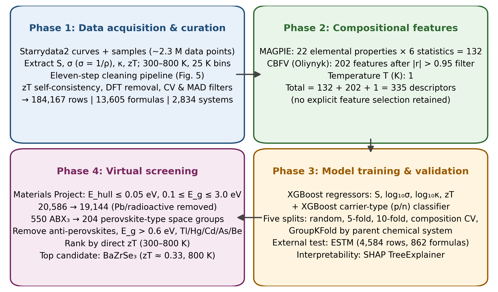
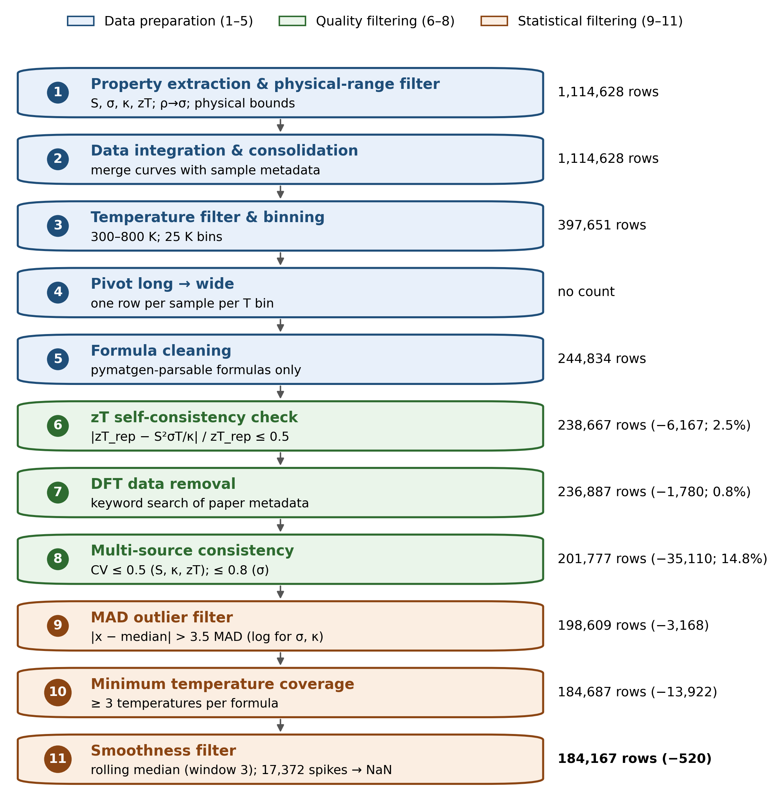
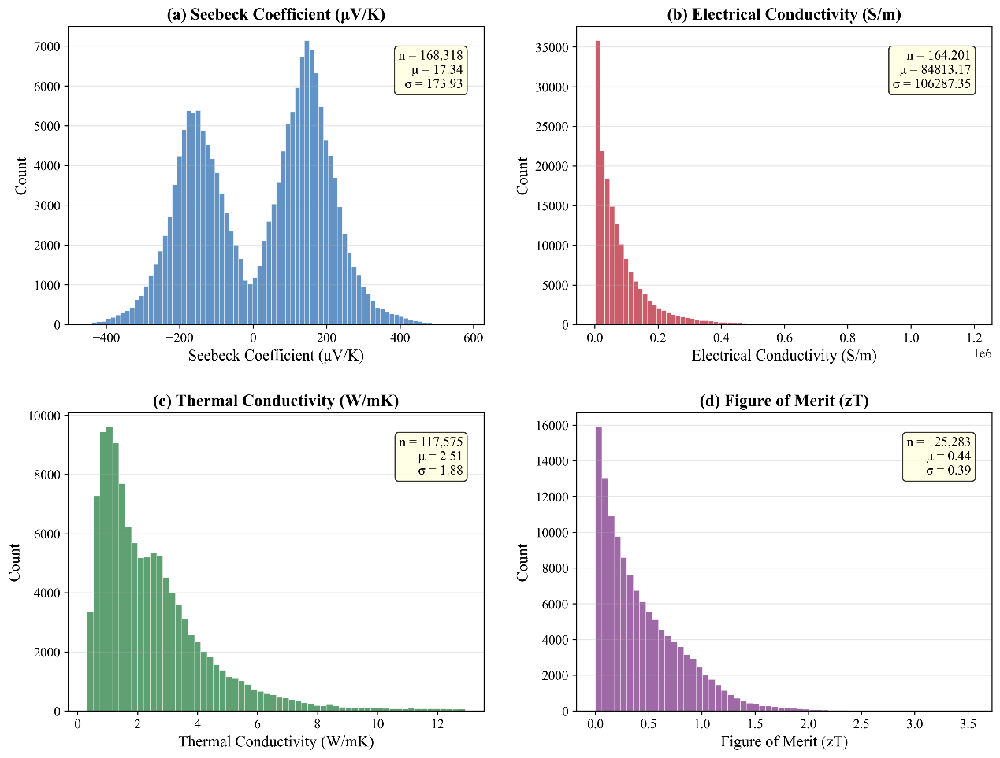
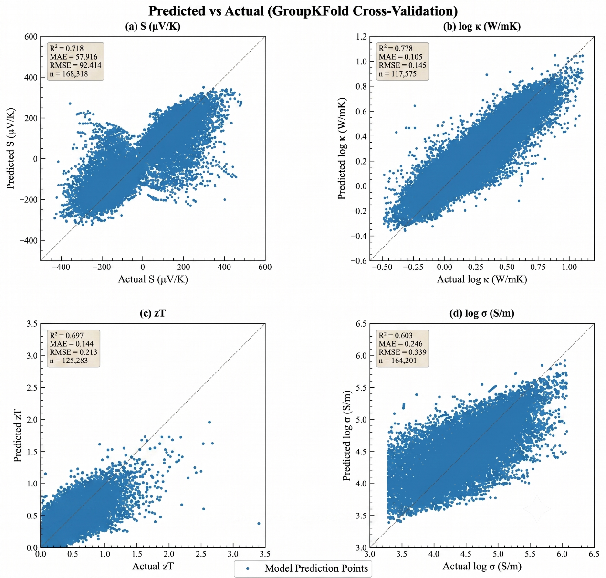
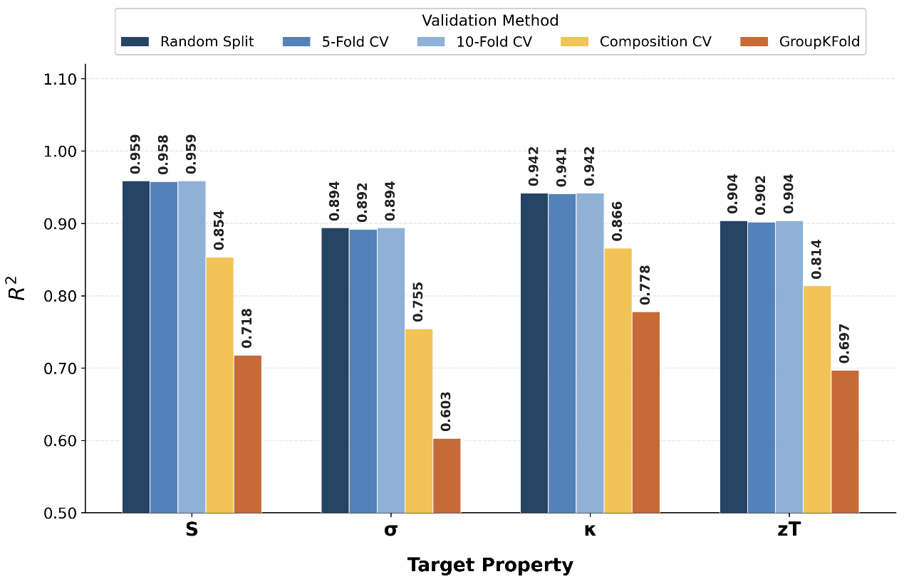
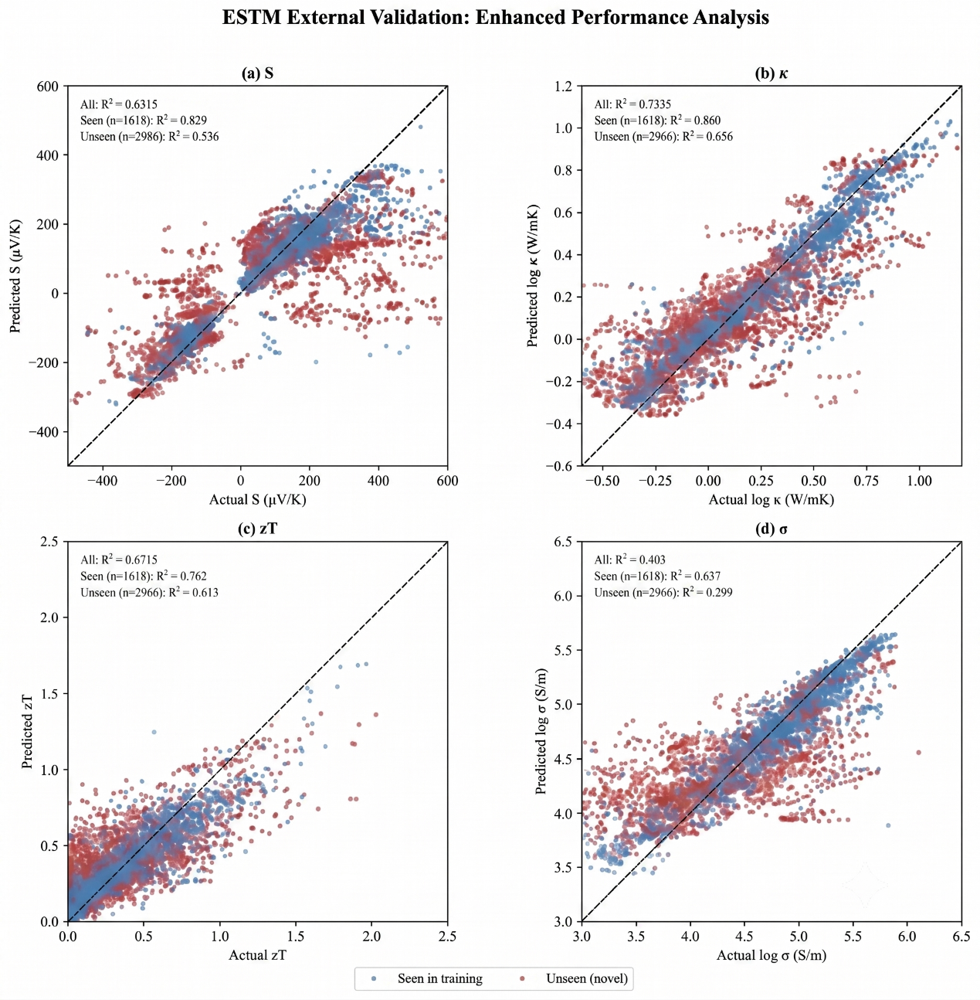
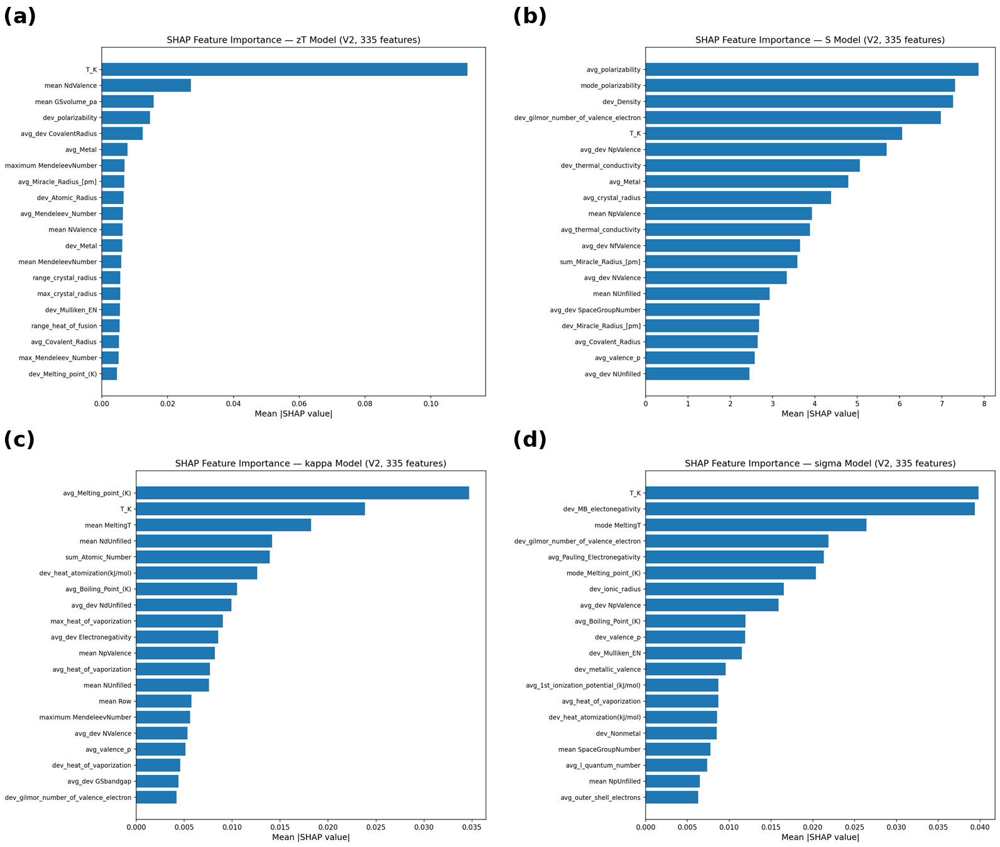
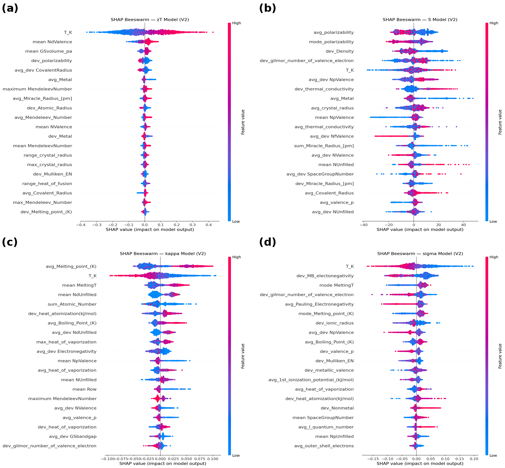
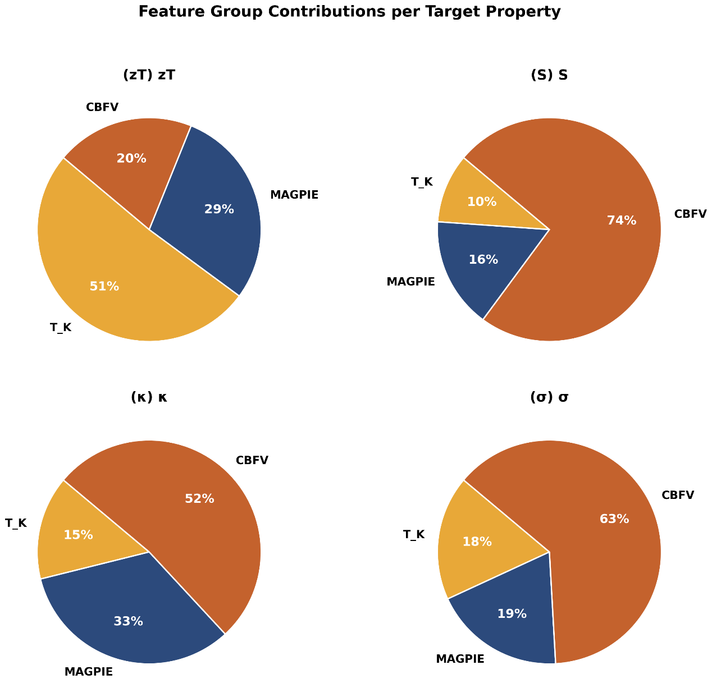

**Machine learning-assisted materials screening and prediction of thermoelectric properties of lead-free perovskite materials**

Muhammad Behzad Gull^a^, Kamran Javed^a^, Muhammad Ejaz Khan^∗a^

*^a^School of Computing Sciences, Pak-Austria Fachhochschule: Institute of Applied Sciences and Technology, Haripur, Khyber Pakhtunkhwa, 22620, Pakistan*

**Abstract**

Machine learning (ML) is increasingly used to search for non-toxic, lead-free thermoelectric materials, but reported accuracies are often inflated because temperature-series measurements and chemically related compounds appear in both training and test sets. Here, gradient-boosted (XGBoost) models were trained on 184,167 curated experimental records from Starrydata2, described by 335 composition-based features (MAGPIE, CBFV and temperature), to predict the Seebeck coefficient (S), electrical conductivity (*σ*), thermal conductivity (*κ*) and figure of merit (zT). Chemistry-grouped cross-validation (GroupKFold by parent chemical system) lowered R^2^ by 0.16--0.29 relative to random splits, giving composition-only ceilings of 0.718, 0.603, 0.778 and 0.697 for S, *σ*, *κ* and zT, respectively. External validation on the independent ESTM database (zT R^2^ = 0.670; 0.613 for unseen formulas) supports a realistic ceiling of ≈0.65--0.70 for zT. Direct zT regression outperformed the component-wise route S^2^*σ*T/*κ* (R^2^ = 0.697 vs 0.460) because component errors compound, and SHAP analysis showed physically consistent drivers: temperature and d-electron count for zT, melting temperature for *κ* and polarisability for S. Screening of the Materials Project with stability (E~hull~ ≤ 0.05 eV), band-gap and space-group filters identified 204 lead-free perovskite-type compounds among 550 nominal ABX~3~ formulas; BaZrSe~3~ emerged as the most credible candidate (predicted zT ≈ 0.33 at 800 K). Composition-based models are therefore useful for triage, but chemistry-aware validation is essential to avoid overstating their accuracy.

**Highlights**

- Chemistry-grouped validation reveals R^2^ inflation of 0.16--0.29 from random splits

- XGBoost trained on 184,167 cleaned Starrydata2 records with 335 descriptors

- Composition-only ceilings under GroupKFold: R^2^ ≈ 0.70 for zT and 0.78 for *κ*

- Independent ESTM test confirms generalisation (zT R^2^ = 0.670)

- Space-group screening finds 204 lead-free perovskites; BaZrSe~3~ ranks top

**Keywords:** Thermoelectric materials ; Machine learning ; Lead-free perovskites ; Validation bias ; Data leakage ; Figure of merit ; XGBoost ; SHAP

<!-- RED: Black text = original thesis material; blue text = text added or rewritten during conversion; red text = technical/consistency issues that must be resolved. Suggested target: Computational Materials Science (Elsevier). -->

^∗^Corresponding author. E-mail address: [muhammad.ejaz@paf-iast.edu.pk](mailto:muhammad.ejaz@paf-iast.edu.pk)

# 1 Introduction

The world's energy situation is challenged both by the rapidly rising demand for energy and the need to reduce carbon emissions for environmental reasons. Waste heat is a crucial, but underutilized, resource in this equation. It has been estimated that approximately 72% of global primary energy consumption is lost after conversion, largely as low-grade heat from combustion engines, industrial furnaces and power plants \[1\]. <!-- RED: [Corrected: the thesis states "some 65%"; Forman et al. report 72% (verified against the abstract).] --> Thermoelectric generators are solid-state devices that need no maintenance. They exploit the Seebeck effect to directly convert temperature gradients into an electrical voltage, thus recovering this lost energy.

The efficiency of thermoelectric conversion is determined by the dimensionless figure of merit (Eq. (1)), where S is the Seebeck coefficient (*µ*V K^−1^), *σ* is the electrical conductivity (S m^−1^), T is the absolute temperature (K), and *κ* is the thermal conductivity (W m^−1^ K^−1^), the sum of electronic (*κ*~e~) and lattice (*κ*~l~) contributions (Eq. (2)):

$zT = \frac{S^{2}\sigma T}{\kappa}$ (1)

$\kappa = \kappa_{e} + \kappa_{l}$ (2)

The fundamental physical challenge is to maximize zT. The problem stems from the coupling of S, *σ* and *κ*~e~ through the carrier concentration and the Wiedemann--Franz law. A material with a high zT should be designed according to the "phonon-glass electron-crystal" (PGEC) concept, which conducts electricity as a crystal but scatters heat like a glass \[2, 3\].

The best thermoelectric materials available today contain toxic lead. Lead telluride (PbTe) and its alloys exhibit zT values as high as ≈2 at optimized compositions \[4\], but their use is increasingly constrained by environmental and regulatory concerns. Bismuth telluride (Bi~2~Te~3~), with zT ≈ 1.0--1.4, dominates near-room-temperature applications \[5\], while silicon--germanium alloys serve high-temperature applications. The push to eliminate Pb has led to research on other material families, with lead-free perovskites being among the most promising candidates \[6\].

Perovskites with general formula ABX~3~ consist of corner-sharing BX~6~ octahedra with A cations in the interstitial voids, and offer considerable octahedral-tilting and chemical flexibility. This structural tunability allows the electronic band structure to be tailored, and many perovskites possess intrinsically low lattice thermal conductivity due to soft, anharmonic lattice vibrations \[7, 8\], a desirable property for thermoelectric applications. <!-- RED: [Issue: the thesis cites Li et al. (Cs~3~Bi~2~Br~9~ phonon coherence) for "band-structure tuning for high power factors"; that paper concerns thermal transport. It has been moved to support the low-*κ* statement; add a proper reference for band-structure tuning if that claim is kept.] -->

Lead-based halide perovskites such as CsPbI~3~ show ultralow thermal conductivity owing to their soft lattices \[7\], but lead toxicity remains a critical bottleneck. Research has thus moved to lead-free alternatives using Sn, Ge or Bi. Sn-based perovskites are unstable due to the facile oxidation of Sn^2+^ to Sn^4+^ \[9\], and other alternatives show lower intrinsic efficiencies. Oxide perovskites including SrTiO~3~, CaMnO~3~ and LaCoO~3~ have been investigated for high-temperature applications, with doped compositions reaching zT of ≈0.2--0.4 \[10\]. <!-- RED: [Issue: Section 2.2 of the thesis quotes zT = 0.18 at 760 K from the same reference (Ohta et al., 2005) while the Introduction quotes 0.2–0.4. Check the paper and use a single, correctly attributed value (temperature included).] --> The chemical space of possible lead-free perovskites is enormous, and pinpointing which compositions are both stable and efficient is still non-trivial.

Density functional theory (DFT) coupled with the Boltzmann transport equation (BTE) provides a rigorous framework to predict thermoelectric properties. However, a full transport calculation for a single complex crystal may require weeks of supercomputer time \[11\], rendering high-throughput screening of thousands of candidates impractical. Machine learning models can learn nonlinear structure--property relationships from existing data and screen thousands of candidates in seconds. Parse et al. \[12\] predicted zT with R^2^ = 0.815, Jia et al. \[13\] achieved R^2^ ≈ 0.90, and Sun et al. \[14\] reported R^2^ \> 0.95 using deep neural networks. <!-- RED: [Sun et al. details unverified; check the paper.] -->

However, existing ML implementations have two major weaknesses. The first is a 'black-box' limitation: models predict zT as a single output but do not disclose the underlying trade-offs among S, *σ* and *κ*, and can yield physically inconsistent property combinations. The second is data leakage: random train--test splits can place temperature-series data from the same material in both training and test sets, producing inflated accuracies that overestimate true generalization \[15, 16\]. To our knowledge, no thermoelectric study has quantified, on the same data and model, how much this leakage inflates reported performance across validation strategies. <!-- RED: [Issue: the thesis repeatedly claims to be "the first". Leakage and grouped validation have been studied in general materials informatics (Meredig 2018; Xiong 2020; Li 2023). Keep "first" claims restricted to thermoelectrics and soften to "to our knowledge".] -->

This study develops a physics-informed machine learning framework for screening lead-free perovskite thermoelectrics, with its central contribution being a rigorous, chemistry-aware quantification of how validation methodology affects reported predictive accuracy. Alongside direct regression of zT, the framework predicts S, *σ* and *κ* individually, so that the two approaches can be compared and the property limiting a candidate's performance can be identified. The study addresses three research questions: (RQ1) what is the realistic prediction ceiling of composition-only descriptors (MAGPIE and CBFV) under chemistry-aware validation; (RQ2) by how much does the validation methodology inflate reported accuracy; and (RQ3) how does component-wise prediction compare with direct regression of zT. These are applied to screen thermodynamically stable lead-free perovskites from the Materials Project. <!-- RED: [Issue: RQ2 in thesis Chapter 1 (Materials Project constraints) differs from RQ2 answered in Chapter 5 (validation inflation). The Chapter 5 version is used here; screening is treated as an application. Keep the RQs consistent.] -->

The main contributions are:

- a reproducible eleven-step curation of Starrydata2 into 184,167 experimental records (13,605 formulas, 2,834 chemical systems);

- a five-way comparison of validation strategies showing that row-level splits inflate R^2^ by +0.163 to +0.288;

- composition-only ceilings for S, *σ*, *κ* and zT confirmed by external validation on the independent ESTM database and by architecture-independence (XGBoost, LightGBM, random forest, stacking);

- a demonstration that direct zT regression outperforms the component-wise route, a conclusion that is only visible under grouped validation;

- a structure-aware screening of lead-free perovskites that separates true perovskite-type structures from ABX~3~ stoichiometric impostors.

The remainder of the paper is organised as follows. Section 2 reviews the background and related work, Section 3 describes the data, features, models and validation protocol, Section 4 presents and discusses the results, and Section 5 concludes.

# 2 Background and related work

## 2.1 Thermoelectric fundamentals

In 1821 Thomas Johann Seebeck discovered that a temperature difference across a junction of two dissimilar conductors creates an electric voltage. The magnitude of this voltage per unit temperature difference is the Seebeck coefficient (S, *µ*V K^−1^). A thermoelectric generator directly converts a temperature gradient into electrical power, without moving parts, using an array of p-type and n-type semiconductor legs connected electrically in series and thermally in parallel (Fig. 1) \[17\]. The reverse phenomenon, the Peltier effect, uses an electric current to transfer heat across a junction, enabling solid-state cooling, and the Thomson effect is the heating or cooling of a current-carrying conductor in a temperature gradient. Together, these three effects form the basis of thermoelectric energy conversion \[18\].

{width="4.572916666666667in" height="4.25in"}

**Figure 1:** Schematic of a thermoelectric p--n couple exhibiting charge-carrier diffusion from the hot to the cold side, giving rise to an open-circuit Seebeck voltage.

In Eq. (1), the numerator S^2^*σ* is the power factor (PF), a measure of electrical power output, whereas *κ* comprises an electronic part (*κ*~e~) controlled by charge carriers and a lattice part (*κ*~l~) controlled by phonons. High zT requires S^2^*σ* to be maximized and *κ* minimized simultaneously, which is inherently difficult because these quantities are interrelated through the carrier concentration (Fig. 2) \[3\]. As carrier concentration increases, *σ* increases while S decreases, because the average entropy per carrier decreases. In addition, the Wiedemann--Franz law links *κ*~e~ to *σ*:

$\kappa_{e} = L\sigma T$ (3)

where L is the Lorenz number. The only transport parameter that can be reduced relatively independently is *κ*~l~, which has driven research toward materials with complex crystal structures, heavy atoms and large unit cells that scatter phonons efficiently.

{width="4.385416666666667in" height="4.052083333333333in"}

**Figure 2:** Carrier-concentration dependence of the thermoelectric transport properties. The figure of merit (zT) reaches its maximum at an optimum carrier concentration of ≈10^19^--10^20^ cm^−3^.

Several strategies approach the PGEC ideal \[2\]. Band convergence aligns multiple band extrema to enhance the density-of-states effective mass and hence S without reducing mobility \[19\]. Nanostructuring introduces grain boundaries that scatter long-wavelength phonons more effectively than charge carriers, reducing *κ*~l~ while preserving *σ* \[4\]. Doping or alloying introduces mass and strain fluctuations that scatter phonons over a range of frequencies. Interest has also grown in materials with intrinsic bond anharmonicity: lone-pair electrons (SnSe, BiCuSeO), rattling cations in oversized cages (skutterudites, clathrates) and soft lattice modes (halide perovskites) produce strong anharmonic phonon--phonon interactions and intrinsically low *κ*~l~ without complex processing \[20\].

## 2.2 Perovskite thermoelectric materials

In ABX~3~ perovskites, A is a larger cation (e.g. Sr, Ca, Ba, Cs), B a smaller cation (e.g. Ti, Mn, Co, Sn) and X an anion (O, Cl, Br, I, S, Se, Te). The ideal cubic structure (space group *Pm*3̄*m*) consists of corner-sharing BX~6~ octahedra with the A cation in the cuboctahedral void (Fig. 3). Structural stability is conventionally assessed by the Goldschmidt tolerance factor t and the octahedral factor *µ* \[21\]:

$t = \frac{r_{A} + r_{X}}{\sqrt{2}\left( r_{B} + r_{X} \right)},\quad\quad µ = \frac{r_{B}}{r_{X}}$ (4)

where r~A~, r~B~ and r~X~ are the ionic radii of the A-, B- and X-site ions. Values of t between ≈0.80 and 1.05 generally correspond to perovskite formation. Bartel et al. \[22\] proposed a revised tolerance factor *τ* that accounts for oxidation state and performs better for both oxides and halides. While tolerance factors provide useful first-pass estimates, the Materials Project already provides DFT-computed formation energies and energies above the convex hull, which are more reliable stability indicators; this study therefore uses Materials Project stability data directly rather than geometric criteria.

{width="3.5729166666666665in" height="3.5729166666666665in"}

**Figure 3:** Ideal cubic perovskite structure (ABX~3~) showing A-site cations (green) at the corners, the B-site cation (blue) at the body centre and X-site anions (red) at the face centres, forming the BX~6~ octahedron.

*Oxide perovskites.* Oxide perovskites have been studied since the early 2000s owing to their chemical stability at high temperature and the abundance of their constituent elements. Undoped SrTiO~3~ has a large Seebeck coefficient (≈ −700 *µ*V K^−1^ at 300 K) but negligible electrical conductivity and high thermal conductivity (10--12 W m^−1^ K^−1^), giving zT below 0.01. La or Nb doping introduces carriers and reduces both *κ* and S, raising zT substantially \[10\]. CaMnO~3~ exhibits S ≈ −350 *µ*V K^−1^ but zT \< 0.1 because of low *σ* \[23\]; rare-earth substitution on the Ca site (Dy, Y, Nd, Yb) raises the carrier concentration and zT up to ≈0.2. LaCoO~3~ and its Sr-doped derivatives are p-type, with S of 200--600 *µ*V K^−1^ but modest zT \[24\].

*Halide perovskites.* Following their success in photovoltaics, halide perovskites have entered the thermoelectric field. CsSnI~3~ and related all-inorganic halides exhibit lattice thermal conductivity below 0.5 W m^−1^ K^−1^ arising from soft, anharmonic vibrations and cation rattling in the halide cage \[7, 25\], but experimental validation of high zT has been limited by the instability of tin-based compounds under ambient conditions \[9\]. <!-- RED: [Issue: the thesis attributes the *κ* < 0.5 W/mK value to Stoumpos et al. (2013), which does not report thermal conductivity, and attributes "theoretical zT > 1.0" to Xie et al. (2020), which is largely experimental. Citations were reassigned; confirm the zT > 1 claim with a proper theoretical reference or remove it.] --> In hybrid organic--inorganic perovskites such as MASnI~3~, the rotational freedom of the organic cation further complicates transport and is difficult to encode in compositional feature vectors.

*Chalcogenides.* Chalcogenide perovskites (e.g. BaZrS~3~, BaZrSe~3~) and related ternary chalcogenides are attractive lead-free targets because they combine earth-abundant elements with heavy anions and low thermal conductivity \[26\]. Doped polycrystalline BiSbSe~3~ has been reported to reach zT close to 1.0 at 800 K with S ≈ −254 *µ*V K^−1^, and Cu~3~SbS~3~ and Ag~3~SbS~3~ show intrinsically low *κ* attributed to Sb lone-pair activity. <!-- RED: [Issue: (i) BiSbSe~3~ is not a perovskite or perovskite-related structure, so the original heading "Chalcogenide perovskite-related structures" is misleading; (ii) the BiSbSe~3~ result is cited in the thesis to Wang et al. (2025, J. Mater. Inform.), which is an ML review: cite the primary experimental paper; (iii) the thesis calls Cu~3~SbS~3~ "famatinite", but famatinite is Cu~3~SbS~4~. Correct these.] -->

## 2.3 Computational methods and materials databases

The conventional computational route to thermoelectric properties begins with a DFT band structure from codes such as VASP \[27\] or Quantum ESPRESSO \[28\]. Electronic transport coefficients (S, *σ*/*τ*, *κ*~e~/*τ*) are then obtained by solving the BTE within the constant relaxation-time approximation, commonly with BoltzTraP \[29\]; because *τ* is assumed constant, absolute *σ* and *κ*~e~ require additional experimental input or separate calculations. <!-- RED: [Issue: the thesis says "we employ the widely used BoltzTraP code", but no DFT/BoltzTraP calculations were performed in this work. The sentence was reworded.] --> Lattice thermal conductivity requires interatomic force constants from supercell calculations and solution of the phonon BTE, e.g. with ShengBTE \[11\]. A complete characterization (S, *σ*, *κ*~e~, *κ*~l~ at several temperatures) of one compound can take days to weeks, motivating ML surrogate models.

*Starrydata2* is the largest publicly available database of experimental thermoelectric measurements, assembled by systematic digitization of published figures; each data point is linked to a paper DOI and sample ID \[30\]. Known limitations include digitization uncertainty (typically 2--5%), inter-laboratory variability for the same nominal composition and occasional unlabeled computational data. The *Materials Project* provides DFT-computed crystal structures, formation energies, energies above the convex hull and band gaps for over 150,000 inorganic compounds via a REST API \[31\], but transport coefficients are not available for most entries. The ESTM (Experimentally Synthesized Thermoelectric Materials) database curated at the Korea Research Institute of Chemical Technology contains 5,205 experimental observations for 880 unique materials \[32\]. <!-- RED: [Issue: the thesis expands ESTM as "Experimental Thermoelectric Materials", describes "more than 5,000 samples" and gives no citation. Corrected per Na & Chang (2022).] --> ESTM was curated independently of Starrydata2, making it a valuable external validation resource. JARVIS, maintained by NIST, contains BoltzTraP-computed transport properties for thousands of compounds \[33\]; these differ systematically from experiment because of the constant relaxation-time approximation and ideal-crystal assumptions.

## 2.4 Machine learning for thermoelectric property prediction

ML approaches are divided by input representation. Structure-based approaches use atomic coordinates, lattice vectors and site symmetry, e.g. crystal graph neural networks (CGCNN) \[34\]. Composition-based methods use only the chemical formula, from which statistical summaries of elemental properties are computed; they are more broadly applicable because they do not require the crystal structure, which is often unknown for hypothetical materials. Tree ensembles (XGBoost, LightGBM, gradient-boosted decision trees) dominate composition-based thermoelectric prediction because they handle tabular features, are robust to missing values and are compatible with SHAP; deep neural networks and transformer-based models (TabPFN) have been used with mixed results. Table 1 summarizes recent studies.

**Table 1:** Summary of recent ML studies for thermoelectric property prediction.

| **Study** | **Model** | **Source** | **Rows** | **S R^2^** | **zT R^2^** | **Validation** |
|--------------|----------|-----------|-----------|-------|-----------|------------|
| Parse et al. \[12\] | XGBoost | Starrydata2 | 23.7K | N/R | 0.815 | 5-fold CV |
| Jia et al. \[13\] | GBDT | Starrydata2 | 92K | N/R | 0.89--0.90 | Composition CV |
| Ma & Poon \[35\] | LightGBM | Compiled TE | 14.1K | 0.80 | 0.86 | Not stated |
| Sun et al. \[14\] | DNN | Starrydata2 | ∼50K <!-- RED: [unverified] --> | N/R | \>0.95 <!-- RED: [unverified] --> | Random split <!-- RED: [unverified] --> |
| Barua et al. \[36\] | XGBoost | Starrydata2 | ∼160K | N/R | ∼0.80 | <!-- RED: [verify] --> |
| Wang et al. \[37\] | Stacking | Mixed | 5.2K | N/R | 0.97 | 10-fold CV |
| Elavunkel & Padhan \[38\] | Stacking | Half-Heusler | small | 0.99 | 0.92 | Random split |

N/R = not reported. <!-- RED: [Hallucination check: the thesis gave Parse et al. 18K rows (paper: ≈23,662 points), Barua et al. 165K rows with external R^2^ 0.67–0.80 (secondary sources report ≈160,000 points and R^2^ ≈ 0.80; the external-validation range could not be confirmed), Wang et al. random split (paper: 10-fold CV) and Ma & Poon random split (preprint does not state the split). Sun et al. details could not be verified (paywalled); check against the full papers.] [Issue: in the thesis this row cited Wang, Zhong, Zhang, Liu et al. (the review) whereas the text cites the stacking paper by Wang, Zhong, Zhang, Yao et al.: corrected to the latter. Also, the thesis captions for Tables 1–12 were shifted by one table (e.g. this table carried the caption "Final dataset statistics"); all captions have been re-matched here.] -->

Parse et al. \[12\] trained XGBoost on ≈23,700 Starrydata2 data points (R^2^ = 0.815, 5-fold CV). Jia et al. \[13\] introduced composition-based cross-validation, excluding individual compositions rather than random rows, and obtained R^2^ of 0.89--0.90 for zT on 92,000 entries; this is stricter than standard K-fold but less strict than system-level grouping, because members of the same chemical family (e.g. different doping levels of Bi~2~Te~3~) can still appear in both sets. Sun et al. \[14\] combined MAGPIE and CBFV features in deep neural networks (∼50,000 entries, R^2^ \> 0.95 under random split), showing that the combination outperforms either scheme alone and motivating the dual-featurizer approach used here. Ma and Poon \[35\] added pair-interaction descriptors (Miedema mixing enthalpy) and dopant properties, reporting modest improvements. Barua et al. \[36\] trained XGBoost on ≈160,000 data points and reported zT R^2^ ≈ 0.80. <!-- RED: [The thesis states external validation with R^2^ 0.67–0.80 for this work; this could not be confirmed; check the paper.] --> Stacking ensembles on small, domain-restricted datasets \[37, 38\] reported R^2^ of 0.92--0.99, under row-level validation (10-fold CV in \[37\]), which inflates R^2^ relative to chemistry-aware splitting of larger and more diverse data.

MAGPIE \[39\] computes six statistics (minimum, maximum, range, mean, average deviation, mode) of 22 elemental properties, yielding 132 features per composition. CBFV extends this with the Oliynyk elemental property set \[40\], including polarizability, Gordy and Mulliken electronegativities, Miracle radius, metallic valence and heat of atomization. Physics-informed descriptors such as mass variance (phonon scattering by mass disorder) \[41\], tolerance factors \[21, 22\] and Miedema mixing enthalpy \[35\] have also been explored.

## 2.5 Validation strategies and data leakage

Random train--test splitting and K-fold cross-validation assume independent and identically distributed (i.i.d.) samples; when this holds, K-fold CV provides a nearly unbiased estimate of generalization error \[42\]. Data leakage from improper validation is now recognized as a widespread cause of over-optimistic results across ML-based science \[15\]. Thermoelectric datasets violate the i.i.d. assumption because a material such as Bi~0.5~Sb~1.5~Te~3~ may appear at 20 temperatures (300, 325, . . . , 800 K); under random splitting the test prediction becomes interpolation along a known temperature curve rather than extrapolation to new chemistry. Roberts et al. \[43\] showed that grouped or blocked CV, which withholds entire groups of correlated observations, is needed for unbiased estimates with structured data. In materials informatics, Meredig et al. \[16\] introduced leave-one-cluster-out CV, Xiong et al. \[44\] showed that standard K-fold overstates the ability to extrapolate, and Li et al. \[45\] demonstrated systematic degradation of materials ML models under distribution shift. GroupKFold assigns all measurements of one group exclusively to training or test. The grouping can be defined at the level of compositions (as in \[13\]), element sets (e.g. Bi--Sb--Te) or broader families; stricter grouping gives more conservative but more realistic estimates for genuinely new chemistry.

## 2.6 Model interpretability

SHAP (SHapley Additive exPlanations) attributes each prediction to features using Shapley values from cooperative game theory, and TreeExplainer computes exact values in polynomial time for tree ensembles \[46\]. SHAP provides consistent global (mean \|SHAP\|) and local explanations, unlike gain-based importance. LIME fits local linear surrogates around individual predictions \[47\] but does not provide global patterns. In thermoelectrics, interpretability is a tool for scientific validation: if melting temperature dominates predictions of *κ*, this is consistent with known physics (bond strength governs phonon velocity), whereas a dominant but physically irrelevant feature would indicate a spurious correlation.

## 2.7 Research gaps

Five gaps motivate this study. (1) *Validation bias is unquantified*: no thermoelectric study compares several splitting strategies on the same data and model. (2) *Component properties are rarely reported*: *σ* and *κ* are seldom predicted as independent targets, although knowing what is and is not predictable from composition is essential for reliable screening. (3) *Feature-selection effects are not examined*: correlation filtering, Lasso or mutual-information selection is often applied without checking whether it helps tree models with built-in feature subsampling. (4) *Lead-free perovskite screening with experimentally trained, chemistry-aware-validated models is limited*: existing screens rely on DFT-trained models or random-split validation. (5) *Model architecture is overemphasized*: gains from complex architectures are usually reported on small datasets with random splits. The present study addresses all five gaps.

# 3 Methodology

## 3.1 Research framework

The research follows a four-phase pipeline (Fig. 4): (1) data acquisition and curation from Starrydata2; (2) feature engineering with two complementary compositional featurization schemes; (3) model development with chemistry-aware validation; and (4) virtual screening of lead-free perovskite candidates from the Materials Project. Each phase addresses a particular challenge: noise and inconsistency in experimental databases, translation of formulas into physically meaningful numerical representations, avoidance of temperature-series leakage, and identification of promising lead-free candidates.

{width="6.260416666666667in" height="3.6770833333333335in"}

**Figure 4:** Research workflow showing the four phases from data acquisition to virtual screening (redrawn). <!-- RED: [Issue: the thesis version of this figure (and of Fig. 5) appears to be AI-generated and contains errors: garbled text ("MAGPIE (1?) . . . = 35 descriptors", "Intext Renovation"), a "Descriptor Selection |r|" step that contradicts the use of all 335 features, step labels that do not match the 11-step pipeline, and R^2^ = 0.679 instead of 0.697. Elsevier policy does not permit generative-AI-created images in manuscripts. Both figures were redrawn from the reported numbers; verify them.] -->

## 3.2 Data acquisition and curation

### 3.2.1 Source data

The main data source is Starrydata2 \[30\], which covers bismuth tellurides, lead chalcogenides, skutterudites, half-Heuslers, oxides and silicides, among others. The raw database comprises starrydata_curves.csv (measurement points) and starrydata_samples.csv (sample metadata), together containing about 2.3 million data points. Each data point is a single property reading of one sample at one temperature, so this figure reflects measurement volume rather than the number of distinct compositions. Four targets were extracted: S, *σ*, *κ* and zT; where resistivity *ρ* was reported instead of conductivity, it was converted using *σ* = 1/*ρ*. The parent chemical system of each formula was defined as the sorted set of its constituent elements (e.g. Bi--Sb--Te for all bismuth antimony telluride variants irrespective of stoichiometry or doping).

### 3.2.2 Data cleaning pipeline

An eleven-step cleaning pipeline converted the raw data into a reliable training set (Fig. 5).

{width="5.0in" height="5.15625in"}

**Figure 5:** Eleven-step data-cleaning pipeline from raw Starrydata2 (≈2.3 M data points) to the final dataset (184,167 rows), with the number of rows retained after each step (redrawn).

*Data preparation (steps 1--5).* Step 1 extracted the four target properties, converted resistivity to conductivity and applied physical-range bounds: −1000 ≤ S ≤ 1000 *µ*V K^−1^, 10 ≤ *σ* ≤ 10^7^ S m^−1^, 0.05 ≤ *κ* ≤ 25 W m^−1^ K^−1^ and 0 ≤ zT ≤ 4. The Seebeck bound is an empirical cap that excludes gross digitization errors rather than imposing a tight physical limit; the *σ* and *κ* limits correspond approximately to the semiconductor--insulator boundary and to a value below the amorphous (Cahill--Pohl) limit \[48\], respectively; and zT ≤ 4 admits all physically plausible values \[3\]. <!-- RED: [Issue: the text gives *σ* ≥ 10 S/m while the thesis Fig. 5 shows 1 S/m: state the value actually used. Note also that the Cahill–Pohl minimum is material-specific (typically ≈0.2–0.5 W/mK), so 0.05 W/mK is a permissive lower bound rather than the minimum itself.] --> Step 2 merged curve data with sample metadata. Step 3 restricted temperatures to 300--800 K, the practically relevant range for waste-heat recovery, and binned them into 25 K intervals so that slightly different reported temperatures (e.g. 298, 300 and 303 K) fall in the same bin. Step 4 pivoted the data from long format (one row per measurement) to wide format (one row per sample per temperature bin), and Step 5 removed formulas that could not be parsed by the pymatgen Composition class \[49\].

*Quality filtering (steps 6--8).* Step 6 compared the reported zT with the value recomputed from Eq. (1) for all rows containing the four properties and removed rows whose relative discrepancy exceeded 50%:

$\frac{|{zT}_{rep} - S^{2}\sigma T/\kappa|}{{zT}_{rep}} > 0.5$ (5)

This removed 6,167 rows (2.5%) and shifted the mean zT only slightly (0.387 to 0.393), indicating that noise rather than signal was removed. This is conservative (some valid individual property measurements may be lost), but guarantees internal consistency of the retained rows. Step 7 removed DFT-computed entries identified by searching paper metadata for keywords such as "DFT", "first principles", "ab initio" and "VASP", because such values differ systematically from experiment owing to the constant relaxation-time assumption; only 1,780 rows (0.8%) were flagged, confirming that Starrydata2 is predominantly experimental. <!-- RED: [Issue: the thesis text says "1,800 rows"; Fig. 5 says 1,780. Use the exact number.] --> Step 8, the largest single step, removed 35,110 rows (14.8%): for each (formula, temperature) group with multiple measurements, the coefficient of variation (CV) was computed and groups exceeding property-specific thresholds were removed (0.5 for S, *κ* and zT; 0.8 for *σ*, which varies more with synthesis conditions).

*Statistical filtering (steps 9--11).* Step 9 applied a median absolute deviation (MAD) filter, removing values with

$|x - median(x)| > 3.5\, MAD(x)$ (6)

following the robust-outlier recommendation of Leys et al. \[50\]; for the skewed properties *σ* and *κ* the filter was applied on a logarithmic scale. <!-- RED: [Issue: state whether MAD was scaled by 1.4826 (consistency with the normal distribution); the 3.5 threshold is usually defined on the scaled MAD.] --> The MAD filter was applied to S, *σ* and *κ* but not to zT, a derived quantity whose plausibility is better judged against the physical bounds of Step 1. A few records (8 of 125,283, \<0.01%) have zT \> 3.0, above the maximum reliably reported for bulk thermoelectrics (≈2.6 \[20\]); these are ascribed to residual digitization errors and retained as statistically immaterial. Step 10 removed formulas with fewer than three distinct temperatures, for which consistency cannot be verified. Step 11 applied a rolling-median smoothness filter (window = 3) to each temperature curve; 17,372 spikes were set to NaN and 520 rows in which all properties became NaN were removed. Additional filters on publication year (pre-2005) and minimum property count (≥2 properties per row) were evaluated but removed no rows.

### 3.2.3 Final dataset

The final dataset contains 184,167 rows covering 13,605 unique chemical formulas across 2,834 parent chemical systems (Table 2, Fig. 6). The mean zT of the retained data is 0.44, higher than the value of 0.393 after Step 6, because the subsequent DFT-exclusion and statistical-filtering steps (Steps 7--11) preferentially eliminated lower-quality, lower-zT entries. The bimodal distribution of S (Fig. 6a) reflects the near-balanced mixture of p-type and n-type samples, which explains why the mean (17.3 *µ*V K^−1^) differs strongly from the median (61.5 *µ*V K^−1^).

**Table 2:** Final dataset statistics.

| **Property** | **Coverage** | **Mean** | **Median** | **Std** | **Range** |
|---------------|-----------|-----------|-----------|-----------|----------------|
| S (*µ*V K^−1^) | 91.4% | 17.3 | 61.5 | 173.9 | −452 to 577 |
| *σ* (S m^−1^) | 89.2% | 84,813 | 52,384 | 106,287 | 1,884 to 1.2 × 10^6^ |
| *κ* (W m^−1^ K^−1^) | 63.8% | 2.51 | 2.02 | 1.88 | 0.32 to 12.9 |
| zT | 68.0% | 0.44 | 0.33 | 0.39 | 0 to 3.55 |

{width="6.0in" height="4.552083333333333in"}

**Figure 6:** Distribution of thermoelectric properties in the final dataset (184,167 rows): (a) Seebeck coefficient, (b) electrical conductivity, (c) thermal conductivity and (d) figure of merit.

## 3.3 Feature engineering

The first feature set was generated with the MAGPIE preset of the matminer library \[39, 51\]: six statistics for each of 22 elemental properties, i.e. 132 features computed from the chemical formula alone. <!-- RED: [Issue: the thesis cites Dunn et al. (2020, Matbench) for matminer; the matminer reference is Ward et al. (2018), added here. Keep Dunn et al. only if Matbench/Automatminer was used.] --> The second set was generated with CBFV using the Oliynyk element property set \[40\], which includes properties not available in MAGPIE (polarizability, Gordy and Mulliken electronegativity, heat of atomization). After removing intra-CBFV features with Pearson correlation \|r\| \> 0.95, 202 CBFV features remained. Temperature (T, K) was added as a direct input feature, giving 132 + 202 + 1 = 335 descriptors in total.

An initial three-step selection pipeline (Pearson filtering, LassoCV and mutual-information ranking) reduced the features to 25--44 per target. Under GroupKFold validation, using all 335 features always gave better results (Table 3). Because XGBoost with colsample_bytree = 0.3 performs implicit feature subsampling at every tree, explicit pre-selection was not only unnecessary but harmful; all results reported below use the full 335-feature set.

**Table 3:** Effect of feature selection on GroupKFold R^2^.

| **Target** | **Selected features** | **All 335 features** | **Difference** |
|------------|-----------------------|----------------------|----------------|
| S          | 0.649 (25 features)   | 0.718                | +0.069         |
| *σ*        | 0.579 (44 features)   | 0.603                | +0.024         |
| *κ*        | 0.766 (39 features)   | 0.778                | +0.012         |
| zT         | 0.695 (32 features)   | 0.697                | +0.002         |

## 3.4 Model development

XGBoost \[52\] was selected after comparison with LightGBM \[53\], random forest \[54\] and a stacking ensemble, all of which converged within ±0.02 R^2^ under GroupKFold validation (Section 4.1). XGBoost was preferred for its robustness to missing features (*κ* coverage is 63.8%), feature subsampling, computational efficiency and compatibility with SHAP. Each model follows a three-stage scikit-learn \[55\] pipeline: median imputation (SimpleImputer), standardization (StandardScaler) and regression (XGBRegressor). Four models were trained for S (*µ*V K^−1^), log~10~*σ*, log~10~*κ* and zT; the logarithmic transformation was applied to *σ* and *κ* because they span several orders of magnitude. To prevent preprocessing leakage (the same form of leakage examined in this study), the entire pipeline was fitted on the training partition of each fold only. Although XGBoost handles missing values natively, explicit median imputation was retained so that the same fitted pipeline could be applied consistently to the Materials Project candidates; standardization has no effect on tree splits and is retained only for pipeline uniformity.

Key hyperparameters were colsample_bytree = 0.3, learning_rate = 0.01, max_depth = 10, n_estimators = 700 and subsample = 0.8; for the Seebeck model, learning_rate = 0.05 with 500 trees gave the best validation score (Table 4). Hyperparameters were selected per target by randomized search (RandomizedSearchCV, 30 sampled configurations), scored by R^2^ under the same GroupKFold scheme used for final evaluation. Using the evaluation folds for tuning can introduce a small optimistic bias \[56, 57\]; the effect is expected to be minor given the limited number of configurations, and the close agreement among independent architectures (Section 4.1.3) indicates that the reported ceiling does not depend strongly on tuning. <!-- RED: [Issue: (i) the thesis refers to search "ranges listed above" but lists only the final values: report the search space (Table 4); (ii) reviewers are likely to request nested GroupKFold (inner loop for tuning, outer loop for evaluation). Strongly recommended to run it and report the difference.] -->

**Table 4:** XGBoost hyperparameters (final values).

| **Parameter** | **S model** | ***σ*, *κ*, zT models** | **Search range** |
|---------------------|---------------|--------------------|-----------------|
| n_estimators | 500 | 700 | <!-- RED: [add] --> |
| learning_rate | 0.05 | 0.01 | <!-- RED: [add] --> |
| max_depth | 10 | 10 | <!-- RED: [add] --> |
| subsample | 0.8 | 0.8 | <!-- RED: [add] --> |
| colsample_bytree | 0.3 | 0.3 | <!-- RED: [add] --> |

Table added during conversion to improve reproducibility. <!-- RED: [Confirm that max_depth, subsample and colsample_bytree of the S model equal those of the other models.] -->

The Seebeck regressor is trained on signed S and predicts the sign implicitly, but for compositions far from the training distribution the predicted sign may be unreliable. An XGBoost classifier was therefore trained on the same 335 features to predict carrier type (p vs n) on balanced classes (51.1% p-type, 48.9% n-type); during screening, when the classifier and regressor disagree on the sign, the classifier's prediction is used.

## 3.5 Validation strategy

GroupKFold (5 folds) with the parent chemical system as the grouping variable prevents temperature-series leakage: with 2,834 parent systems, entire chemical families are withheld from training in each fold \[43\]. To quantify inflation, five splitting strategies were applied with the same model and features: (i) a random 80/20 split; (ii) 5-fold and (iii) 10-fold CV, all partitioning data at row level; (iv) composition-level CV following Jia et al. \[13\], where all temperature points of a given formula are kept in the same fold, preventing intra-formula leakage but allowing related compounds of the same family (e.g. Bi~2~Te~3~ and Bi~0.5~Sb~1.5~Te~3~) on opposite sides of the split; and (v) system-level GroupKFold, in which no Bi--Sb--Te variant appears in testing if any Bi--Sb--Te variant appears in training. Performance was quantified by the coefficient of determination and the mean absolute error,

$R^{2} = 1 - \frac{\sum_{i}^{}\left( y_{i} - {y\hat{}}_{i} \right)^{2}}{\sum_{i}^{}\left( y_{i} - y\bar{} \right)^{2}},\quad\quad MAE = \frac{1}{n}\sum_{i}^{}{|y_{i} - {y\hat{}}_{i}|}$ (7)

and the validation inflation was defined as

$\Delta R^{2} = R_{random}^{2} - R_{GroupKFold}^{2}$ (8)

For external validation, the models were tested on ESTM \[32\]: after restricting to 300--800 K, 4,584 measurements on 862 formulas, of which 284 (32.9%) were seen during training and 578 (67.1%) were unseen, allowing a direct comparison of interpolation and extrapolation. <!-- RED: [Issue: ESTM and Starrydata2 are both digitized from the literature and may share source papers; the "seen" subset may therefore contain near-duplicate measurements. State whether overlapping DOIs were checked, and consider excluding them.] --> As a cross-domain test, the models were also evaluated on DFT-computed perovskite data from JARVIS \[33\].

## 3.6 Virtual screening

<mark>The Materials Project API \[31\] was queried for compounds with energy above the convex hull E~hull~ ≤ 0.05 eV atom^−1^ (lower values indicate greater thermodynamic stability) and band gap 0.1 ≤ E~g~ ≤ 3.0 eV, returning 20,586 lead-free candidates. <!-- RED: [Issue: specify the unit of E_hull (eV/atom in the Materials Project).] --> Removing compounds containing Pb or radioactive/unstable elements (Tc, Pm, Po, At, Rn, Fr, Ra, Ac, Th, Pa, U, Np, Pu and heavier actinides) left 19,144 candidates. Perovskites were then identified structurally: of the 19,144 candidates, 550 have ABX~3~ stoichiometry, but only 204 (37%) adopt perovskite-type space groups (cubic *Pm*3̄*m* and the common distorted variants *Pnma*, *R*3̄*c*, *I*4/*mcm*, *Imma*, *P*4/*mbm* and *Cmcm*). The remaining 346 ABX~3~ formulas (including silver oxysalts (AgBrO~3~, AgClO~3~, AgNO~3~), thiophosphates (AgPS~3~) and layered chalcogenides) share the formula but not the corner-sharing octahedral framework. Anti-perovskites (in which an electropositive metal, rather than the anion, occupies the threefold site; 16 compounds such as Sr~3~BiN, Rb~3~AuO and Ba~3~GeO) were excluded. Two further filters were applied before ranking: compounds with E~g~ \> 0.6 eV were removed, because efficient thermoelectric transport requires a narrow gap to sustain adequate carrier concentration and the composition-only models extrapolate unreliably to wide-gap insulators; and compounds containing Tl, Hg, Cd, As or Be were excluded, consistent with the green-materials premise. <!-- RED: [Issue: report the number of candidates remaining after the anti-perovskite, band-gap and toxicity filters (i.e. the size of the ranked list from which Table 11 is taken).] --></mark>

<!-- RED: [Critical technical issue: space group alone does not prove a perovskite structure. Pnma is shared by GdFeO~3~-type distorted perovskites and by the NH~4~CdCl~3~-type "needle-like" structure with edge-sharing octahedral chains, which is the low-temperature structure of *α*-SrZrS~3~ (*β*-SrZrS~3~ is the GdFeO~3~-type perovskite; both are Pnma) and occurs in other ABX~3~ chalcogenides [26]; Cmcm is likewise not specific. Candidates such as SrZrSe~3~, NdLuSe~3~, PrLuSe~3~, TiGeS~3~ and TaCuS~3~ in Table 11 may therefore not be perovskites. Add an explicit connectivity test (e.g. pymatgen local-environment analysis requiring six-fold B–X coordination with corner-sharing octahedra) and update the 204 count and Table 11 accordingly.] -->

<mark>For each candidate, MAGPIE and CBFV features were computed and the four models predicted S, *σ*, *κ* and zT from 300 to 800 K in 100 K steps; the carrier-type classifier assigned the sign of S. Direct zT prediction was used for ranking because it was more accurate under GroupKFold than the derived S^2^*σ*T/*κ* route (Section 4.4).</mark>

## 3.7 Model explainability

SHAP TreeExplainer \[46\] was applied to each model on a random subsample of 2,000 rows. Global bar plots (mean \|SHAP\| per feature) and beeswarm plots were created for the top 20 features per target. Agreement between the most important features and known thermoelectric physics provides an independent check that the models have learned meaningful relationships rather than spurious correlations.

# 4 Results and discussion

## 4.1 Model performance

### 4.1.1 GroupKFold cross-validation

Table 5 presents the GroupKFold results. R^2^ was highest for *κ* (0.778), followed by S (0.718), zT (0.697) and *σ* (0.603). This ordering is consistent with the intrinsic predictability of each property from composition: *κ* depends on atomic mass, bond strength and structural complexity, all of which have strong compositional proxies, whereas *σ* depends strongly on carrier concentration, which is set by doping and synthesis conditions rather than by the nominal formula. Fig. 7 shows predicted versus measured values; predictions cluster along the diagonal with larger scatter at extreme values, and high-zT materials are compressed towards the mean because high-performance compositions are rare in the training data.

**Table 5:** GroupKFold (5-fold, grouped by parent chemical system) cross-validation results.

| **Target** | **R^2^** | **MAE**                       | **Rows** | **Features** |
|------------|-----------|------------------------|--------------|------------|
| S          | 0.718    | 57.9 *µ*V K^−1^               | 168,318  | 335          |
| log~10~*σ* | 0.603    | 0.246 (log~10~ S m^−1^)       | 164,201  | 335          |
| log~10~*κ* | 0.778    | 0.105 (log~10~ W m^−1^ K^−1^) | 117,575  | 335          |
| zT         | 0.697    | 0.144                         | 125,283  | 335          |

Values are means across five folds; fold-level standard deviations were ±0.01--0.03 for all targets. <!-- RED: [Report the individual fold standard deviation for each target, and RMSE (available in Fig. 7), for completeness.] -->

{width="5.572916666666667in" height="5.322916666666667in"}

**Figure 7:** Predicted versus measured values under GroupKFold cross-validation for (a) S, (b) log *κ*, (c) zT and (d) log *σ*. The dashed line indicates perfect prediction.

### 4.1.2 Validation method comparison

Table 6 and Fig. 8 compare the five validation methods. Random split, 5-fold and 10-fold CV give practically identical R^2^ (maximum difference 0.003), showing that all three leak the same temperature-series information and that increasing the number of folds does not address the leakage. Composition-level CV gives intermediate values (e.g. zT R^2^ = 0.814), and system-level GroupKFold gives the lowest and most realistic values. This yields a clear hierarchy for zT: random/K-fold (≈0.90) \> composition CV (0.81) \> GroupKFold (0.70). The inflation ∆R^2^ (Eq. (8)) ranges from +0.163 for *κ* to +0.288 for *σ*, depending on how strongly each property depends on doping rather than composition. GroupKFold is the relevant estimate for discovering entirely new chemical families, whereas composition-level CV is appropriate for the doping-optimization use case, i.e. predicting new variants within a known family.

**Table 6:** R^2^ obtained with five validation methods (same model and 335 features).

| **Target** | **Random** | **5-fold** | **10-fold** | **Comp. CV** | **GroupKFold** | **∆R^2^** |
|---------|-----------|-----------|-----------|-----------|------------|----------|
| S | 0.959 | 0.958 | 0.959 | 0.854 | 0.718 | +0.241 |
| *σ* | 0.891 | 0.892 | 0.894 | 0.755 | 0.603 | +0.288 |
| *κ* | 0.942 | 0.941 | 0.942 | 0.866 | 0.778 | +0.163 |
| zT | 0.904 | 0.902 | 0.904 | 0.814 | 0.697 | +0.207 |

<!-- RED: [Issue: Fig. 8 shows random-split R^2^ = 0.894 for *σ*, while this table gives 0.891 (∆R^2^ would be +0.291). Also 0.942 − 0.778 = 0.164, not 0.163 (rounding). Reconcile table, figure and text.] -->

{width="5.59375in" height="3.6145833333333335in"}

**Figure 8:** Comparison of R^2^ across five validation methods. GroupKFold is consistently lower than the row-level methods. <!-- RED: [The thesis text referred to this figure as "Figure 7"; corrected.] -->

### 4.1.3 Algorithm comparison

LightGBM, random forest and XGBoost converged to within ±0.02 R^2^ for every target under GroupKFold. A stacking ensemble (XGBoost + LightGBM + random forest with a ridge meta-learner) improved R^2^ by at most 0.002 (Table 7). This confirms that the performance ceiling is determined by the information content of the compositional features, not by model architecture.

**Table 7:** Stacking ensemble versus XGBoost (GroupKFold R^2^).

| **Target** | **XGBoost** | **Stacking** | **Difference** |
|------------|-------------|--------------|----------------|
| S          | 0.718       | 0.720        | +0.002         |
| *σ*        | 0.603       | 0.602        | −0.001         |
| *κ*        | 0.778       | 0.778        | 0.000          |
| zT         | 0.697       | 0.699        | +0.002         |

<!-- RED: [Add the LightGBM and random-forest R^2^ values to this table so that the "±0.02" statement can be verified.] -->

### 4.1.4 Carrier-type classification

The XGBoost carrier-type classifier achieved 89.45% accuracy under GroupKFold on balanced classes. <!-- RED: [Report precision/recall or a confusion matrix, and the fraction of screening candidates whose sign was overridden by the classifier.] -->

## 4.2 External validation

The most stringent test is evaluation on a completely independent dataset. ESTM data (4,584 measurements on 862 formulas, 300--800 K) were not used in model development. Results are summarized in Table 8 and Fig. 9. Thermal conductivity and figure of merit generalize remarkably well: the drops from GroupKFold to ESTM are only −0.040 for *κ* and −0.027 for zT, and zT still achieves R^2^ = 0.613 for unseen formulas, confirming genuine predictive power for new chemistry. The largest decrease is for *σ* (−0.200 overall; R^2^ = 0.299 for unseen formulas), reinforcing the limitation of composition-only models for carrier-concentration-dependent properties.

**Table 8:** ESTM external validation (R^2^).

| **Target** | **GroupKFold** | **ESTM (all)** | **Seen** | **Unseen** | **Drop** |
|------------|----------------|----------------|----------|------------|----------|
| S          | 0.718          | 0.631          | 0.839    | 0.536      | −0.087   |
| *σ*        | 0.603          | 0.403          | 0.637    | 0.299      | −0.200   |
| *κ*        | 0.778          | 0.738          | 0.860    | 0.656      | −0.040   |
| zT         | 0.697          | 0.670          | 0.762    | 0.613      | −0.027   |

<!-- RED: [Issue: Fig. 9 reports S seen R^2^ = 0.829 (table 0.839), *κ* all R^2^ = 0.7335 (table 0.738, which changes the drop to −0.045), zT all R^2^ = 0.6715 (table 0.670), and n(unseen) = 2,986 for S but 2,966 for the others. Regenerate the figure or correct the table.] -->

{width="5.59375in" height="5.708333333333333in"}

**Figure 9:** ESTM external validation for (a) S, (b) log *κ*, (c) zT and (d) log *σ*. Blue: formulas seen during training; red: unseen (novel) formulas.

Validation against DFT-computed perovskite data from JARVIS gave R^2^ \< 0 for S, illustrating the intrinsic domain gap between experimental measurements and constant-relaxation-time DFT calculations; models trained on experimental data cannot be transferred directly to the DFT domain without domain adaptation. <!-- RED: [Give the number of JARVIS compounds and the R^2^ values for all targets evaluated, or move this result to supplementary material.] -->

## 4.3 Feature importance and explainability

Table 9 lists the five most important features per target. Temperature dominates the zT model (mean \|SHAP\| = 0.111), consistent with the explicit T dependence in Eq. (1). The second feature, mean NdValence (d-electron count), governs carrier transport in transition-metal compounds. Thermal conductivity is dominated by the average melting temperature, reflecting the link between bond strength and phonon velocity. Electrical conductivity is driven by temperature and electronegativity descriptors, which capture charge-transfer tendencies and band-gap effects, and the Seebeck coefficient is dominated by polarizability features, related to dielectric response and band curvature. Fig. 10 shows the SHAP bar plots and Fig. 11 the beeswarm plots, in which red points denote high feature values and blue points low values, and the horizontal position indicates whether the feature increases (right) or decreases (left) the prediction.

**Table 9:** Top five features per target by mean \|SHAP\| value.

| **Rank** | **zT** | **S** | ***κ*** | ***σ*** |
|--------|----------------|----------------|----------------|----------------|
| 1 | T (0.111) | avg polarizability (7.87) | avg melting T (0.035) | T (0.040) |
| 2 | mean NdValence (0.027) | mode polarizability (7.31) | T (0.024) | dev MB electroneg. (0.039) |
| 3 | mean GS volume (0.016) | dev density (7.27) | mean melting T (0.018) | mode melting T (0.026) |
| 4 | dev polarizability (0.015) | dev Gilmor valence (6.98) | mean NdUnfilled (0.014) | dev Gilmor valence (0.022) |
| 5 | avg-dev covalent radius (0.013) | T (6.06) | sum atomic number (0.014) | avg Pauling electroneg. (0.021) |

SHAP values are in the units of each target (*µ*V K^−1^ for S; log~10~ units for *σ* and *κ*). Prefixes avg/sum/dev/mode denote CBFV statistics; mean/avg_dev denote MAGPIE statistics.

{width="6.260416666666667in" height="5.3125in"}

**Figure 10:** SHAP global feature importance (top 20 features) for (a) zT, (b) S, (c) *κ* and (d) *σ*. <!-- RED: [Remove internal labels such as "V2, 335 features" from panel titles and use the symbols *κ* and *σ* instead of "kappa"/"sigma".] -->

{width="6.260416666666667in" height="5.802083333333333in"}

**Figure 11:** SHAP beeswarm plots for (a) zT, (b) S, (c) *κ* and (d) *σ*.

The two featurization schemes contribute differently to the targets (Fig. 12). CBFV features dominate the S (74%) and *σ* (63%) models, consistent with the polarizability and electronegativity variants available only in CBFV, whereas the zT model is dominated by temperature (51%). This complementarity explains the advantage of combining both schemes. <!-- RED: [Issue: the thesis states that *κ* and zT are "dominated by MAGPIE features", but Fig. 12 shows CBFV 52% vs MAGPIE 33% for *κ*, and T 51% / MAGPIE 29% / CBFV 20% for zT. The sentence was corrected to match the figure; please confirm. Consider replacing pie charts with a stacked bar chart.] -->

{width="4.822916666666667in" height="4.729166666666667in"}

**Figure 12:** Relative contribution of MAGPIE, CBFV and temperature features (share of mean \|SHAP\| among the top-10 features) to each model.

## 4.4 Direct versus component-wise zT prediction

Direct zT prediction was compared with the component-wise derivation S^2^*σ*T/*κ* under GroupKFold (Table 10). Direct prediction is more accurate (R^2^ = 0.697 vs 0.460). The derived pathway suffers from error propagation; to first order, the relative error of the derived zT is

$\frac{\delta zT}{zT} \approx \sqrt{\left( 2\frac{\delta S}{S} \right)^{2} + \left( \frac{\delta\sigma}{\sigma} \right)^{2} + \left( \frac{\delta\kappa}{\kappa} \right)^{2}}$ (9)

so the quadratic dependence on S doubles its relative error, and the weakest component model (*σ*) adds a large further term. The individual component models remain useful diagnostically: a material predicted to have high S but low *σ*, for example, may benefit from carrier-concentration optimization through doping. Notably, under random-split validation both pathways appeared to agree (R^2^ ≈ 0.91), so the advantage of direct prediction is visible only under chemistry-grouped validation, a further illustration of how validation bias can lead to incorrect scientific conclusions.

**Table 10:** Direct versus component-wise zT prediction (GroupKFold).

| **Pathway**            | **R^2^** | **MAE** |
|------------------------|----------|---------|
| Direct (features → zT) | 0.697    | 0.144   |
| Derived (S^2^*σ*T/*κ*) | 0.460    | 0.187   |

## 4.5 Virtual screening

Of the 20,586 stable, semiconducting Materials Project compounds, 1,442 containing Pb or radioactive/unstable elements (including several uranium-bearing double perovskites) were removed, leaving 19,144. The structural filter (Section 3.6) yielded 204 perovskite-type compounds, for which S, *σ*, *κ* and zT were predicted from 300 to 800 K. Stoichiometric matching alone would have mislabelled the majority (63%) of nominal ABX~3~ compounds as perovskites. Table 11 lists the leading candidates after the anti-perovskite, band-gap and toxicity filters.

**Table 11:** Top lead-free perovskite-type candidates ranked by predicted zT (wide-gap, toxic and anti-perovskite compounds excluded).

| **\#** | **Formula** | **Space group** | **E_g (eV)** | **Stability** | **T (K)** | **zT** |
|------|------------|-------------|-----------|-------------|---------|-----------|
| 1      | RbEuCl~3~   | Pm-3m           | 0.454        | metastable    | 800       | 0.344  |
| 2      | BaZrSe~3~   | Pnma            | 0.373        | stable        | 800       | 0.326  |
| 3      | SrZrSe~3~   | Pnma            | 0.167        | metastable    | 800       | 0.312  |
| 4      | DyCrSe~3~   | Pnma            | 0.117        | metastable    | 800       | 0.275  |
| 5      | NdLuSe~3~   | Cmcm            | 0.496        | stable        | 800       | 0.255  |
| 6      | PrLuSe~3~   | Cmcm            | 0.494        | stable        | 800       | 0.255  |
| 7      | TiGeS~3~    | Pnma            | 0.324        | stable        | 800       | 0.253  |
| 8      | TbCrSe~3~   | Pnma            | 0.114        | metastable    | 800       | 0.247  |
| 9      | EuHfS~3~    | Pnma            | 0.129        | stable        | 800       | 0.218  |
| 10     | TaCuS~3~    | Pnma            | 0.418        | stable        | 800       | 0.184  |

E_g: PBE band gap from the Materials Project. Stable: E_hull = 0; metastable: 0 \< E_hull ≤ 0.05 eV atom^−1^. <!-- RED: [Add E_hull values, predicted S, *σ* and *κ* and the predicted carrier type for each candidate, so that the limiting property can be discussed as promised in the Introduction.] -->

The leading candidate is BaZrSe~3~ (predicted zT = 0.33 at 800 K), an orthorhombic (*Pnma*) chalcogenide that lies on the convex hull (E~hull~ = 0) and belongs to the chalcogenide-perovskite family \[26\], making it the most credible candidate. RbEuCl~3~ ranks marginally higher (0.34) but is metastable (E~hull~ = 0.038 eV atom^−1^) and Eu-based, so its prediction is less reliable. <!-- RED: [Issue: Eu 4f states are poorly described by PBE, so the 0.454 eV PBE gap of RbEuCl~3~ is likely unreliable. Also, the thesis says BaZrSe~3~'s family has been "studied experimentally for thermoelectric applications" without a citation: add one or rephrase.] --> The remaining candidates are predominantly selenide and rare-earth transition-metal compounds with predicted zT between 0.18 and 0.31. All candidates peak at 800 K, consistent with zT rising with temperature in this range.

Because PBE systematically underestimates band gaps \[58\], the E~g~ ≤ 0.6 eV criterion applied to PBE values admits compounds whose true gaps may be considerably larger; this should be considered when interpreting the narrow-gap filter. No lead-free perovskite in the screened set is predicted to exceed zT ≈ 0.35, indicating that none rivals established chalcogenide thermoelectrics under composition-only screening. These predictions carry greater uncertainty than the GroupKFold ceiling, because perovskites are under-represented in Starrydata2, which is dominated by chalcogenide and telluride chemistries. Given the GroupKFold MAE of 0.144 for zT, the prediction for BaZrSe~3~ (0.33) should be read as an order-of-magnitude estimate (≈0.2--0.5) rather than a precise value, and experimental verification remains necessary.

### 4.5.1 Literature validation

To test the model on the chemistry of interest, predictions were compared with published measurements for perovskite-related oxides (Table 12), a class most relevant to the screening pipeline and a challenging test for a model trained mainly on chalcogenides. The model reproduces the zT of Ca~3~Co~4~O~9~ closely (0.111 vs 0.093 at 1000 K) and predicts its Seebeck coefficient within ≈6% (+164 vs +175 *µ*V K^−1^), including the correct p-type sign. For CaMnO~3~ it captures the n-type character and the correct order of magnitude of zT (0.072 vs 0.11 for a CaMnO~3~/CaMn~2~O~4~ composite) but overestimates the high-temperature Seebeck magnitude. The model therefore reproduces carrier type and approximate performance, but not precise magnitudes, consistent with the composition-only ceiling. <!-- RED: [Issue: (i) both comparisons are at 1000–1100 K, outside the 300–800 K training range: this is temperature extrapolation and must be stated, or comparisons at ≤800 K used instead; (ii) Ca~3~Co~4~O~9~ is a misfit-layered cobaltite rather than a perovskite-related oxide; (iii) two compounds are too few for a validation claim: add perovskite examples such as La- or Nb-doped SrTiO~3~ and doped CaMnO~3~ at ≤800 K.] -->

**Table 12:** Literature validation of predicted zT and S against measured values.

| **Formula** | **Sample** | **T (K)** | **Pred. zT** | **Exp. zT** | **Pred. S** | **Exp. S** | **Carrier** | **Ref.** |
|------------|----------|-------|--------|--------|--------|--------|--------|------|
| CaMnO~3~ | composite | 1100 | 0.072 | 0.11 | −286 | ≈−150\* | n | \[59\] |
| Ca~3~Co~4~O~9~ (x = 0) | single-phase | 1000 | 0.111 | 0.093 | +164 | +175 | p | \[60\] |

S in *µ*V K^−1^. \*Read from the reported composite curves at the comparison temperature; approximate.

## 4.6 Comparison with published results

Table 13 compares this work with published thermoelectric ML studies. Under random-split validation, the Seebeck model (R^2^ = 0.959) is comparable to or better than published results, achieved with standard XGBoost without deep neural networks or stacking. Under composition-level CV (the strategy of Jia et al. \[13\]), the zT model achieves R^2^ = 0.814, compared with their 0.89--0.90; the difference probably arises from the larger, more diverse dataset (184,167 vs 92,000 rows) and stricter cleaning, which removes easy-to-predict duplicate entries. Under GroupKFold, zT drops further to R^2^ = 0.697. The ESTM result (R^2^ = 0.670) is consistent with the R^2^ ≈ 0.80 reported by Barua et al. \[36\] on a similar-sized dataset without chemistry-grouped splitting, and together these provide convergent evidence that the composition-only ceiling for zT is ≈0.65--0.70.

**Table 13:** Comparison with published results.

| **Study** | **Model** | **S R^2^** | **zT R^2^** | **Rows** | **Validation** |
|--------------|-----------|--------|-------------|---------------|-------------|
| This work | XGBoost | 0.959 | 0.904 | 168K (S) / 125K (zT) | Random split |
| This work | XGBoost | 0.718 | 0.697 | 168K (S) / 125K (zT) | GroupKFold |
| Sun et al. \[14\] | DNN | N/R | \>0.95 <!-- RED: [unverified] --> | ∼50K <!-- RED: [unverified] --> | Random split |
| Jia et al. \[13\] | GBDT | N/R | 0.90 | 92K | Comp. CV |
| Parse et al. \[12\] | XGBoost | N/R | 0.815 | 23.7K | 5-fold CV |
| Barua et al. \[36\] | XGBoost | N/R | ∼0.80 | ∼160K | <!-- RED: [verify] --> |
| Ma & Poon \[35\] | LightGBM | 0.80 | 0.86 | 14.1K | Not stated |

N/R = not reported. <!-- RED: [Issue: the thesis listed 168K rows for both S and zT; the zT model uses 125,283 rows. Corrected.] -->

## 4.7 Limitations

Prediction of electrical conductivity is intrinsically limited (GroupKFold R^2^ = 0.603; ESTM unseen R^2^ = 0.299) because carrier concentration depends on doping and synthesis conditions not reflected in the formula, a limitation common to all composition-only models. The carrier-type classifier (89.45% accuracy) mitigates sign errors in S, but about one in ten materials could still be assigned the wrong sign, most critically for chalcogenides where the sign is sensitive to subtle band-structure effects. Materials Project structural features (formation energy, band gap, density) were tested but covered only 4.5% of formulas and degraded performance. MAGPIE and CBFV cannot encode the molecular properties of organic cations, so predictions for hybrid organic--inorganic perovskites should not be trusted. Finally, all top candidates peak at 800 K, the upper edge of the training range where data are sparsest (2,502 rows), so these predictions are more uncertain; re-ranking at 600 K, where the training data are densest, would provide a more robust list. The models provide point predictions without calibrated uncertainty; ensemble variance or conformal prediction \[61\] would make the screening more decision-ready.

# 5 Conclusions

A composition-only machine learning framework was developed to predict S, *σ*, *κ* and zT of thermoelectric materials and to screen lead-free perovskites, using 184,167 curated experimental records from Starrydata2 and 335 MAGPIE, CBFV and temperature descriptors. The main conclusions are:

- Validation methodology dominates reported accuracy. Random, 5-fold and 10-fold CV give nearly identical, inflated R^2^ values; chemistry-grouped GroupKFold reduces R^2^ by 0.163 (*κ*) to 0.288 (*σ*). (RQ2)

- Under GroupKFold, the composition-only ceilings are R^2^ = 0.718 (S), 0.603 (*σ*), 0.778 (*κ*) and 0.697 (zT). XGBoost, LightGBM, random forest and stacking converge within ±0.02, so the bottleneck is feature information content, not model complexity. (RQ1)

- External validation on ESTM confirms generalization (zT R^2^ = 0.670, only −0.027 below GroupKFold; 0.613 on unseen formulas), while *σ* remains poorly predictable (R^2^ = 0.299 for unseen formulas); experimental-to-DFT transfer fails (JARVIS R^2^ \< 0).

- Direct zT regression (R^2^ = 0.697) outperforms the component-wise route S^2^*σ*T/*κ* (R^2^ = 0.460) because component errors compound; component models remain diagnostically useful. (RQ3)

- SHAP analysis confirms physically meaningful learning: temperature and d-electron count for zT, melting temperature for *κ*, polarizability for S and electronegativity for *σ*.

- Only 204 of 550 lead-free ABX~3~ compounds adopt perovskite-type space groups; among these, BaZrSe~3~ is the most credible candidate (predicted zT ≈ 0.33 at 800 K, thermodynamically stable), and no screened perovskite exceeds zT ≈ 0.35.

Future work should (i) add structural information, e.g. by mapping doped compositions to parent-compound structures (Bi~0.5~Sb~1.5~Te~3~ → Bi~2~Te~3~), which could raise structural coverage from 4.5% to an estimated 60--70%, or by using crystal graph networks such as CGCNN \[34\] and MEGNet \[62\]; (ii) quantify uncertainty with bootstrap ensembles or conformal prediction \[61\]; (iii) combine DFT and experimental data through multi-fidelity or transfer learning; (iv) build doping-aware descriptors that separate dopant elements from the host formula \[35\]; (v) close the loop with active learning; and (vi) synthesize and characterize BaZrSe~3~, SrZrSe~3~ and the rare-earth selenides to calibrate the framework in the under-represented perovskite region. Composition-based models are useful for triage, but only chemistry-aware validation prevents overstatement of their accuracy.

# CRediT authorship contribution statement

**Muhammad Behzad Gull:** Methodology, Software, Data curation, Formal analysis, Investigation, Visualization, Writing -- original draft. **Kamran Javed:** Supervision, Project, Resources, Writing -- review & editing. **Muhammad Ejaz Khan:** Conceptualization, Supervision, Administration, Methodology, Validation, Writing -- review & editing.

# Declaration of competing interest

The authors declare that they have no known competing financial interests or personal relationships that could have appeared to influence the work reported in this paper.

# Data availability

The raw data are publicly available from Starrydata2, the Materials Project and ESTM.

# Funding

This research did not receive any specific grant from funding agencies in the public, commercial, or not-for-profit sectors.

# Declaration of generative AI and AI-assisted technologies in the writing process

During the preparation of this work the authors used Claude (Anthropic) to restructure the thesis into journal-article format and to improve language. After using this tool, the authors reviewed and edited the content as needed and take full responsibility for the content of the published article. <!-- RED: [Adjust to reflect all AI tools actually used, including any used to create the original Figs. 4 and 5.] -->

# Acknowledgements

The authors thank the developers and maintainers of Starrydata2, the Materials Project, ESTM (KRICT) and JARVIS (NIST) for making their data openly available, and the School of Computing Sciences, Pak-Austria Fachhochschule: Institute of Applied Sciences and Technology, for computational support.

# A Nomenclature and abbreviations

| **Symbol / abbreviation** | **Meaning** |
|---------------------|---------------------------------------------------|
| AI | Artificial intelligence |
| ML | Machine learning |
| DL | Deep learning |
| TE | Thermoelectric |
| DFT | Density functional theory |
| BTE | Boltzmann transport equation |
| PGEC | Phonon-glass electron-crystal |
| XGBoost | Extreme gradient boosting |
| LightGBM | Light gradient boosting machine |
| GBDT | Gradient-boosted decision trees |
| RF | Random forest |
| DNN | Deep neural network |
| CGCNN | Crystal graph convolutional neural network |
| TabPFN | Tabular prior-data fitted network |
| CV | Cross-validation (also coefficient of variation in Step 8) |
| MAGPIE | Materials-Agnostic Platform for Informatics and Exploration |
| CBFV | Composition-based feature vector |
| SHAP | SHapley Additive exPlanations |
| LIME | Local interpretable model-agnostic explanations |
| MAE | Mean absolute error |
| MAD | Median absolute deviation |
| MP | Materials Project |
| ESTM | Experimentally Synthesized Thermoelectric Materials (database) |
| JARVIS | Joint Automated Repository for Various Integrated Simulations |
| VASP | Vienna Ab initio Simulation Package |
| KRICT | Korea Research Institute of Chemical Technology |
| API | Application programming interface |
| REST | Representational state transfer |
| zT | Dimensionless figure of merit |
| S | Seebeck coefficient |
| *σ* | Electrical conductivity |
| *κ*, *κ*~e~, *κ*~l~ | Total, electronic and lattice thermal conductivity |
| PF | Power factor (S^2^*σ*) |
| L | Lorenz number |
| R^2^ | Coefficient of determination |
| T | Absolute temperature |
| E~hull~ | Energy above the convex hull |
| E~g~ | Band gap |
| ABX~3~ | General perovskite stoichiometry |

# References

\[1\] C. Forman, I.K. Muritala, R. Pardemann, B. Meyer, Estimating the global waste heat potential, Renew. Sustain. Energy Rev. 57 (2016) 1568--1579. https://doi.org/10.1016/j.rser.2015.12.192

\[2\] G.A. Slack, New materials and performance limits for thermoelectric cooling, in: D.M. Rowe (Ed.), CRC Handbook of Thermoelectrics, CRC Press, Boca Raton, 2018, pp. 407--440. <!-- RED: [The chapter first appeared in the 1995 edition; cite the edition actually consulted.] -->

\[3\] G.J. Snyder, E.S. Toberer, Complex thermoelectric materials, Nat. Mater. 7 (2008) 105--114.

\[4\] K. Biswas, J. He, I.D. Blum, C.-I. Wu, T.P. Hogan, D.N. Seidman, V.P. Dravid, M.G. Kanatzidis, High-performance bulk thermoelectrics with all-scale hierarchical architectures, Nature 489 (2012) 414--418.

\[5\] B. Poudel, Q. Hao, Y. Ma, Y. Lan, A. Minnich, B. Yu, X. Yan, D. Wang, A. Muto, D. Vashaee, X. Chen, J. Liu, M.S. Dresselhaus, G. Chen, Z. Ren, High-thermoelectric performance of nanostructured bismuth antimony telluride bulk alloys, Science 320 (2008) 634--638.

\[6\] L.E. Bell, Cooling, heating, generating power, and recovering waste heat with thermoelectric systems, Science 321 (2008) 1457--1461.

\[7\] W. Lee, H. Li, A.B. Wong, D. Zhang, M. Lai, Y. Yu, Q. Kong, E. Lin, J.J. Urban, J.C. Grossman, P. Yang, Ultralow thermal conductivity in all-inorganic halide perovskites, Proc. Natl. Acad. Sci. U.S.A. 114 (2017) 8693--8697.

\[8\] Y. Li, X. Li, B. Wei, J. Liu, F. Pan, H. Wang, et al., Phonon coherence in bismuth-halide perovskite Cs~3~Bi~2~Br~9~ with ultralow thermal conductivity, Adv. Funct. Mater. 34 (2024) 2411152.

\[9\] C.C. Stoumpos, C.D. Malliakas, M.G. Kanatzidis, Semiconducting tin and lead iodide perovskites with organic cations: phase transitions, high mobilities, and near-infrared photoluminescent properties, Inorg. Chem. 52 (2013) 9019--9038.

\[10\] S. Ohta, T. Nomura, H. Ohta, K. Koumoto, High-temperature carrier transport and thermoelectric properties of heavily La- or Nb-doped SrTiO~3~ single crystals, J. Appl. Phys. 97 (2005) 034106.

\[11\] W. Li, J. Carrete, N.A. Katcho, N. Mingo, ShengBTE: A solver of the Boltzmann transport equation for phonons, Comput. Phys. Commun. 185 (2014) 1747--1758.

\[12\] N. Parse, J. Recatala-Gomez, R. Zhu, A.K. Low, K. Hippalgaonkar, T. Mato, et al., Predicting high-performance thermoelectric materials with StarryData2, Adv. Theory Simul. 7 (2024) 2400308.

\[13\] X. Jia, A. Aziz, Y. Hashimoto, H. Li, Dealing with the big data challenges in AI for thermoelectric materials, Sci. China Mater. 67 (2024) 1173--1182. https://doi.org/10.1007/s40843-023-2777-2

\[14\] Y. Sun, X. Chen, J. Gao, W. Zhu, M. Pan, Rationally design thermoelectric materials based on ingenious machine learning methods, Adv. Electron. Mater. 11 (2025) 2500210. https://doi.org/10.1002/aelm.202500210

\[15\] S. Kapoor, A. Narayanan, Leakage and the reproducibility crisis in machine-learning-based science, Patterns 4 (2023) 100804.

\[16\] B. Meredig, E. Antono, C. Church, M. Hutchinson, J. Ling, S. Paradiso, et al., Can machine learning identify the next high-temperature superconductor? Examining extrapolation performance for materials discovery, Mol. Syst. Des. Eng. 3 (2018) 819--825.

\[17\] D.M. Rowe (Ed.), Thermoelectrics Handbook: Macro to Nano, CRC Press, Boca Raton, 2005.

\[18\] H.J. Goldsmid, Introduction to Thermoelectricity, Springer Series in Materials Science, vol. 121, Springer, Berlin, 2010.

\[19\] Y. Pei, X. Shi, A. LaLonde, H. Wang, L. Chen, G.J. Snyder, Convergence of electronic bands for high performance bulk thermoelectrics, Nature 473 (2011) 66--69.

\[20\] L.-D. Zhao, S.-H. Lo, Y. Zhang, H. Sun, G. Tan, C. Uher, C. Wolverton, V.P. Dravid, M.G. Kanatzidis, Ultralow thermal conductivity and high thermoelectric figure of merit in SnSe crystals, Nature 508 (2014) 373--377.

\[21\] V.M. Goldschmidt, Die Gesetze der Krystallochemie, Naturwissenschaften 14 (1926) 477--485.

\[22\] C.J. Bartel, C. Sutton, B.R. Goldsmith, R. Ouyang, C.B. Musgrave, L.M. Ghiringhelli, M. Scheffler, New tolerance factor to predict the stability of perovskite oxides and halides, Sci. Adv. 5 (2019) eaav0693.

\[23\] D. Flahaut, R. Funahashi, K. Lee, H. Ohta, K. Koumoto, Effect of the Yb substitutions on the thermoelectric properties of CaMnO~3~, in: Proc. 25th Int. Conf. Thermoelectrics (ICT 2006), IEEE, 2006. <!-- RED: [Add page numbers and DOI.] -->

\[24\] J. Androulakis, P. Migiakis, J. Giapintzakis, La~0~.~95~Sr~0~.~05~CoO~3~: An efficient room-temperature thermoelectric oxide, Appl. Phys. Lett. 84 (2004) 1099--1101.

\[25\] H. Xie, S. Hao, J. Bao, T.J. Slade, G.J. Snyder, C. Wolverton, M.G. Kanatzidis, All-inorganic halide perovskites as potential thermoelectric materials: dynamic cation off-centering induces ultralow thermal conductivity, J. Am. Chem. Soc. 142 (2020) 9553--9563.

\[26\] K.V. Sopiha, C. Comparotto, J.A. Márquez, J.J.S. Scragg, Chalcogenide perovskites: tantalizing prospects, challenging materials, Adv. Opt. Mater. 10 (2022) 2101704.

\[27\] G. Kresse, J. Furthmüller, Efficient iterative schemes for ab initio total-energy calculations using a plane-wave basis set, Phys. Rev. B 54 (1996) 11169--11186.

\[28\] P. Giannozzi, S. Baroni, N. Bonini, M. Calandra, R. Car, C. Cavazzoni, et al., QUANTUM ESPRESSO: a modular and open-source software project for quantum simulations of materials, J. Phys.: Condens. Matter 21 (2009) 395502.

\[29\] G.K.H. Madsen, D.J. Singh, BoltzTraP. A code for calculating band-structure dependent quantities, Comput. Phys. Commun. 175 (2006) 67--71.

\[30\] Y. Katsura, M. Kumagai, T. Kodani, M. Kaneshige, Y. Ando, S. Gunji, et al., Data-driven analysis of electron relaxation times in PbTe-type thermoelectric materials, Sci. Technol. Adv. Mater. 20 (2019) 511--520.

\[31\] A. Jain, S.P. Ong, G. Hautier, W. Chen, W.D. Richards, S. Dacek, et al., Commentary: The Materials Project: A materials genome approach to accelerating materials innovation, APL Mater. 1 (2013) 011002.

\[32\] G.S. Na, H. Chang, A public database of thermoelectric materials and system-identified material representation for data-driven discovery, npj Comput. Mater. 8 (2022) 214. https://doi.org/10.1038/s41524-022-00897-2

\[33\] K. Choudhary, K.F. Garrity, A.C.E. Reid, B. DeCost, A.J. Biacchi, A.R. Hight Walker, et al., The joint automated repository for various integrated simulations (JARVIS) for data-driven materials design, npj Comput. Mater. 6 (2020) 173.

\[34\] T. Xie, J.C. Grossman, Crystal graph convolutional neural networks for an accurate and interpretable prediction of material properties, Phys. Rev. Lett. 120 (2018) 145301.

\[35\] C.T. Ma, S.J. Poon, Reexamining machine learning models on predicting thermoelectric properties, arXiv preprint arXiv:2509.00299, 2025. <!-- RED: [Preprint (not peer reviewed); the thesis gave no venue. The R^2^ values attributed to this work in Tables 1 and 13 should be re-checked against the preprint.] -->

\[36\] N.K. Barua, S. Lee, A.O. Oliynyk, H. Kleinke, Thermoelectric material performance (zT) predictions with machine learning, ACS Appl. Mater. Interfaces 17 (2025) 1662--1673. <!-- RED: [Thesis cites 2024; volume 17 is the 2025 issue (online Dec 2024). Use the year of the issue consistently.] -->

\[37\] Y. Wang, C. Zhong, J. Zhang, H. Yao, J. Chen, X. Lin, High-performance stacking ensemble learning for thermoelectric figure-of-merit prediction, Mater. Des. 249 (2025) 113552.

\[38\] V.K. Elavunkel, P. Padhan, Unlocking thermoelectric potential: a machine learning stacking approach for half-Heusler alloys, ACS Appl. Energy Mater. 8 (2025) 15241--15257.

\[39\] L. Ward, A. Agrawal, A. Choudhary, C. Wolverton, A general-purpose machine learning framework for predicting properties of inorganic materials, npj Comput. Mater. 2 (2016) 16028.

\[40\] A.O. Oliynyk, E. Antono, T.D. Sparks, L. Ghadbeigi, M.W. Gaultois, B. Meredig, A. Mar, High-throughput machine-learning-driven synthesis of full-Heusler compounds, Chem. Mater. 28 (2016) 7324--7331.

\[41\] S. Tamura, Isotope scattering of dispersive phonons in Ge, Phys. Rev. B 27 (1983) 858--866.

\[42\] T. Hastie, R. Tibshirani, J. Friedman, The Elements of Statistical Learning: Data Mining, Inference, and Prediction, 2nd ed., Springer, New York, 2009.

\[43\] D.R. Roberts, V. Bahn, S. Ciuti, M.S. Boyce, J. Elith, G. Guillera-Arroita, et al., Cross-validation strategies for data with temporal, spatial, hierarchical, or phylogenetic structure, Ecography 40 (2017) 913--929.

\[44\] Z. Xiong, Y. Cui, Z. Liu, Y. Zhao, M. Hu, J. Hu, Evaluating explorative prediction power of machine learning algorithms for materials discovery using k-fold forward cross-validation, Comput. Mater. Sci. 171 (2020) 109203.

\[45\] K. Li, B. DeCost, K. Choudhary, M. Greenwood, J. Hattrick-Simpers, A critical examination of robustness and generalizability of machine learning prediction of materials properties, npj Comput. Mater. 9 (2023) 55.

\[46\] S.M. Lundberg, S.-I. Lee, A unified approach to interpreting model predictions, in: Advances in Neural Information Processing Systems 30 (NIPS 2017), 2017, pp. 4765--4774.

\[47\] M.T. Ribeiro, S. Singh, C. Guestrin, "Why should I trust you?" Explaining the predictions of any classifier, in: Proc. 22nd ACM SIGKDD Int. Conf. Knowledge Discovery and Data Mining, ACM, 2016, pp. 1135--1144.

\[48\] D.G. Cahill, S.K. Watson, R.O. Pohl, Lower limit to the thermal conductivity of disordered crystals, Phys. Rev. B 46 (1992) 6131--6140.

\[49\] S.P. Ong, W.D. Richards, A. Jain, G. Hautier, M. Kocher, S. Cholia, et al., Python Materials Genomics (pymatgen): A robust, open-source python library for materials analysis, Comput. Mater. Sci. 68 (2013) 314--319.

\[50\] C. Leys, C. Ley, O. Klein, P. Bernard, L. Licata, Detecting outliers: Do not use standard deviation around the mean, use absolute deviation around the median, J. Exp. Soc. Psychol. 49 (2013) 764--766.

\[51\] L. Ward, A. Dunn, A. Faghaninia, N.E.R. Zimmermann, S. Bajaj, Q. Wang, et al., Matminer: An open source toolkit for materials data mining, Comput. Mater. Sci. 152 (2018) 60--69.

\[52\] T. Chen, C. Guestrin, XGBoost: A scalable tree boosting system, in: Proc. 22nd ACM SIGKDD Int. Conf. Knowledge Discovery and Data Mining, ACM, 2016, pp. 785--794.

\[53\] G. Ke, Q. Meng, T. Finley, T. Wang, W. Chen, W. Ma, Q. Ye, T.-Y. Liu, LightGBM: A highly efficient gradient boosting decision tree, in: Advances in Neural Information Processing Systems 30 (NIPS 2017), 2017, pp. 3146--3154.

\[54\] L. Breiman, Random forests, Mach. Learn. 45 (2001) 5--32.

\[55\] F. Pedregosa, G. Varoquaux, A. Gramfort, V. Michel, B. Thirion, O. Grisel, et al., Scikit-learn: Machine learning in Python, J. Mach. Learn. Res. 12 (2011) 2825--2830.

\[56\] G.C. Cawley, N.L.C. Talbot, On over-fitting in model selection and subsequent selection bias in performance evaluation, J. Mach. Learn. Res. 11 (2010) 2079--2107.

\[57\] S. Varma, R. Simon, Bias in error estimation when using cross-validation for model selection, BMC Bioinformatics 7 (2006) 91.

\[58\] P. Borlido, T. Aull, A.W. Huran, F. Tran, M.A.L. Marques, S. Botti, Large-scale benchmark of exchange--correlation functionals for the determination of electronic band gaps of solids, J. Chem. Theory Comput. 15 (2019) 5069--5079.

\[59\] N. Kanas, B.A.D. Williamson, F. Steinbach, R. Hinterding, M.-A. Einarsrud, S.M. Selbach, et al., Tuning the thermoelectric performance of CaMnO~3~-based ceramics by controlled exsolution and microstructuring, ACS Appl. Energy Mater. 5 (2022) 12396--12407.

\[60\] U. Hira, L. Han, K. Norrman, D.V. Christensen, N. Pryds, F. Sher, High-temperature thermoelectric properties of Na- and W-doped Ca~3~Co~4~O~9~ system, RSC Adv. 8 (2018) 12211--12221.

\[61\] G. Shafer, V. Vovk, A tutorial on conformal prediction, J. Mach. Learn. Res. 9 (2008) 371--421.

\[62\] C. Chen, W. Ye, Y. Zuo, C. Zheng, S.P. Ong, Graph networks as a universal machine learning framework for molecules and crystals, Chem. Mater. 31 (2019) 3564--3572.

# <!-- RED: Summary of flagged issues (for the authors; delete before submission) -->

1.  <!-- RED: insert Dr. Kamran Javed's institutional e-mail -->

2.  <!-- RED: Corrected: the thesis states "some 65%"; Forman et al. report 72% (verified against the abstract). -->

3.  <!-- RED: Issue: the thesis cites Li et al. (Cs~3~Bi~2~Br~9~ phonon coherence) for "band-structure tuning for high power factors"; that paper concerns thermal transport. It has been moved to support the low-*κ* statement; add a proper reference for band-structure tuning if that claim is kept. -->

4.  <!-- RED: Issue: Section 2.2 of the thesis quotes zT = 0.18 at 760 K from the same reference (Ohta et al., 2005) while the Introduction quotes 0.2–0.4. Check the paper and use a single, correctly attributed value (temperature included). -->

5.  <!-- RED: Sun et al. details unverified; check the paper. -->

6.  <!-- RED: Issue: the thesis repeatedly claims to be "the first". Leakage and grouped validation have been studied in general materials informatics (Meredig 2018; Xiong 2020; Li 2023). Keep "first" claims restricted to thermoelectrics and soften to "to our knowledge". -->

7.  <!-- RED: Issue: RQ2 in thesis Chapter 1 (Materials Project constraints) differs from RQ2 answered in Chapter 5 (validation inflation). The Chapter 5 version is used here; screening is treated as an application. Keep the RQs consistent. -->

8.  <!-- RED: Issue: the thesis attributes the *κ* < 0.5 W/mK value to Stoumpos et al. (2013), which does not report thermal conductivity, and attributes "theoretical zT > 1.0" to Xie et al. (2020), which is largely experimental. Citations were reassigned; confirm the zT > 1 claim with a proper theoretical reference or remove it. -->

9.  <!-- RED: Issue: (i) BiSbSe~3~ is not a perovskite or perovskite-related structure, so the original heading "Chalcogenide perovskite-related structures" is misleading; (ii) the BiSbSe~3~ result is cited in the thesis to Wang et al. (2025, J. Mater. Inform.), which is an ML review: cite the primary experimental paper; (iii) the thesis calls Cu~3~SbS~3~ "famatinite", but famatinite is Cu~3~SbS~4~. Correct these. -->

10. <!-- RED: Issue: the thesis says "we employ the widely used BoltzTraP code", but no DFT/BoltzTraP calculations were performed in this work. The sentence was reworded. -->

11. <!-- RED: Issue: the thesis expands ESTM as "Experimental Thermoelectric Materials", describes "more than 5,000 samples" and gives no citation. Corrected per Na & Chang (2022). -->

12. <!-- RED: Hallucination check: the thesis gave Parse et al. 18K rows (paper: ≈23,662 points), Barua et al. 165K rows with external R^2^ 0.67–0.80 (secondary sources report ≈160,000 points and R^2^ ≈ 0.80; the external-validation range could not be confirmed), Wang et al. random split (paper: 10-fold CV) and Ma & Poon random split (preprint does not state the split). Sun et al. details could not be verified (paywalled); check against the full papers.] [Issue: in the thesis this row cited Wang, Zhong, Zhang, Liu et al. (the review) whereas the text cites the stacking paper by Wang, Zhong, Zhang, Yao et al.: corrected to the latter. Also, the thesis captions for Tables 1–12 were shifted by one table (e.g. this table carried the caption "Final dataset statistics"); all captions have been re-matched here. -->

13. <!-- RED: The thesis states external validation with R^2^ 0.67–0.80 for this work; this could not be confirmed; check the paper. -->

14. <!-- RED: Issue: the thesis version of this figure (and of Fig. 5) appears to be AI-generated and contains errors: garbled text ("MAGPIE (1?) . . . = 35 descriptors", "Intext Renovation"), a "Descriptor Selection |r|" step that contradicts the use of all 335 features, step labels that do not match the 11-step pipeline, and R^2^ = 0.679 instead of 0.697. Elsevier policy does not permit generative-AI-created images in manuscripts. Both figures were redrawn from the reported numbers; verify them. -->

15. <!-- RED: Issue: the text gives *σ* ≥ 10 S/m while the thesis Fig. 5 shows 1 S/m: state the value actually used. Note also that the Cahill–Pohl minimum is material-specific (typically ≈0.2–0.5 W/mK), so 0.05 W/mK is a permissive lower bound rather than the minimum itself. -->

16. <!-- RED: Issue: the thesis text says "1,800 rows"; Fig. 5 says 1,780. Use the exact number. -->

17. <!-- RED: Issue: state whether MAD was scaled by 1.4826 (consistency with the normal distribution); the 3.5 threshold is usually defined on the scaled MAD. -->

18. <!-- RED: Issue: the thesis cites Dunn et al. (2020, Matbench) for matminer; the matminer reference is Ward et al. (2018), added here. Keep Dunn et al. only if Matbench/Automatminer was used. -->

19. <!-- RED: Issue: (i) the thesis refers to search "ranges listed above" but lists only the final values: report the search space (Table 4); (ii) reviewers are likely to request nested GroupKFold (inner loop for tuning, outer loop for evaluation). Strongly recommended to run it and report the difference. -->

20. <!-- RED: Confirm that max_depth, subsample and colsample_bytree of the S model equal those of the other models. -->

21. <!-- RED: Issue: ESTM and Starrydata2 are both digitized from the literature and may share source papers; the "seen" subset may therefore contain near-duplicate measurements. State whether overlapping DOIs were checked, and consider excluding them. -->

22. <!-- RED: Issue: specify the unit of E_hull (eV/atom in the Materials Project). -->

23. <!-- RED: Issue: report the number of candidates remaining after the anti-perovskite, band-gap and toxicity filters (i.e. the size of the ranked list from which Table 11 is taken). -->

24. <!-- RED: Critical technical issue: space group alone does not prove a perovskite structure. Pnma is shared by GdFeO~3~-type distorted perovskites and by the NH~4~CdCl~3~-type "needle-like" structure with edge-sharing octahedral chains, which is the low-temperature structure of *α*-SrZrS~3~ (*β*-SrZrS~3~ is the GdFeO~3~-type perovskite; both are Pnma) and occurs in other ABX~3~ chalcogenides [26]; Cmcm is likewise not specific. Candidates such as SrZrSe~3~, NdLuSe~3~, PrLuSe~3~, TiGeS~3~ and TaCuS~3~ in Table 11 may therefore not be perovskites. Add an explicit connectivity test (e.g. pymatgen local-environment analysis requiring six-fold B–X coordination with corner-sharing octahedra) and update the 204 count and Table 11 accordingly. -->

25. <!-- RED: Report the individual fold standard deviation for each target, and RMSE (available in Fig. 7), for completeness. -->

26. <!-- RED: Issue: Fig. 8 shows random-split R^2^ = 0.894 for *σ*, while this table gives 0.891 (∆R^2^ would be +0.291). Also 0.942 − 0.778 = 0.164, not 0.163 (rounding). Reconcile table, figure and text. -->

27. <!-- RED: The thesis text referred to this figure as "Figure 7"; corrected. -->

28. <!-- RED: Add the LightGBM and random-forest R^2^ values to this table so that the "±0.02" statement can be verified. -->

29. <!-- RED: Report precision/recall or a confusion matrix, and the fraction of screening candidates whose sign was overridden by the classifier. -->

30. <!-- RED: Issue: Fig. 9 reports S seen R^2^ = 0.829 (table 0.839), *κ* all R^2^ = 0.7335 (table 0.738, which changes the drop to −0.045), zT all R^2^ = 0.6715 (table 0.670), and n(unseen) = 2,986 for S but 2,966 for the others. Regenerate the figure or correct the table. -->

31. <!-- RED: Give the number of JARVIS compounds and the R^2^ values for all targets evaluated, or move this result to supplementary material. -->

32. <!-- RED: Remove internal labels such as "V2, 335 features" from panel titles and use the symbols *κ* and *σ* instead of "kappa"/"sigma". -->

33. <!-- RED: Issue: the thesis states that *κ* and zT are "dominated by MAGPIE features", but Fig. 12 shows CBFV 52% vs MAGPIE 33% for *κ*, and T 51% / MAGPIE 29% / CBFV 20% for zT. The sentence was corrected to match the figure; please confirm. Consider replacing pie charts with a stacked bar chart. -->

34. <!-- RED: Add E_hull values, predicted S, *σ* and *κ* and the predicted carrier type for each candidate, so that the limiting property can be discussed as promised in the Introduction. -->

35. <!-- RED: Issue: Eu 4f states are poorly described by PBE, so the 0.454 eV PBE gap of RbEuCl~3~ is likely unreliable. Also, the thesis says BaZrSe~3~'s family has been "studied experimentally for thermoelectric applications" without a citation: add one or rephrase. -->

36. <!-- RED: Issue: (i) both comparisons are at 1000–1100 K, outside the 300–800 K training range: this is temperature extrapolation and must be stated, or comparisons at ≤800 K used instead; (ii) Ca~3~Co~4~O~9~ is a misfit-layered cobaltite rather than a perovskite-related oxide; (iii) two compounds are too few for a validation claim: add perovskite examples such as La- or Nb-doped SrTiO~3~ and doped CaMnO~3~ at ≤800 K. -->

37. <!-- RED: Issue: the thesis listed 168K rows for both S and zT; the zT model uses 125,283 rows. Corrected. -->

38. <!-- RED: Adjust to reflect all AI tools actually used, including any used to create the original Figs. 4 and 5. -->

39. <!-- RED: Ref. slack: The chapter first appeared in the 1995 edition; cite the edition actually consulted. -->

40. <!-- RED: Ref. flahaut: Add page numbers and DOI. -->

41. <!-- RED: Ref. mapoon: Preprint (not peer reviewed); the thesis gave no venue. The R^2^ values attributed to this work in Tables 1 and 13 should be re-checked against the preprint. -->

42. <!-- RED: Ref. barua: Thesis cites 2024; volume 17 is the 2025 issue (online Dec 2024). Use the year of the issue consistently. -->
